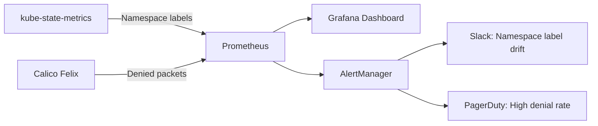

# How to Monitor Calico Namespace-Based Policy Impact

Author: [nawazdhandala](https://github.com/nawazdhandala)

Tags: Calico, Kubernetes, Network Policy, Namespace, Monitoring

Description: Monitor the effectiveness of Calico namespace-based network policies using metrics, namespace label coverage reports, and cross-namespace traffic analytics.

---

## Introduction

Monitoring namespace-based policies means tracking two things: whether all namespaces have the correct labels for policy enforcement, and whether the policies are producing the expected traffic patterns. Namespace label drift - where labels are added or removed without coordination - is a particularly common issue in multi-team clusters.

Calico's Prometheus metrics combined with kube-state-metrics namespace label data give you the visibility needed to detect policy gaps and unexpected cross-namespace traffic. Setting up dashboards and alerts for these metrics turns namespace security from a one-time configuration into an actively monitored control.

## Prerequisites

- Kubernetes cluster with Calico v3.26+
- Prometheus and Grafana deployed
- kube-state-metrics installed

## Step 1: Track Namespace Label Coverage

```promql
# Count namespaces with required labels
count(kube_namespace_labels{label_environment!=""})

# Namespaces missing environment label
count(kube_namespace_info) - count(kube_namespace_labels{label_environment!=""})
```

## Step 2: Monitor Cross-Namespace Denial Rate

```promql
# Rate of namespace-boundary denials
rate(felix_denied_packets_total[5m])

# Categorized by source namespace (requires flow logs + label enrichment)
sum by (src_namespace) (rate(calico_flow_denials_total[5m]))
```

## Step 3: Create Namespace Isolation Dashboard

```json
{
  "title": "Namespace Isolation Dashboard",
  "panels": [
    {"title": "Namespace Label Coverage", "type": "stat",
     "targets": [{"expr": "count(kube_namespace_labels{label_environment!=""}) / count(kube_namespace_info) * 100"}]},
    {"title": "Cross-NS Denials/sec", "type": "graph",
     "targets": [{"expr": "rate(felix_denied_packets_total[5m])"}]},
    {"title": "Active Namespace Policies", "type": "stat",
     "targets": [{"expr": "felix_active_network_policies"}]}
  ]
}
```

## Step 4: Alert on Namespace Label Drift

```yaml
apiVersion: monitoring.coreos.com/v1
kind: PrometheusRule
metadata:
  name: namespace-isolation-alerts
  namespace: monitoring
spec:
  groups:
    - name: calico.namespace
      rules:
        - alert: NamespaceMissingRequiredLabels
          expr: |
            count(kube_namespace_info unless kube_namespace_labels{label_environment!=""}) > 0
          for: 5m
          labels:
            severity: warning
          annotations:
            summary: "Namespaces found without required environment label"
        - alert: UnexpectedCrossNamespaceDenials
          expr: rate(felix_denied_packets_total[5m]) > 20
          for: 3m
          labels:
            severity: warning
          annotations:
            summary: "High cross-namespace denial rate detected"
```

## Step 5: Weekly Namespace Audit

```bash
#!/bin/bash
echo "=== Namespace Policy Audit ==="
echo "Namespaces without environment label:"
kubectl get namespaces -o json | jq -r '.items[] | select(.metadata.labels.environment == null) | .metadata.name'

echo ""
echo "Policy count per namespace:"
for ns in $(kubectl get namespaces -o jsonpath='{.items[*].metadata.name}'); do
  COUNT=$(calicoctl get networkpolicies -n $ns --no-headers 2>/dev/null | wc -l)
  echo "  $ns: $COUNT policies"
done
```

## Monitoring Architecture



## Conclusion

Monitoring namespace-based Calico policies requires tracking both namespace label health and cross-namespace traffic patterns. Set up Prometheus alerts for namespaces missing required labels and for unexpected spikes in cross-namespace denials. A weekly namespace audit report gives your team awareness of the current state and catches drift before it creates security gaps or outages.
