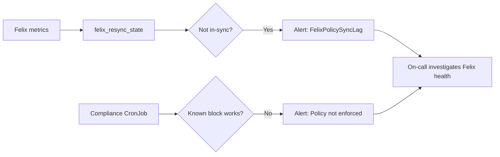

# How to Monitor Network Policy Not Taking Effect in Calico

Author: [nawazdhandala](https://github.com/nawazdhandala)

Tags: Calico, Kubernetes, Networking, Troubleshooting

Description: Monitor for Calico NetworkPolicy enforcement gaps using Felix policy sync metrics, audit logging, and periodic policy compliance checks.

---

## Introduction

Monitoring for NetworkPolicy enforcement gaps requires detecting cases where policies are applied but not enforced. This can happen if Felix is not healthy on a node, if the policy sync is lagging, or if policy ordering causes unexpected behavior. Felix metrics include policy sync state that can be tracked as a health indicator.

## Symptoms

- Felix policy sync lag not detected
- No visibility into whether policies are actually being enforced

## Root Causes

- Felix metrics not monitored
- No audit logging enabled to observe policy decisions

## Diagnosis Steps

```bash
NODE_POD=$(kubectl get pods -n kube-system -l k8s-app=calico-node -o name | head -1)
kubectl exec $NODE_POD -n kube-system -- \
  wget -qO- http://localhost:9091/metrics | grep "felix_route\|felix_policy" | head -20
```

## Solution

**Monitor Felix policy sync metrics**

```yaml
apiVersion: monitoring.coreos.com/v1
kind: PrometheusRule
metadata:
  name: felix-policy-sync-alerts
  namespace: monitoring
spec:
  groups:
  - name: felix.policy
    rules:
    - alert: FelixPolicySyncLag
      expr: |
        felix_resync_state{state!="in-sync"} > 0
      for: 5m
      labels:
        severity: warning
      annotations:
        summary: "Felix policy sync not in-sync on {{ $labels.instance }}"
    - alert: FelixActiveLocalEndpointsDropped
      expr: |
        decrease(felix_active_local_endpoints[10m]) > 5
      for: 5m
      labels:
        severity: warning
      annotations:
        summary: "Felix local endpoints decreased significantly on {{ $labels.instance }}"
```

**Enable Calico policy audit logging**

```bash
kubectl patch felixconfiguration default \
  --type merge \
  --patch '{"spec":{"policyDebugEnabled":true}}'
```

**Periodic policy compliance check**

```yaml
apiVersion: batch/v1
kind: CronJob
metadata:
  name: policy-compliance-check
  namespace: kube-system
spec:
  schedule: "0 */4 * * *"
  jobTemplate:
    spec:
      template:
        spec:
          containers:
          - name: checker
            image: curlimages/curl
            command:
            - /bin/sh
            - -c
            - |
              # Test that a known policy is being enforced
              # This test should FAIL (blocked by policy) if working
              RESULT=$(curl -sk --max-time 3 http://blocked-service.namespace.svc || echo "BLOCKED")
              if [ "$RESULT" = "BLOCKED" ]; then
                echo "PASS: Policy enforcement confirmed"
              else
                echo "ALERT: Policy may not be enforced"
                exit 1
              fi
          restartPolicy: Never
```



## Prevention

- Enable Felix metrics and monitor policy sync state
- Implement compliance checks that verify known policies are enforced
- Alert on Felix sync state changes

## Conclusion

Monitoring NetworkPolicy enforcement requires tracking Felix policy sync state metrics and implementing compliance checks that verify known policies actually block traffic as expected. The compliance check approach is the most direct monitoring method since it tests actual enforcement behavior.
