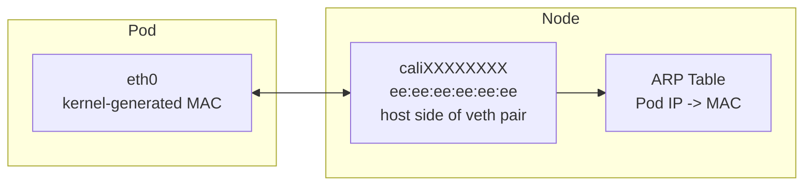

# How to Monitor Pod MAC Addresses with Calico

Author: [nawazdhandala](https://github.com/nawazdhandala)

Tags: Calico, Kubernetes, MAC Address, Networking, CNI

Description: Monitor pod MAC address allocation in Calico to detect conflicts, MAC table exhaustion, and address assignment failures.

---

## Introduction

Calico assigns MAC addresses to the virtual ethernet (veth) pair connecting each pod to its host. By default, the pod-side interface (eth0) receives a normal kernel-generated MAC, while the host-side interface (caliXXXX) is assigned the fixed MAC ee:ee:ee:ee:ee:ee. Because Calico operates at layer 3 and uses proxy ARP to answer the pod's ARP request for its 169.254.1.1 link-local gateway, every cali* veth on a node can safely share the same MAC. This design works well for most environments but requires attention in networks where MAC addresses have security implications or in environments with physical switches that track ARP/MAC bindings.

Understanding Calico's MAC address assignment is important for debugging layer-2 networking issues, configuring certain network security controls, and ensuring compatibility with network monitoring tools that track device identity by MAC address.

## Prerequisites

- Calico v3.20+ installed
- kubectl access to the cluster
- Access to node networking stack

## Check Pod MAC Addresses

```bash
# View MAC address of a pod interface

kubectl exec test-pod -- ip link show eth0

# View the corresponding veth on the host
ip link | grep -A1 cali

# Verify MAC address uniqueness across pods
kubectl get pods -A -o wide | while read ns pod rest; do
  mac=$(kubectl exec -n ${ns} ${pod} -- ip link show eth0 2>/dev/null |     grep -oP '([0-9a-f]{2}:){5}[0-9a-f]{2}' | head -1)
  echo "${ns}/${pod}: ${mac}"
done | sort -t: -k2
```

## Configure a Pod's MAC Address

Calico does not expose a cluster-wide MAC prefix setting, but the pod-side MAC can be pinned per pod with the `cni.projectcalico.org/hwAddr` annotation at pod creation time:

```yaml
metadata:
  annotations:
    cni.projectcalico.org/hwAddr: "ca:fe:1a:2b:3c:4d"
```

The host-side veth MAC (ee:ee:ee:ee:ee:ee) is hardcoded by Calico and is not user-configurable.

## Check for MAC Conflicts

```bash
# Look for duplicate MACs in arp table
arp -n | awk '{print $3}' | sort | uniq -d
```

## MAC Address Architecture



## Conclusion

Calico's MAC address management combines kernel-generated, per-pod MACs on the container side with a single shared MAC (ee:ee:ee:ee:ee:ee) on every host-side cali* veth, served via proxy ARP. Monitoring for MAC conflicts and understanding this assignment scheme helps diagnose layer-2 networking issues and configure security controls appropriately in your Kubernetes environment.
