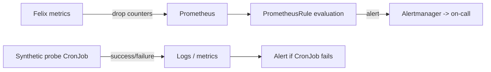

# How to Monitor for Pod Connectivity Failures with Calico

Author: [nawazdhandala](https://github.com/nawazdhandala)

Tags: Calico, Kubernetes, Networking, Troubleshooting

Description: Monitoring setup for detecting pod-to-pod connectivity failures in Calico using synthetic probes, Calico policy metrics, and Felix drop counters.

---

## Introduction

Monitoring pod-to-pod connectivity in Calico requires a combination of active synthetic probes and passive metrics collection. Active probes detect connectivity failures directly by attempting to ping or connect between pods, while passive metrics surface policy drop events and Felix counters that indicate traffic is being blocked.

Without monitoring, pod-to-pod connectivity failures are typically discovered by application teams when their services start returning errors. By that point, the failure may have been occurring for many minutes. Active probes running at short intervals detect the failure within seconds of onset and trigger alerts before application traffic is significantly impacted.

This guide covers deploying a synthetic connectivity probe DaemonSet, setting up Prometheus alerts on Calico policy metrics, and watching Felix drop counters for signs of unexpected traffic blocking.

## Symptoms

- Pod connectivity failures discovered through application-level errors rather than infrastructure monitoring
- No visibility into Calico policy drop events
- Felix drop counters increasing without any alert firing

## Root Causes

- No synthetic connectivity probe deployed
- Calico Felix metrics not enabled or not scraped by Prometheus
- No PrometheusRule defined for policy drop events

## Diagnosis Steps

```bash
# Check if Felix metrics are enabled
calicoctl get felixconfiguration default -o yaml | grep prometheus

# Check current drop counters
NODE_POD=$(kubectl get pods -n kube-system -l k8s-app=calico-node -o name | head -1)
kubectl exec $NODE_POD -n kube-system -- wget -qO- http://localhost:9091/metrics \
  | grep "felix_iptables_dropped" | head -10
```

## Solution

**Step 1: Deploy a connectivity probe DaemonSet**

```yaml
apiVersion: apps/v1
kind: DaemonSet
metadata:
  name: connectivity-probe
  namespace: monitoring
spec:
  selector:
    matchLabels:
      app: connectivity-probe
  template:
    metadata:
      labels:
        app: connectivity-probe
    spec:
      containers:
      - name: probe
        image: busybox
        command:
        - /bin/sh
        - -c
        - |
          while true; do
            # Ping the cluster DNS service
            ping -c 1 -W 2 10.96.0.10 > /dev/null 2>&1
            echo "DNS ping exit: $?"
            sleep 10
          done
```

**Step 2: Enable Felix metrics**

```bash
kubectl patch felixconfiguration default \
  --type merge \
  --patch '{"spec":{"prometheusMetricsEnabled":true,"prometheusMetricsPort":9091}}'
```

**Step 3: Alert on Felix drop counters**

```yaml
apiVersion: monitoring.coreos.com/v1
kind: PrometheusRule
metadata:
  name: calico-connectivity-alerts
  namespace: kube-system
spec:
  groups:
  - name: calico.connectivity
    rules:
    - alert: CalicoHighPolicyDropRate
      expr: |
        rate(felix_iptables_dropped_total{direction="incoming"}[5m]) > 100
      for: 2m
      labels:
        severity: warning
      annotations:
        summary: "High Calico policy drop rate on {{ $labels.instance }}"
        description: "Felix is dropping {{ $value }} packets/sec on {{ $labels.instance }}"
    - alert: CalicoIPIPTunnelDown
      expr: |
        felix_ipset_errors_total > 0
      for: 5m
      labels:
        severity: warning
      annotations:
        summary: "Calico IPSet errors on {{ $labels.instance }}"
```

**Step 4: Synthetic pod ping CronJob**

```yaml
apiVersion: batch/v1
kind: CronJob
metadata:
  name: pod-connectivity-check
  namespace: monitoring
spec:
  schedule: "*/3 * * * *"
  jobTemplate:
    spec:
      template:
        spec:
          containers:
          - name: checker
            image: busybox
            command:
            - /bin/sh
            - -c
            - |
              if ! ping -c 2 -W 3 10.96.0.10; then
                echo "CONNECTIVITY FAILURE: Cannot reach kube-dns"
                exit 1
              fi
              echo "Connectivity OK"
          restartPolicy: Never
```



## Prevention

- Include connectivity probe deployment in cluster bootstrap
- Test alert rules by temporarily applying a blocking NetworkPolicy
- Review Felix drop counter trends weekly for anomalies

## Conclusion

Monitoring pod-to-pod connectivity in Calico requires both synthetic probes for active detection and Felix drop counter metrics for passive monitoring. Combining these two approaches ensures that connectivity failures are detected within minutes rather than discovered through application errors.
