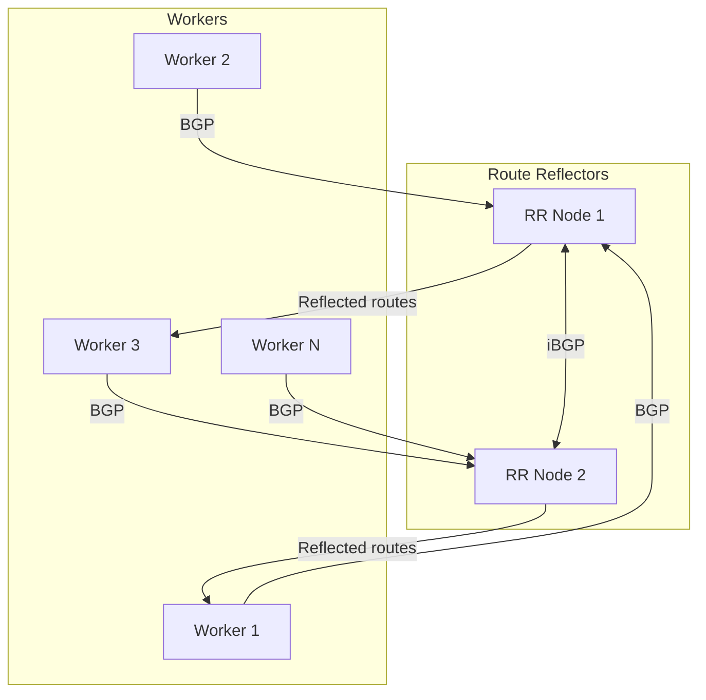

# How to Monitor Route Reflectors in Calico

Author: [nawazdhandala](https://github.com/nawazdhandala)

Tags: Calico, Kubernetes, BGP, Route Reflector, Networking

Description: Monitor route reflector health in Calico by tracking session counts, route table sizes, and convergence metrics.

---

## Introduction

As Kubernetes clusters grow beyond 50-100 nodes, the default Calico full-mesh BGP topology creates O(n²) session complexity — each node must maintain a BGP session with every other node. A 100-node cluster requires 4,950 BGP sessions, consuming significant CPU and memory on each node.

Route reflectors solve this by acting as BGP hubs: instead of each node peering with all others, worker nodes peer only with a small set of route reflectors, which then reflect routes to all other nodes. This reduces the per-node session count from O(n) to O(r) where r is the number of route reflectors (typically 2-3).

## Prerequisites

- Calico with BGP mode
- Dedicated nodes for route reflector role (recommended: not worker nodes)
- kubectl and calicoctl access

## Designate Route Reflector Nodes

```bash
# Label nodes that will act as route reflectors
kubectl label node rr-node-1 calico-route-reflector=true
kubectl label node rr-node-2 calico-route-reflector=true

# Set route reflector cluster ID
calicoctl patch node rr-node-1 --type merge \
  --patch '{"spec":{"bgp":{"routeReflectorClusterID":"244.0.0.1"}}}'
calicoctl patch node rr-node-2 --type merge \
  --patch '{"spec":{"bgp":{"routeReflectorClusterID":"244.0.0.1"}}}'
```

## Disable Full-Mesh and Configure Peering

```bash
# Disable node-to-node mesh
calicoctl patch bgpconfiguration default --type merge \
  --patch '{"spec":{"nodeToNodeMeshEnabled":false}}'
```

Create BGPPeer resources for workers to peer with RRs:

```yaml
apiVersion: projectcalico.org/v3
kind: BGPPeer
metadata:
  name: bgppeer-global-rr
spec:
  nodeSelector: "!has(calico-route-reflector)"
  peerSelector: "has(calico-route-reflector)"
---
apiVersion: projectcalico.org/v3
kind: BGPPeer
metadata:
  name: bgppeer-rr-to-rr
spec:
  nodeSelector: "has(calico-route-reflector)"
  peerSelector: "has(calico-route-reflector)"
```

## Verify Route Reflection

```bash
# On a worker node, check sessions are with RRs only
RR_NODE_POD=$(kubectl get pod -n calico-system -l app=calico-node \
  --field-selector spec.nodeName=rr-node-1 -o name | head -1)
kubectl exec -n calico-system ${RR_NODE_POD} -- birdcl show protocols

# Verify routes are being reflected
kubectl exec -n calico-system ${RR_NODE_POD} -- birdcl show route count
```

## Route Reflector Architecture



## Conclusion

Route reflectors in Calico scale BGP from O(n²) full-mesh to an O(n×r) hub-and-spoke model that handles hundreds of nodes efficiently. Deploy at least two route reflectors for high availability, ensure they peer with each other, and configure all worker nodes to peer with all route reflectors. After migration, verify route counts on workers confirm they receive all pod CIDRs via reflection.
