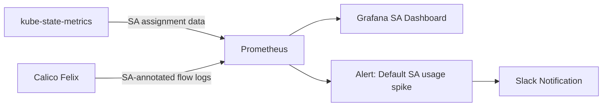

# How to Monitor Calico Service Account-Based Policy Impact

Author: [nawazdhandala](https://github.com/nawazdhandala)

Tags: Calico, Kubernetes, Network Policy, Service Accounts, Monitoring

Description: Monitor Calico service account-based network policies to track SA coverage, identity-based traffic decisions, and unauthorized access attempts.

---

## Introduction

Monitoring service account-based policies means tracking three things: service account coverage (are all pods running with dedicated SAs?), traffic decisions (are SA-based allow/deny rules working correctly?), and anomalies (are there unexpected SA identity changes or access attempts?).

Kube-state-metrics provides service account assignment data, while Calico flow logs include SA identity when configured. Together, they give you the monitoring foundation for identity-based network security.

## Prerequisites

- Kubernetes cluster with Calico v3.26+
- Prometheus, Grafana, and kube-state-metrics installed

## Step 1: Track Service Account Coverage

```promql
# Pods using default service account (security risk)
count(kube_pod_spec_service_account_name{service_account="default"})

# Percentage of pods with dedicated service accounts
100 * (1 - count(kube_pod_spec_service_account_name{service_account="default"}) / count(kube_pod_info))
```

## Step 2: Alert on Default SA Usage

```yaml
apiVersion: monitoring.coreos.com/v1
kind: PrometheusRule
metadata:
  name: sa-policy-alerts
  namespace: monitoring
spec:
  groups:
    - name: calico.sa
      rules:
        - alert: PodsUsingDefaultServiceAccount
          expr: count(kube_pod_spec_service_account_name{service_account="default"}) > 5
          for: 5m
          labels:
            severity: warning
          annotations:
            summary: "More than 5 pods using default service account"
        - alert: UnexpectedSADenials
          expr: rate(felix_denied_packets_total[5m]) > 10
          for: 2m
          labels:
            severity: warning
          annotations:
            summary: "Elevated denial rate - possible SA misconfiguration"
```

## Step 3: SA Coverage Dashboard

```promql
# Panel 1: SA Coverage %
100 * count(kube_pod_spec_service_account_name{service_account!="default"}) / count(kube_pod_info)

# Panel 2: Top 10 default SA pods
topk(10, kube_pod_spec_service_account_name{service_account="default"})

# Panel 3: SA policy evaluation rate
rate(felix_policy_evaluation_total[5m])
```

## Step 4: Weekly SA Audit

```bash
#!/bin/bash
echo "=== Service Account Coverage Audit ==="
echo "Pods using default SA:"
kubectl get pods --all-namespaces -o custom-columns='NAMESPACE:.metadata.namespace,NAME:.metadata.name,SA:.spec.serviceAccountName' | grep " default$" | grep -v "kube-system"

echo ""
echo "Service accounts without associated pods:"
for sa in $(kubectl get serviceaccounts --all-namespaces -o jsonpath='{range .items[*]}{.metadata.namespace}/{.metadata.name}
{end}'); do
  ns=$(echo $sa | cut -d/ -f1)
  name=$(echo $sa | cut -d/ -f2)
  count=$(kubectl get pods -n $ns -o jsonpath="{.items[?(@.spec.serviceAccountName=='$name')].metadata.name}" | wc -w)
  if [ "$count" -eq 0 ] && [ "$name" != "default" ]; then
    echo "  Unused SA: $sa"
  fi
done
```

## Monitoring Architecture



## Conclusion

Monitoring service account-based Calico policies requires tracking SA coverage as a key metric - the percentage of pods using dedicated service accounts versus the default SA. Alert when this metric degrades, as it indicates new workloads are being deployed without the required SA configuration. Combine SA coverage metrics with Calico denial rate metrics to build a comprehensive picture of your identity-based network security posture.
