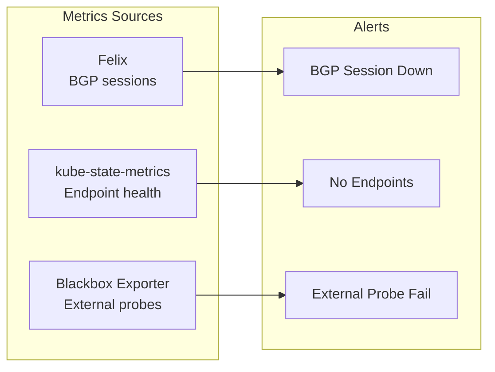

# How to Monitor Service IP Advertisement with Calico

Author: [nawazdhandala](https://github.com/nawazdhandala)

Tags: Calico, Kubernetes, BGP, Monitoring, Service Advertisement

Description: Monitor Calico service IP advertisement health using Prometheus metrics, probes, and alerting rules to detect service route withdrawals and access failures.

---

## Introduction

Monitoring service IP advertisement in Calico requires watching both the BGP advertisement layer and the service forwarding data plane. A service route can be withdrawn by Calico when all endpoint pods on a node become unhealthy with ExternalTrafficPolicy: Local, causing that node to stop advertising the service IP and potentially dropping external connections.

Proactive monitoring of service advertisement health catches these situations before users report service unavailability. Key signals to monitor include the number of nodes advertising each service IP, BGP route counts, and end-to-end synthetic probes from outside the cluster.

## Prerequisites

- Prometheus and Grafana
- Calico with Felix metrics enabled
- Service IP advertisement configured

## Monitor Service Route Counts

Track how many nodes are advertising service routes:

```bash
kubectl exec -n calico-system ${NODE_POD} -- birdcl show route | grep "192.168.100" | wc -l
```

## Configure Prometheus Rules

```yaml
apiVersion: monitoring.coreos.com/v1
kind: PrometheusRule
metadata:
  name: calico-service-advertisement
  namespace: monitoring
spec:
  groups:
  - name: service-advertisement
    rules:
    - alert: ServiceRouteNotAdvertised
      expr: |
        absent(felix_bgp_num_established_v4{instance=~".*"}) or
        felix_bgp_num_not_established > 0
      for: 3m
      labels:
        severity: critical
      annotations:
        summary: "Calico service route advertisement may be affected"
    - alert: ServiceEndpointCountLow
      expr: |
        kube_endpoint_address_available == 0
      for: 1m
      labels:
        severity: warning
      annotations:
        summary: "Service {{ $labels.namespace }}/{{ $labels.endpoint }} has no available endpoints"
```

## Synthetic Monitoring from External

Deploy a probe to test service connectivity from outside:

```yaml
apiVersion: monitoring.coreos.com/v1
kind: Probe
metadata:
  name: service-lb-probe
  namespace: monitoring
spec:
  interval: 30s
  module: http_2xx
  prober:
    url: blackbox-exporter.monitoring.svc:9115
  targets:
    staticConfig:
      static:
      - http://192.168.100.10:80
      - http://192.168.100.11:443
```

## Service Advertisement Monitoring Dashboard

Key panels for a Grafana dashboard:

- BGP established sessions per node
- Number of service routes advertised
- Service probe success rate
- Service endpoint count over time



## Conclusion

Monitoring Calico service IP advertisement requires combining BGP-level metrics from Felix, endpoint health from kube-state-metrics, and synthetic probes from external vantage points. Alerts on BGP session failures, endpoint count drops, and external probe failures together provide early warning of service advertisement issues before they affect users.
