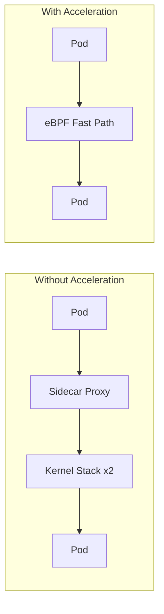

# How to Monitor Sidecar Acceleration in Calico

Author: [nawazdhandala](https://github.com/nawazdhandala)

Tags: Calico, Kubernetes, eBPF, Sidecar, Service Mesh

Description: Monitor the effectiveness of Calico sidecar acceleration using eBPF metrics and latency tracking.

---

## Introduction

Calico's sidecar acceleration feature uses eBPF to optimize traffic flows in service mesh environments. When pods use sidecar proxies like Envoy, network packets traverse multiple kernel networking layers. Calico eBPF can identify these patterns and apply fast-path processing that reduces the overhead introduced by sidecar interception.

This is one of the most impactful performance optimizations available for microservices architectures that have adopted service meshes - latency improvements of 30-50% are achievable for high-frequency inter-service calls.

## Prerequisites

- Calico eBPF dataplane enabled
- Service mesh with sidecar injection (Istio, Linkerd, etc.)
- kubectl and calicoctl access

## Configure and Verify

```bash
# Verify eBPF is enabled and sidecar acceleration is on
calicoctl get felixconfiguration default -o yaml | grep -E 'bpfEnabled|sidecarAccelerationEnabled'

# Inspect eBPF counters maintained by Felix
kubectl exec -n calico-system ds/calico-node -- \
  calico-node -bpf counters dump

# List the BPF programs and attachments on the node
kubectl exec -n calico-system ds/calico-node -- \
  calico-node -bpf ifstate dump
```

## Benchmark Acceleration

```bash
# Compare latency with and without acceleration using ghz
# Without acceleration:
kubectl exec client-pod -- ghz --insecure -n 10000 --call helloworld.Greeter/SayHello server:50051

# With acceleration enabled:
kubectl exec client-pod -- ghz --insecure -n 10000 --call helloworld.Greeter/SayHello server:50051
```

## Monitoring

```bash
# List Calico's loaded eBPF programs (Calico uses the `cali` prefix)
kubectl exec -n calico-system ds/calico-node -- \
  bpftool prog show | grep -E 'cali'
```

## Acceleration Flow



## Conclusion

How to Monitor Sidecar Acceleration in Calico requires enabling Calico eBPF mode and verifying that service mesh sidecar traffic is being processed through the optimized eBPF path. Monitor latency metrics before and after enabling acceleration to quantify the performance improvement in your specific workload profile.
