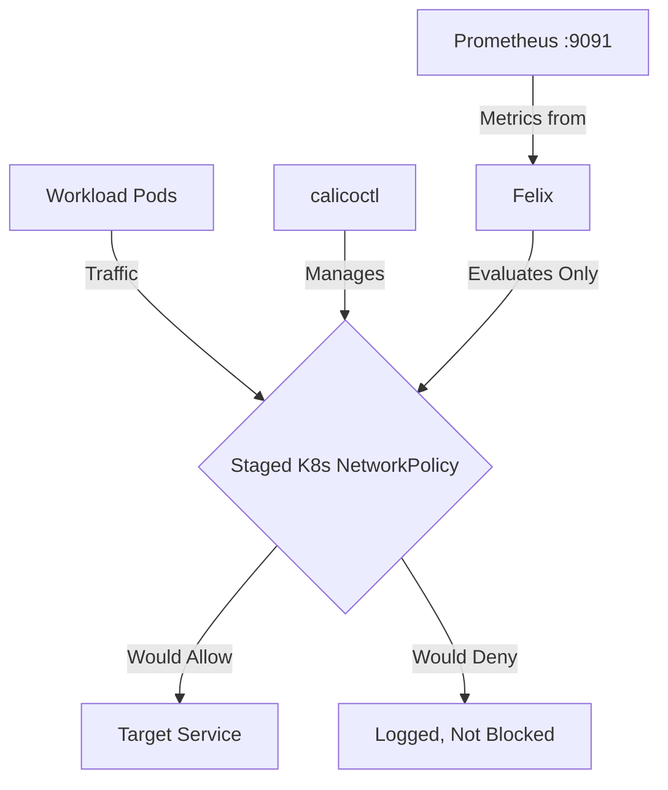

# How to Monitor Staged Kubernetes NetworkPolicy in Calico

Author: [nawazdhandala](https://github.com/nawazdhandala)

Tags: Calico, Kubernetes, Network Policy, Staged Policies

Description: Monitor the impact of Staged Kubernetes NetworkPolicy in Calico using metrics and dashboards.

---

## Introduction

Staged Kubernetes NetworkPolicy is an advanced Calico feature that provides fine-grained network security controls using the `projectcalico.org/v3` API. This guide covers how to monitor Staged K8s NetworkPolicy effectively in your Kubernetes cluster.

Calico's `projectcalico.org/v3` API provides rich support for Staged K8s NetworkPolicy through its `GlobalNetworkPolicy`, `NetworkPolicy`, and related resources. Proper configuration of Staged K8s NetworkPolicy is essential for maintaining a secure, well-controlled network fabric.

This guide provides production-tested patterns for monitor Staged K8s NetworkPolicy, including YAML examples, CLI commands, and troubleshooting techniques.

## Prerequisites

- Kubernetes cluster with Calico v3.26+
- `calicoctl` and `kubectl` installed  
- Basic understanding of Calico network policy concepts
- Calico v3.26+ for full Staged K8s NetworkPolicy feature support

## Core Configuration

The following YAML demonstrates the key pattern for Staged K8s NetworkPolicy:

```yaml
apiVersion: projectcalico.org/v3
kind: StagedKubernetesNetworkPolicy
metadata:
  name: monitor-staged-k8s-networkpolicy
  namespace: production
spec:
  stagedAction: Set
  podSelector: {}
  policyTypes:
    - Ingress
    - Egress
  ingress:
    - from:
        - podSelector:
            matchLabels:
              app: authorized-source
      ports:
        - protocol: TCP
          port: 8080
        - protocol: TCP
          port: 443
  egress:
    - ports:
        - protocol: UDP
          port: 53
    - to:
        - podSelector:
            matchLabels:
              app: authorized-destination
```

## Implementation Steps

```bash
# 1. Apply the policy

calicoctl apply -f monitor-staged-k8s-networkpolicy.yaml

# 2. Verify it's active
calicoctl get stagedkubernetesnetworkpolicies -n production -o wide

# 3. Test connectivity
kubectl exec -n production test-pod -- curl -s --max-time 5 http://target:8080
echo "Exit code: $?"

# 4. Check active policy counters (if Felix metrics enabled)
curl -s http://localhost:9091/metrics | grep felix_active_local_policies
```

## Operational Commands

```bash
# List all relevant policies
calicoctl get stagedkubernetesnetworkpolicies --all-namespaces
calicoctl get stagednetworkpolicies --all-namespaces

# View policy details
calicoctl get stagedkubernetesnetworkpolicy monitor-staged-k8s-networkpolicy -n production -o yaml

# Delete a policy if needed
calicoctl delete stagedkubernetesnetworkpolicy monitor-staged-k8s-networkpolicy -n production
```

## Architecture



## Common Issues

1. **Policy not applying**: Verify API version is `projectcalico.org/v3` and run `calicoctl apply --dry-run` first
2. **Selector not matching**: Use `kubectl get pods -l your-selector` to verify label matches
3. **Policy conflicts**: Compare with enforced policies that share the same `podSelector` to predict the effect once the staged policy is promoted
4. **DNS failures**: Always ensure egress to port 53 is allowed when restricting egress

## Conclusion

Monitor Staged K8s NetworkPolicy in Calico requires careful attention to policy ordering, selector syntax, and bidirectional traffic rules. Use the patterns in this guide as a starting point, adapt them to your specific requirements, and always validate changes in a staging environment before applying to production. Consistent logging and monitoring will help you detect and resolve issues quickly when they occur.
