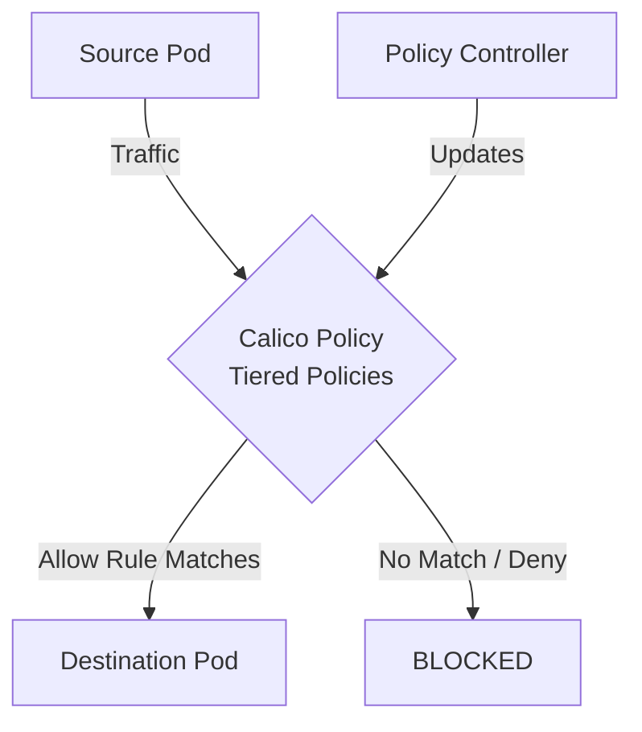

# How to Monitor the Impact of Calico Tiered Policies in Calico

Author: [nawazdhandala](https://github.com/nawazdhandala)

Tags: Calico, Kubernetes, Network Policy, Policy Tiers, Security

Description: Monitor the effectiveness of Calico Tiered Policies in Calico using metrics and analytics.

---

## Introduction

Calico Tiered Policies in Calico provides fine-grained network security controls using the `projectcalico.org/v3` API. This guide covers how to monitor Tiered Policies effectively.

Calico's extensible policy model supports Tiered Policies through its `GlobalNetworkPolicy` and `NetworkPolicy` resources, giving you cluster-wide and namespace-scoped control over traffic that matches your Tiered Policies criteria.

This guide provides practical techniques for monitor Tiered Policies in your Kubernetes cluster, following security best practices and production-tested patterns.

## Prerequisites

- Kubernetes cluster with Calico v3.29+ (open source Calico added the `Tier` resource in v3.29)
- `calicoctl` and `kubectl` installed
- Basic understanding of Calico network policy concepts

## Step 1: Enable Prometheus Metrics

```bash
kubectl patch felixconfiguration default --type=merge -p '{"spec":{"prometheusMetricsEnabled":true}}'
```

## Step 2: Key Metrics

Felix exposes its metrics on port `9091`. The metrics below are all available in open source Calico (per the Felix Prometheus reference). Note that open source Calico does not expose a per-policy denied-packet counter - those metrics (`calico_denied_packets`, `cnx_policy_rule_packets`) are only available in Calico Cloud / Enterprise.

```promql
# Total policies in the cluster (across all tiers)
felix_cluster_num_policies

# Total tiers in the cluster
felix_cluster_num_tiers

# Active policies programmed on this host
felix_active_local_policies

# Iptables rules programmed by Felix (proxy for total programmed rules)
felix_iptables_rules
```

## Step 3: Set Up Alerts

Because open source Felix does not expose a denied-packets counter, the alerts below focus on signals that *are* available: sudden drops in cluster-wide policy or tier counts (often the first symptom of an accidental delete or a bad rollout), and Felix dataplane errors.

```yaml
apiVersion: monitoring.coreos.com/v1
kind: PrometheusRule
metadata:
  name: calico-tiered-policies-alerts
spec:
  groups:
    - name: calico.policy
      rules:
        - alert: PolicyCountDropped
          expr: delta(felix_cluster_num_policies[10m]) < -5
          for: 2m
          labels:
            severity: warning
          annotations:
            summary: "Cluster-wide Calico policy count dropped sharply - possible accidental delete"
        - alert: TierCountDropped
          expr: delta(felix_cluster_num_tiers[10m]) < 0
          for: 2m
          labels:
            severity: warning
          annotations:
            summary: "A Calico tier was removed - verify this was intentional"
        - alert: FelixIptablesSaveErrors
          expr: rate(felix_iptables_save_errors[5m]) > 0
          for: 5m
          labels:
            severity: critical
          annotations:
            summary: "Felix is failing to program iptables - policy enforcement may be stale"
```

## Step 4: Grafana Dashboard

Track cluster-wide policy and tier counts, per-host active policy counts, and iptables rule counts on a single dashboard to quickly spot anomalies related to Tiered Policies changes. If you are on Calico Cloud / Enterprise, add `calico_denied_packets` and `cnx_policy_rule_packets` panels for per-rule allow/deny visibility.

## Architecture



## Conclusion

Monitor Tiered Policies policies in Calico requires attention to policy ordering, selector accuracy, and bidirectional rule coverage. Follow the patterns in this guide to ensure your Tiered Policies policies are correctly configured, tested, and monitored. Always validate in staging before applying to production, and maintain comprehensive logging for visibility into policy decisions.
