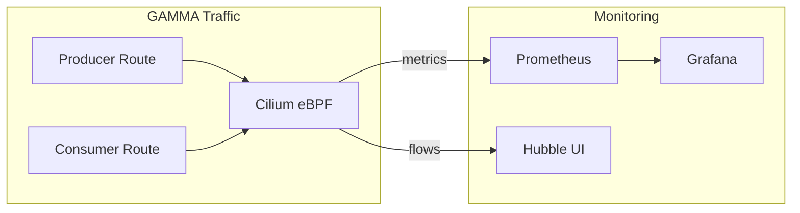

# How to Monitor Types of GAMMA Configuration in the Cilium Gateway API

Author: [nawazdhandala](https://github.com/nawazdhandala)

Tags: Cilium, Kubernetes, GAMMA, Gateway API, Monitoring, Service Mesh

Description: Monitor producer, consumer, and mixed GAMMA configuration types in Cilium using Hubble flow data to verify routing ownership models remain effective.

---

## Introduction

Monitoring different GAMMA configuration types requires distinguishing between traffic that is producer-controlled versus consumer-controlled at the flow level. Hubble's rich metadata—including source namespace, destination service, and applied policies—makes this differentiation possible.

By tagging flows with their GAMMA configuration type context, platform teams can build dashboards that show whether routing rules from each ownership model are being exercised correctly. This is particularly valuable in multi-tenant environments where both producers and consumers may define routing policies.

## Prerequisites

- Cilium with Hubble relay and GAMMA enabled
- `hubble` CLI and Grafana/Prometheus configured
- Multiple GAMMA route types deployed

## Monitor Producer-Controlled Traffic

```bash
hubble observe --namespace <producer-ns> --protocol http --follow \
  --to-service <api-service>
```

Look for flows coming from multiple consumer namespaces—all routed to the same backend.

## Monitor Consumer-Specific Traffic

```bash
hubble observe --namespace <consumer-ns> --protocol http --follow
```

Traffic from this namespace should follow consumer-specific routing rules.

## Architecture



## Prometheus Query for Namespace-Level Routing

Track requests per source namespace to monitor per-consumer traffic patterns:

```promql
sum by (source_namespace, destination_workload) (
  rate(cilium_forward_count_total{destination_workload=~"api-.*"}[1m])
)
```

## Create Dashboard Panels

For a Grafana dashboard monitoring GAMMA types:

1. **Producer traffic distribution**: Pie chart showing requests per backend from all namespaces
2. **Consumer isolation**: Time series per consumer namespace showing requests to the shared Service
3. **Drop rate by type**: Bar chart of dropped flows grouped by source namespace

## Alert on Unexpected Routing

```yaml
groups:
  - name: gamma-type-monitoring
    rules:
      - alert: ConsumerRouteBypassDetected
        expr: |
          sum(rate(cilium_forward_count_total{
            source_namespace="consumer-ns",
            destination_workload="api-service-v1"
          }[5m])) > 0
        for: 2m
        annotations:
          summary: "Consumer traffic reaching restricted backend"
```

## Conclusion

Monitoring GAMMA configuration types in Cilium requires Hubble for per-namespace flow visibility and Prometheus for aggregate routing metrics. Building dashboards that segment traffic by GAMMA ownership type helps enforce and audit the intended service mesh policies.
