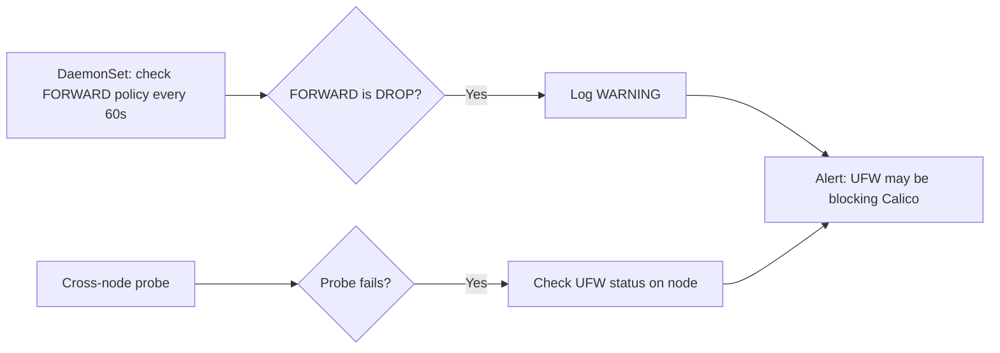

# How to Monitor UFW Blocking Kubernetes When Using Calico

Author: [nawazdhandala](https://github.com/nawazdhandala)

Tags: Calico, Kubernetes, Networking, Troubleshooting

Description: Monitor for UFW conflicts with Calico Kubernetes networking using iptables FORWARD policy checks, node networking health probes, and UFW log analysis.

---

## Introduction

Monitoring for UFW-Calico conflicts requires detecting the conditions that UFW creates when it interferes with Kubernetes networking: a DROP FORWARD policy in iptables, missing IPIP/VXLAN allows, or absent BGP port rules. These conditions can be detected through a combination of node-level health checks and network connectivity probes.

UFW-induced failures are particularly insidious because they often appear intermittently when UFW is re-enabled after OS maintenance, upgraded, or applied by automated hardening tools. Monitoring that checks UFW state periodically catches these regressions before they affect workloads.

## Symptoms

- Cross-node connectivity fails after node OS maintenance
- UFW enabled event correlates with network degradation
- iptables FORWARD policy changes from ACCEPT to DROP on a node

## Root Causes

- Automated OS hardening enables UFW without Kubernetes exceptions
- UFW updated and reset to defaults during package upgrade

## Diagnosis Steps

```bash
# Check UFW and FORWARD policy on all nodes
for NODE in $(kubectl get nodes -o jsonpath='{.items[*].metadata.name}'); do
  echo -n "$NODE UFW: "
  ssh $NODE "sudo ufw status | grep Status" 2>/dev/null
  echo -n "$NODE FORWARD: "
  ssh $NODE "sudo iptables -L FORWARD -n | head -1" 2>/dev/null
done
```

## Solution

**Step 1: Create a DaemonSet that checks FORWARD policy**

```yaml
apiVersion: apps/v1
kind: DaemonSet
metadata:
  name: ufw-monitor
  namespace: kube-system
spec:
  selector:
    matchLabels:
      app: ufw-monitor
  template:
    metadata:
      labels:
        app: ufw-monitor
    spec:
      hostNetwork: true
      hostPID: true
      tolerations:
      - operator: Exists
      containers:
      - name: monitor
        image: busybox
        securityContext:
          privileged: true
        command:
        - /bin/sh
        - -c
        - |
          while true; do
            POLICY=$(iptables -L FORWARD -n 2>/dev/null | head -1 | grep -c "DROP" || true)
            if [ "$POLICY" -gt 0 ]; then
              echo "WARNING: iptables FORWARD policy is DROP - UFW may be blocking Calico"
            fi
            sleep 60
          done
```

**Step 2: Alert on cross-node connectivity loss**

```yaml
apiVersion: monitoring.coreos.com/v1
kind: PrometheusRule
metadata:
  name: ufw-calico-conflict-alerts
  namespace: kube-system
spec:
  groups:
  - name: ufw.calico
    rules:
    - alert: CalicoNodeNotReady
      expr: |
        kube_daemonset_status_number_unavailable{
          namespace="kube-system",
          daemonset="calico-node"
        } > 0
      for: 5m
      labels:
        severity: critical
      annotations:
        summary: "calico-node unavailable - possible UFW conflict"
```

**Step 3: Log UFW activity for analysis**

```bash
# On each node, enable UFW logging to detect drops
sudo ufw logging on

# Watch UFW logs for Calico-related drops
sudo tail -f /var/log/ufw.log | grep -E "BLOCK|DROP" | grep -E "4789|proto 4|DPT=179"
```



## Prevention

- Run the FORWARD policy check DaemonSet as permanent cluster infrastructure
- Include UFW state in automated node health reports
- Alert on calico-node becoming unavailable (often a proxy for UFW conflict)

## Conclusion

Monitoring UFW-Calico conflicts requires checking the iptables FORWARD policy on nodes and watching for cross-node connectivity drops. A DaemonSet that periodically checks the FORWARD policy combined with calico-node availability alerts provides reliable detection of UFW-induced networking failures.
