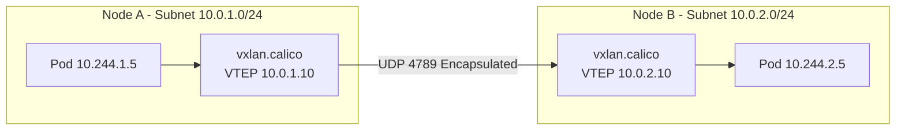

# How to Monitor VXLAN in Calico

Author: [nawazdhandala](https://github.com/nawazdhandala)

Tags: Calico, Kubernetes, VXLAN, Networking, Encapsulation

Description: Monitor VXLAN tunnel health, encapsulation statistics, and VTEP table state in Calico using kernel counters and Prometheus metrics.

---

## Introduction

VXLAN (Virtual Extensible LAN) is an encapsulation protocol that wraps layer-2 Ethernet frames inside UDP packets, allowing pod networks to span across layer-3 boundaries without BGP routing support. Calico uses VXLAN to create an overlay network where pods on different subnets can communicate as if they were on the same flat network.

VXLAN is the preferred encapsulation mode for cloud environments where BGP peering with the underlying network is not possible or practical. It uses UDP port 4789 for encapsulation and requires all cluster nodes to be able to reach each other on this port.

## Prerequisites

- Kubernetes cluster with Calico installed
- UDP port 4789 open between all nodes
- kubectl and calicoctl access

## Configure VXLAN Mode

```yaml
apiVersion: projectcalico.org/v3
kind: IPPool
metadata:
  name: default-ipv4-ippool
spec:
  cidr: 10.244.0.0/16
  vxlanMode: Always
  ipipMode: Never
  natOutgoing: true
```

```bash
calicoctl apply -f ippool-vxlan.yaml

# Verify VXLAN interface is created
ip link show vxlan.calico
ip addr show vxlan.calico
```

## Check VTEP Table

```bash
# View VXLAN forwarding database (FDB)
bridge fdb show dev vxlan.calico

# View ARP table for VTEP neighbors
arp -n | grep "vxlan"

# Check Calico VTEP information
kubectl get nodes -o yaml | grep -A5 vxlanTunnelMACAddr
```

## Test Cross-Subnet Pod Connectivity

```bash
# Deploy pods on different subnets
kubectl run pod1 --image=busybox --overrides='{"spec":{"nodeName":"node-subnet-a"}}' -- sleep 3600
kubectl run pod2 --image=busybox --overrides='{"spec":{"nodeName":"node-subnet-b"}}' -- sleep 3600

POD2_IP=$(kubectl get pod pod2 -o jsonpath='{.status.podIP}')
kubectl exec pod1 -- ping -c 3 ${POD2_IP}

# Verify VXLAN encapsulation with tcpdump
tcpdump -i eth0 -n 'udp port 4789' -c 10
```

## VXLAN Encapsulation Architecture



## Conclusion

VXLAN in Calico provides robust overlay networking for clusters deployed across multiple subnets or in cloud environments without BGP support. Configure IP pools with `vxlanMode: Always`, verify VTEP configuration and FDB entries, and test cross-subnet connectivity. The main operational consideration with VXLAN is MTU sizing — subtract 50 bytes from the host MTU for the VXLAN overhead.
