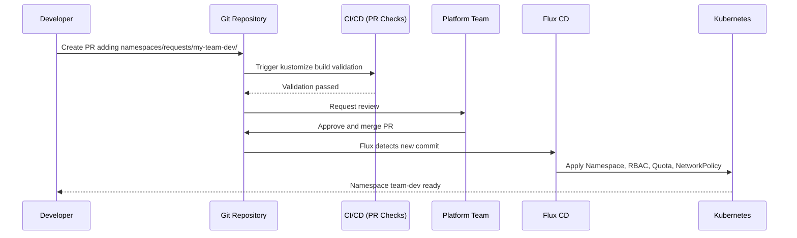

# How to Build a Namespace-as-a-Service Platform with Flux CD

Author: [nawazdhandala](https://github.com/nawazdhandala)

Tags: Flux CD, Kubernetes, GitOps, Platform Engineering, Namespace, Multi-tenancy

Description: Implement namespace-as-a-service for development teams using Flux CD so teams can request isolated Kubernetes namespaces through Git pull requests.

---

## Introduction

Namespace-as-a-Service (NaaS) is a pattern where platform teams provide isolated Kubernetes namespaces to development teams on demand, complete with RBAC, network policies, resource quotas, and tooling pre-configured. Teams get an environment they own without needing cluster-admin access, and the platform team maintains governance at scale.

Flux CD is the ideal engine for NaaS because namespace lifecycle — creation, configuration, and deletion — maps perfectly to Git commits. A team requests a namespace by opening a PR, a platform team member reviews and approves it, and Flux reconciles the desired state in seconds. Deleting the PR branch or removing the configuration file triggers Flux's pruning to clean up all associated resources.

This guide walks through building a complete NaaS implementation on top of Flux CD, including a self-service request workflow and automated provisioning pipeline.

## Prerequisites

- Kubernetes cluster 1.25+ with Flux CD v2 bootstrapped
- Flux CLI and kubectl installed
- A platform Git repository structure already in place
- Familiarity with Kustomize patches and overlays

## Step 1: Define the Namespace Request Schema

Create a simple directory structure that acts as the namespace request interface. Each subdirectory under `namespaces/requests/` represents one tenant namespace.

```
platform-gitops/
└── namespaces/
    ├── base/                    # Reusable namespace template
    │   ├── kustomization.yaml
    │   ├── namespace.yaml
    │   ├── rbac.yaml
    │   ├── network-policy.yaml
    │   ├── resource-quota.yaml
    │   └── limit-range.yaml
    └── requests/
        ├── team-alpha-dev/
        │   └── values.yaml     # Team-specific overrides
        └── team-beta-staging/
            └── values.yaml
```

## Step 2: Build the Base Namespace Template

```yaml
# namespaces/base/namespace.yaml
apiVersion: v1
kind: Namespace
metadata:
  name: NAMESPACE_NAME
  labels:
    platform.io/managed-by: flux
    platform.io/team: TEAM_NAME
    platform.io/environment: ENVIRONMENT
  annotations:
    platform.io/owner-email: OWNER_EMAIL
    platform.io/created-at: CREATED_AT
```

```yaml
# namespaces/base/network-policy.yaml
apiVersion: networking.k8s.io/v1
kind: NetworkPolicy
metadata:
  name: default-deny-all
  namespace: NAMESPACE_NAME
spec:
  podSelector: {}
  policyTypes:
    - Ingress
    - Egress
---
apiVersion: networking.k8s.io/v1
kind: NetworkPolicy
metadata:
  name: allow-same-namespace
  namespace: NAMESPACE_NAME
spec:
  podSelector: {}
  policyTypes:
    - Ingress
  ingress:
    - from:
        - podSelector: {}
---
apiVersion: networking.k8s.io/v1
kind: NetworkPolicy
metadata:
  name: allow-monitoring
  namespace: NAMESPACE_NAME
spec:
  podSelector: {}
  policyTypes:
    - Ingress
  ingress:
    - from:
        - namespaceSelector:
            matchLabels:
              kubernetes.io/metadata.name: monitoring
      ports:
        - port: 9090
          protocol: TCP
```

```yaml
# namespaces/base/resource-quota.yaml
apiVersion: v1
kind: ResourceQuota
metadata:
  name: compute-quota
  namespace: NAMESPACE_NAME
spec:
  hard:
    requests.cpu: "4"
    requests.memory: 8Gi
    limits.cpu: "8"
    limits.memory: 16Gi
    count/pods: "30"
    count/services: "10"
    count/persistentvolumeclaims: "5"
```

## Step 3: Create a Flux Kustomization for Namespace Requests

```yaml
# clusters/production/namespaces.yaml
apiVersion: kustomize.toolkit.fluxcd.io/v1
kind: Kustomization
metadata:
  name: namespaces
  namespace: flux-system
spec:
  interval: 2m
  path: ./namespaces/requests
  prune: true          # Deleting a request directory removes the namespace
  sourceRef:
    kind: GitRepository
    name: flux-system
  postBuild:
    substituteFrom:
      - kind: ConfigMap
        name: platform-defaults
```

## Step 4: Implement Per-Request Kustomization

Each namespace request directory generates the full namespace configuration using substitution.

```yaml
# namespaces/requests/team-alpha-dev/kustomization.yaml
apiVersion: kustomize.config.k8s.io/v1beta1
kind: Kustomization
resources:
  - ../../base
patches:
  - patch: |-
      - op: replace
        path: /metadata/name
        value: team-alpha-dev
    target:
      kind: Namespace
  - patch: |-
      - op: replace
        path: /metadata/namespace
        value: team-alpha-dev
    target:
      kind: NetworkPolicy
  - patch: |-
      - op: replace
        path: /metadata/namespace
        value: team-alpha-dev
    target:
      kind: ResourceQuota
  - patch: |-
      # Increase quota for team-alpha since they run ML workloads
      - op: replace
        path: /spec/hard/requests.cpu
        value: "8"
      - op: replace
        path: /spec/hard/limits.cpu
        value: "16"
    target:
      kind: ResourceQuota
```

## Step 5: Add Automatic RBAC Binding

```yaml
# namespaces/requests/team-alpha-dev/rbac.yaml
apiVersion: rbac.authorization.k8s.io/v1
kind: RoleBinding
metadata:
  name: team-alpha-edit
  namespace: team-alpha-dev
roleRef:
  apiGroup: rbac.authorization.k8s.io
  kind: ClusterRole
  name: edit
subjects:
  - kind: Group
    name: team-alpha          # Maps to your OIDC group
    apiGroup: rbac.authorization.k8s.io
---
apiVersion: rbac.authorization.k8s.io/v1
kind: RoleBinding
metadata:
  name: team-alpha-view-flux
  namespace: team-alpha-dev
roleRef:
  apiGroup: rbac.authorization.k8s.io
  kind: ClusterRole
  name: view
subjects:
  - kind: ServiceAccount
    name: default
    namespace: flux-system
```

## Step 6: Visualize the NaaS Flow



## Best Practices

- Enforce a naming convention like `{team}-{environment}` for predictable namespace names
- Set `prune: true` on the namespaces Kustomization so deleted requests clean up automatically
- Use a CODEOWNERS file to require platform team approval on all namespace request PRs
- Add a CI check that runs `kustomize build` to catch YAML errors before merge
- Store namespace metadata in labels and annotations for cost attribution reporting
- Implement a TTL annotation and a controller that auto-expires ephemeral namespaces

## Conclusion

Namespace-as-a-Service with Flux CD creates a clean, auditable, and self-service model for Kubernetes multi-tenancy. Development teams get isolated environments in minutes through a familiar PR workflow, while platform teams maintain full governance over quotas, network policies, and RBAC. The Git history provides a complete audit trail of every namespace ever created, modified, or deleted in your organization.
