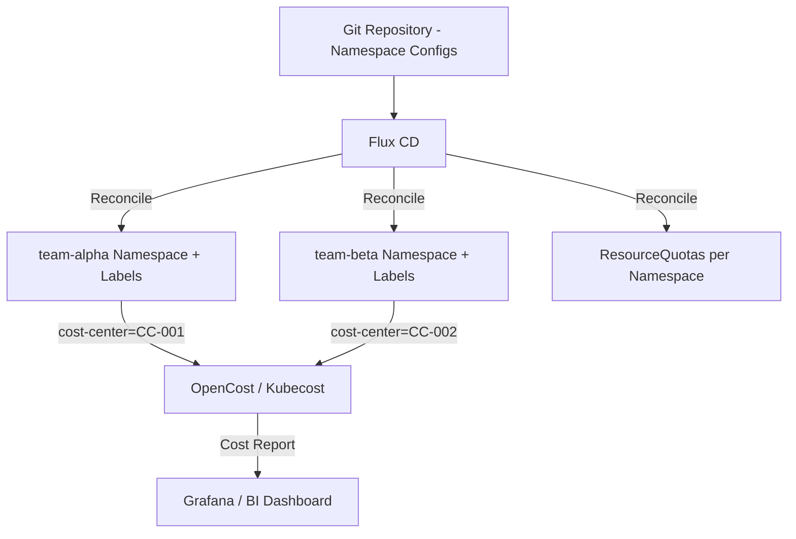

# How to Implement Namespace Cost Allocation with Flux CD

Author: [nawazdhandala](https://github.com/nawazdhandala)

Tags: Flux CD, GitOps, Kubernetes, Cost Allocation, FinOps, Namespaces, Resource Management

Description: Learn how to implement namespace-level cost allocation in Kubernetes using Flux CD to manage resource quotas, labels, and cost tracking integrations through GitOps.

---

## Introduction

Kubernetes cost allocation at the namespace level allows platform teams to attribute resource consumption to specific teams, projects, or business units. By managing cost allocation configuration through Flux CD, you ensure that resource quotas, labels, and cost tracking annotations are consistently applied and version-controlled across environments.

Without structured cost allocation, cloud and infrastructure costs become opaque, making it difficult to optimize spending or hold teams accountable for resource consumption. Flux CD's declarative GitOps model ensures that cost allocation policies are always enforced and auditable.

This guide covers how to implement namespace cost allocation using Flux CD, including resource quota management, cost labels, and integration with cost monitoring tools like OpenCost or Kubecost.

## Prerequisites

- Flux CD v2 installed and bootstrapped
- Kubernetes cluster with RBAC enabled
- OpenCost or Kubecost installed for cost visibility (optional)
- Git repository connected to Flux

## Step 1: Define Namespaces with Cost Allocation Labels

Create namespace manifests with cost center labels managed by Flux.

```yaml
# namespaces/team-alpha-ns.yaml
# Namespace for team-alpha with cost allocation labels
apiVersion: v1
kind: Namespace
metadata:
  name: team-alpha
  labels:
    cost-center: "CC-001"        # Cost center for billing
    team: "alpha"                # Team identifier
    environment: "production"    # Environment tag for cost filtering
    managed-by: "flux"
```

## Step 2: Apply Resource Quotas per Namespace

Define ResourceQuota objects to limit and track resource consumption per team.

```yaml
# namespaces/team-alpha-quota.yaml
# ResourceQuota for team-alpha namespace to cap resource consumption
apiVersion: v1
kind: ResourceQuota
metadata:
  name: team-alpha-quota
  namespace: team-alpha
spec:
  hard:
    requests.cpu: "10"          # Max CPU requests for all pods in namespace
    requests.memory: 20Gi       # Max memory requests
    limits.cpu: "20"            # Max CPU limits
    limits.memory: 40Gi         # Max memory limits
    count/pods: "50"            # Max number of pods
    count/services: "20"        # Max number of services
```

## Step 3: Manage Cost Allocation via Flux Kustomization

Reconcile namespaces and quotas using Flux Kustomizations with team-based structure.

```yaml
# flux/kustomizations/team-namespaces.yaml
# Kustomization managing all team namespace configurations
apiVersion: kustomize.toolkit.fluxcd.io/v1
kind: Kustomization
metadata:
  name: team-namespaces
  namespace: flux-system
spec:
  interval: 10m
  path: ./namespaces
  prune: true           # Remove namespaces removed from Git
  sourceRef:
    kind: GitRepository
    name: cluster-config
```

## Step 4: Integrate with OpenCost via Labels

Configure OpenCost to aggregate costs by the labels Flux manages.

```yaml
# opencost-config.yaml
# ConfigMap configuring OpenCost to aggregate by Flux-managed cost labels
apiVersion: v1
kind: ConfigMap
metadata:
  name: opencost-conf
  namespace: opencost
data:
  opencost.json: |
    {
      "costAllocationLabels": [
        "cost-center",
        "team",
        "environment"
      ],
      "defaultAllocationTarget": "namespace"
    }
```

## Step 5: Audit Cost Allocation with kubectl

Check resource usage and quota consumption across team namespaces.

```bash
# View resource quota usage for all namespaces
kubectl get resourcequota -A

# Describe quota consumption for a specific team
kubectl describe resourcequota team-alpha-quota -n team-alpha

# View top resource-consuming pods per namespace
kubectl top pods -n team-alpha --sort-by=cpu

# List all namespaces with cost-center labels
kubectl get namespaces -l cost-center --show-labels
```

## Cost Allocation Architecture



## Best Practices

- Enforce cost labels as required fields in admission webhooks to prevent unlabeled workloads
- Set `prune: true` in Flux Kustomizations to automatically remove orphaned namespaces
- Use Flux Image Automation to keep quota values updated as team capacity changes
- Review quota usage weekly and right-size quotas to match actual consumption patterns
- Separate cost allocation labels from operational labels to keep policies clean

## Conclusion

Implementing namespace cost allocation through Flux CD ensures consistent, version-controlled cost management across your Kubernetes infrastructure. By managing namespace labels, resource quotas, and cost monitoring configurations as GitOps artifacts, you create an auditable and reproducible cost allocation system. Teams can see their spending, platform engineers can enforce limits, and finance teams get accurate showback data—all driven by a single source of truth in Git.
