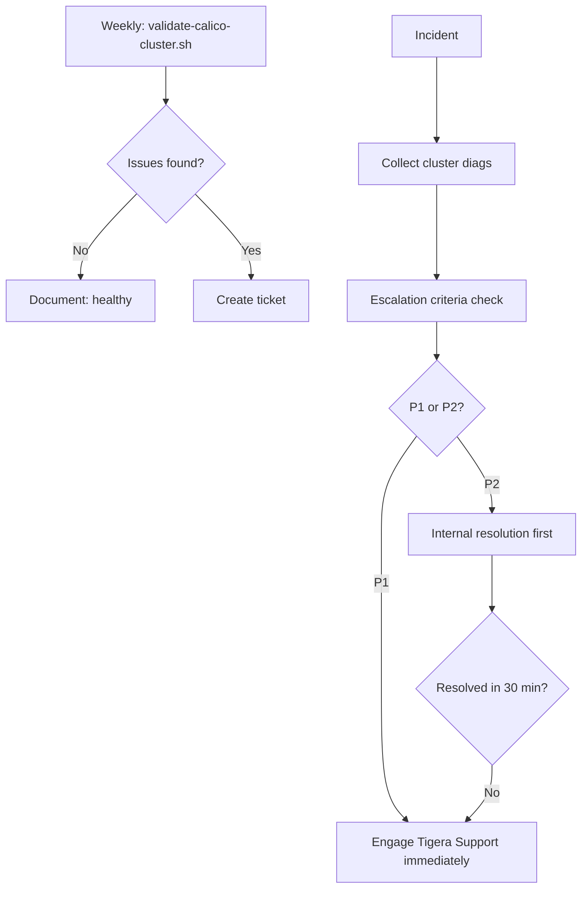

# How to Operationalize Calico Cluster Diagnostics

Author: [nawazdhandala](https://github.com/nawazdhandala)

Tags: Calico, Kubernetes, Networking, Diagnostics, Operations

Description: Build operational processes for Calico cluster diagnostics including weekly health check procedures, incident escalation criteria, diagnostic bundle retention policies, and quarterly cluster...

---

## Introduction

Operationalizing Calico cluster diagnostics means embedding diagnostic procedures into the team's regular rhythms - not just incident response. Weekly validation runs catch IPAM drift before exhaustion, quarterly health reviews identify configuration debt, and clear escalation criteria ensure the right people are engaged at the right time when cluster-wide issues occur.

## Weekly Cluster Health Check Procedure

```markdown
## Weekly Calico Cluster Health Procedure

### Every Monday:
1. Run validate-calico-cluster.sh
   Expected: all PASS
   If FAIL: create ticket, investigate this week

2. Check IPAM utilization trend
   calicoctl ipam show
   If >80%: plan to add IPPool this sprint

3. Review calico-system pod restarts from past week
   kubectl get pods -n calico-system | grep -v "0 restarts"
   If >0: investigate pod restart cause

4. Check TigeraStatus history in Prometheus
   query: changes(tigera_component_available[7d])
   Any drops to 0 = missed incident, investigate
```

## Incident Escalation Decision Tree

```markdown
## Cluster Diagnostic Escalation Criteria

| Condition | Action | Who |
|-----------|--------|-----|
| TigeraStatus degraded < 15 min | Monitor | On-call SRE |
| TigeraStatus degraded > 15 min | Open P2 | On-call SRE + Lead |
| IPAM > 95% | Open P1 | On-call SRE + Lead + Tigera Support |
| Cross-node routing broken | Open P1 | All above + escalate |
| calicoctl cluster diags fail to collect | Add to bundle, continue | Note in ticket |
```

## Diagnostic Bundle Retention Policy

```markdown
## Calico Cluster Diagnostic Bundle Retention

| Type | Retention | Storage |
|------|-----------|---------|
| Weekly health check snapshots | 90 days | S3/GCS - low cost tier |
| Incident diagnostic bundles | 1 year | S3/GCS - standard tier |
| P1 incident bundles | 3 years | S3/GCS - standard tier |

Purge policy: automated lifecycle rule
Access: incident-response IAM role only
```

## Operational Architecture



## Quarterly Cluster Health Review

```markdown
## Quarterly Calico Health Review Agenda

1. IPAM utilization trend - growing toward limit?
2. Policy count trend - unusual growth?
3. BGP peer count - expected for cluster size?
4. Calico version - current? EOL approaching?
5. TigeraStatus degradation events in quarter
6. Open Tigera Support tickets - patterns?
7. Action items for next quarter
```

## Conclusion

Operationalizing Calico cluster diagnostics requires three time horizons: weekly validation runs to catch drift, real-time incident escalation criteria to engage the right people quickly, and quarterly reviews to identify systemic trends. The most valuable operational investment is the weekly check - catching IPAM growth toward exhaustion weeks before it becomes a P1 is worth more than having a perfect P1 response playbook. Build the weekly check into your team's SRE rotation before the first IPAM exhaustion incident.
