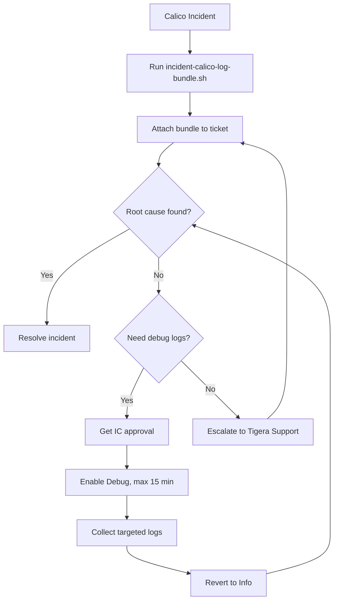

# How to Operationalize Calico Component Log Collection

Author: [nawazdhandala](https://github.com/nawazdhandala)

Tags: Calico, Kubernetes, Networking, Logging, Operations

Description: Build operational processes for Calico log collection including log level change procedures, incident log bundle standards, retention policy management, and runbooks for log collection failures.

---

## Introduction

Operationalizing Calico log collection means defining clear procedures for routine operations (log level changes, retention policy reviews) and incident operations (bundle collection, gap analysis). Without documented procedures, engineers under pressure during incidents make ad-hoc decisions — enabling Debug logging without a timeout, collecting logs from only one node, or forgetting to include CRD state alongside component logs.

## Log Level Change Procedure

```markdown
## Calico Log Level Change Runbook

### Changing to Debug (Troubleshooting Only)
1. Confirm approval from incident commander or team lead
2. Document reason in incident ticket
3. Enable Debug logging with a defined end time:
   kubectl patch felixconfiguration default \
     --type=merge -p '{"spec":{"logSeverityScreen":"Debug"}}'
4. Set a timer for maximum 15 minutes
5. Collect targeted logs immediately
6. Revert to Info:
   kubectl patch felixconfiguration default \
     --type=merge -p '{"spec":{"logSeverityScreen":"Info"}}'
7. Document what was found in ticket

### Never leave Debug logging enabled overnight or over weekends.
```

## Standard Incident Log Bundle

```bash
#!/bin/bash
# incident-calico-log-bundle.sh
# Standard bundle for all Calico incidents

INCIDENT_ID="${1:?Provide incident ID}"
BUNDLE="calico-incident-${INCIDENT_ID}-$(date +%Y%m%d-%H%M%S)"
mkdir -p "${BUNDLE}"

# Component logs (last 2000 lines per component)
kubectl logs -n calico-system -l k8s-app=calico-node \
  -c calico-node --tail=2000 --prefix=true > "${BUNDLE}/calico-node.log"
kubectl logs -n calico-system -l k8s-app=calico-typha \
  --tail=1000 --prefix=true > "${BUNDLE}/calico-typha.log"
kubectl logs -n calico-system -l k8s-app=calico-kube-controllers \
  --tail=500 --prefix=true > "${BUNDLE}/calico-kube-controllers.log"

# CRD state
kubectl get tigerastatus -o yaml > "${BUNDLE}/tigerastatus.yaml"
kubectl get installation -o yaml > "${BUNDLE}/installation.yaml"
kubectl get felixconfiguration -o yaml > "${BUNDLE}/felixconfiguration.yaml"
kubectl get nodes -o wide > "${BUNDLE}/nodes.txt"
kubectl get pods -n calico-system -o wide > "${BUNDLE}/calico-pods.txt"

tar -czf "${BUNDLE}.tar.gz" "${BUNDLE}/"
echo "Incident bundle: ${BUNDLE}.tar.gz"
echo "Attach to: incident-${INCIDENT_ID}"
```

## Operational Process Flow



## Monthly Log Retention Review

```markdown
## Monthly Log Retention Checklist

1. Verify Calico log retention meets compliance requirements:
   - Check Elasticsearch ILM policy: hot (7d) → warm (23d) → delete (30d)
   - Or Loki retention: minimum 30 days for production clusters

2. Review log volume trends:
   - Compare average daily GB vs. previous month
   - Investigate any spike (may indicate Debug logging left enabled)

3. Verify log collection coverage:
   - Run: validate-calico-log-collection.sh
   - All components should show PASS

4. Test log bundle collection procedure:
   - Run incident-calico-log-bundle.sh quarterly to verify it still works
```

## Conclusion

Operationalizing Calico log collection requires documented procedures that engineers can follow under pressure during incidents. The most important operational control is the Debug log level procedure with mandatory revert — this single document prevents the most common log collection problem (pipeline saturation from forgotten Debug logging). Run the incident bundle script quarterly to ensure it works before you need it in a real incident.
