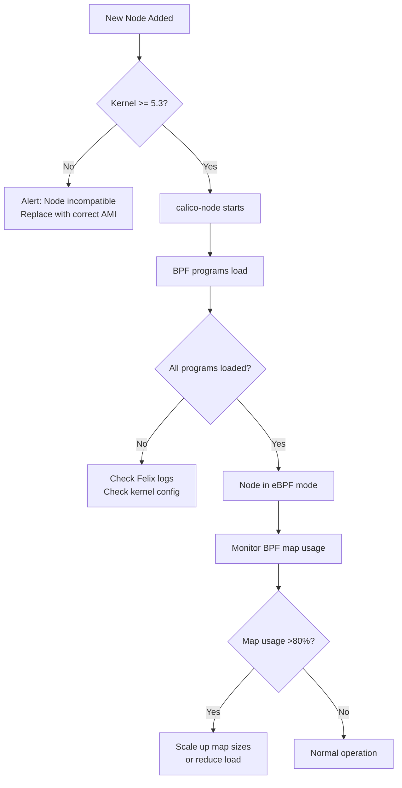

# How to Operationalize Calico eBPF Mode

Author: [nawazdhandala](https://github.com/nawazdhandala)

Tags: Calico, Kubernetes, Networking, eBPF, Operations

Description: Build sustainable operational processes for running Calico in eBPF mode, including upgrade procedures, incident response, and capacity planning for BPF maps.

---

## Introduction

Operationalizing Calico eBPF mode means building processes that keep eBPF running correctly through cluster upgrades, node replacements, kernel updates, and capacity scaling. eBPF mode introduces unique operational concerns that don't exist in iptables mode: BPF map capacity limits, kernel version requirements for new nodes, and the need to verify eBPF is active after every calico-node restart.

The most critical operational difference is that adding new nodes requires ensuring they run a compatible kernel version, and replacing nodes during autoscaling must not inadvertently introduce iptables-mode nodes in an otherwise eBPF cluster.

## Prerequisites

- Calico with eBPF mode active in production
- Monitoring configured (from previous guide)
- GitOps pipeline for configuration management

## Operational Runbook: Calico Upgrade in eBPF Mode

```markdown
## Runbook: Calico Upgrade with eBPF Mode Active

Prerequisites:
- [ ] New Calico version tested in staging with eBPF enabled
- [ ] BPF feature compatibility verified for new kernel version
- [ ] Maintenance window scheduled

Steps:
1. Verify current eBPF status
   `kubectl exec -n calico-system ds/calico-node -c calico-node -- bpftool prog list | wc -l`

2. Update ImageSet to new Calico version (see ImageSet management guide)
3. Monitor rollout
   `kubectl rollout status ds/calico-node -n calico-system -w`

4. After rollout, verify eBPF is still active on all nodes
   `./validate-ebpf-programs.sh`

5. Run connectivity test
   `./test-network-connectivity.sh`

Rollback:
- Revert ImageSet to previous version
- Verify eBPF re-activates: check felix_bpf_enabled metric
```

## Operational Concern: BPF Map Capacity Planning

```bash
# Monitor current BPF map usage trends
# BPF maps have fixed maximum sizes set at compile time

# Check current NAT table usage (service endpoints)
kubectl exec -n calico-system ds/calico-node -c calico-node -- \
  calico-node -bpf-nat-dump 2>/dev/null | wc -l

# Key capacity limits to track:
# - NAT table: scales with number of service endpoints
# - Conntrack table: scales with concurrent connections
# - Route table: scales with number of pods

# Estimate NAT table growth
SERVICE_COUNT=$(kubectl get svc --all-namespaces --no-headers | wc -l)
ENDPOINT_COUNT=$(kubectl get endpoints --all-namespaces --no-headers | \
  awk '{sum += NF} END {print sum}')
echo "Services: ${SERVICE_COUNT}, Endpoints: ~${ENDPOINT_COUNT}"
echo "Estimated NAT entries needed: $((SERVICE_COUNT * 3 + ENDPOINT_COUNT * 2))"
```

## Operational Concern: Node Replacement in eBPF Clusters

```bash
# When replacing nodes, validate new node has correct kernel
validate_new_node() {
  local node="${1}"

  echo "Validating new node ${node} for eBPF compatibility..."

  # Wait for node to be ready
  kubectl wait node/${node} --for=condition=Ready --timeout=300s

  # Check kernel version
  kernel=$(kubectl debug node/${node} --image=alpine -it --quiet -- \
    uname -r 2>/dev/null | tr -d '\r')
  echo "Kernel: ${kernel}"

  # Check calico-node is running eBPF on this node
  pod=$(kubectl get pod -n calico-system -l k8s-app=calico-node \
    --field-selector=spec.nodeName=${node} -o jsonpath='{.items[0].metadata.name}')

  bpf_programs=$(kubectl exec -n calico-system "${pod}" -c calico-node -- \
    bpftool prog list 2>/dev/null | grep -c calico || echo 0)

  if [[ "${bpf_programs}" -gt 5 ]]; then
    echo "OK: Node ${node} running eBPF mode (${bpf_programs} programs)"
  else
    echo "WARN: Node ${node} may not be in eBPF mode (only ${bpf_programs} programs)"
  fi
}
```

## eBPF Mode Operational Flow



## Daily Operational Health Check

```bash
#!/bin/bash
# daily-ebpf-health-check.sh
echo "=== Daily Calico eBPF Health Check $(date) ==="

# 1. All nodes in eBPF mode
total=$(kubectl get nodes --no-headers | wc -l)
ebpf_nodes=0

for node in $(kubectl get nodes -o jsonpath='{.items[*].metadata.name}'); do
  pod=$(kubectl get pod -n calico-system -l k8s-app=calico-node \
    --field-selector=spec.nodeName=${node} \
    -o jsonpath='{.items[0].metadata.name}' 2>/dev/null)
  [[ -z "${pod}" ]] && continue

  programs=$(kubectl exec -n calico-system "${pod}" -c calico-node -- \
    bpftool prog list 2>/dev/null | grep -c calico || echo 0)
  [[ "${programs}" -gt 5 ]] && ebpf_nodes=$((ebpf_nodes + 1))
done

echo "eBPF active: ${ebpf_nodes}/${total} nodes"
[[ "${ebpf_nodes}" -eq "${total}" ]] && echo "STATUS: HEALTHY" || echo "STATUS: DEGRADED"
```

## Conclusion

Operationalizing Calico eBPF mode requires attention to kernel version governance for new nodes, BPF map capacity planning as the cluster scales, and including eBPF validation in the standard post-upgrade checklist. Unlike iptables mode, eBPF mode has hard capacity limits in BPF maps that can cause unexpected failures as your cluster grows. Build capacity monitoring into your operations toolkit from day one, and ensure your node AMI/image pipeline always provides kernels compatible with Calico's eBPF requirements.
