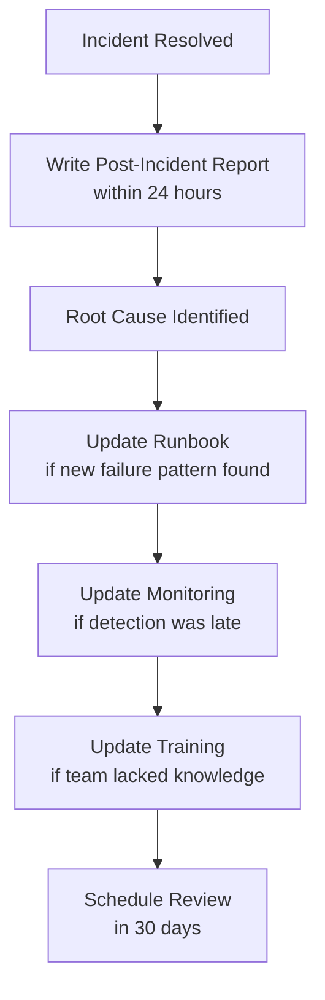

# How to Operationalize Calico eBPF Troubleshooting

Author: [nawazdhandala](https://github.com/nawazdhandala)

Tags: Calico, Kubernetes, Networking, eBPF, Troubleshooting, Operations

Description: Build sustainable operational processes for Calico eBPF troubleshooting including runbooks, on-call training, and post-incident learning workflows.

---

## Introduction

Operationalizing Calico eBPF troubleshooting means ensuring that any engineer on your on-call rotation can effectively diagnose and resolve eBPF issues, not just those with deep eBPF expertise. This requires: documented runbooks for each alert type, a skills training program for on-call engineers, a diagnostic bundle process that provides context without deep expertise, and post-incident learning loops that continuously improve the runbooks.

## On-Call Training Curriculum

The minimum eBPF knowledge for on-call rotation:

```markdown
## Module 1: eBPF Basics (1 hour)
- What BPF programs are and why they replace iptables
- Key BPF maps: conntrack, NAT, routes
- How to check if eBPF mode is active

## Module 2: Diagnostic Tools (2 hours)
- Using bpftool prog list / map list
- Reading Felix logs for eBPF events
- Using calico-node -bpf-* commands
- Running the diagnostic bundle script

## Module 3: Common Failure Patterns (1 hour)
- eBPF mode regression to iptables
- BPF map exhaustion symptoms
- Service routing failures
- Policy enforcement failures

## Module 4: Hands-on Lab (2 hours)
- Intentionally break eBPF mode
- Diagnose using toolkit
- Follow runbook to remediate
```

## Runbook: eBPF Mode Regression

```markdown
## Runbook: CalicoEBPFModeRegression Alert

### Symptoms
- Alert: CalicoEBPFModeRegression
- Users report: possible service latency increase
- felix_bpf_enabled == 0 on affected node(s)

### Step 1: Identify Scope
```bash
kubectl exec -n calico-system -l app=calico-node -- \
  sh -c 'bpftool prog list 2>/dev/null | grep -c calico || echo 0'
```
- If 0 on all nodes: cluster-wide regression
- If 0 on some nodes: partial regression (more dangerous)

### Step 2: Check Root Cause
```bash
kubectl logs -n calico-system ds/calico-node -c calico-node | \
  grep -i "bpf\|fallback" | tail -20
```
- "kernel doesn't support BPF": kernel version issue
- "mount failed": BPF filesystem not mounted
- "Installation changed": operator config changed

### Step 3: Remediate
Based on root cause:
A. BPF filesystem not mounted:
   kubectl debug node/<node> -it --image=ubuntu:22.04 -- mount -t bpf bpffs /sys/fs/bpf
   kubectl delete pod -n calico-system -l app=calico-node --field-selector=spec.nodeName=<node>

B. Installation changed:
   kubectl patch installation default --type=merge -p '{"spec":{"calicoNetwork":{"linuxDataplane":"BPF"}}}'

C. Kernel issue: Replace node with correct kernel version

### Step 4: Validate
./validate-calico-ebpf-installation.sh
```

## Post-Incident Learning Process



## Incident Response Time Tracking

```bash
# Track MTTR for eBPF incidents
# (Add to your incident management system)

INCIDENT_TYPES=(
  "ebpf-mode-regression"
  "bpf-map-exhaustion"
  "service-routing-failure"
  "policy-enforcement-gap"
)

# After each incident, log:
# - Alert fired at:
# - Engineer engaged at:
# - Root cause identified at:
# - Resolved at:
# - MTTR = Resolved - Alert fired

# Target MTTRs:
# - eBPF mode regression: < 30 minutes
# - BPF map exhaustion: < 60 minutes
# - Novel/complex issues: < 4 hours
```

## Conclusion

Operationalizing eBPF troubleshooting turns specialized knowledge into team-wide capability. By building a training curriculum that brings all on-call engineers to a minimum competency level, maintaining runbooks for each known alert type, automating diagnostic data collection, and running post-incident learning loops, you continuously improve both the speed of resolution and the quality of your runbooks. Track MTTR as a key operational metric — a declining MTTR over time is evidence that your operationalization efforts are working.
