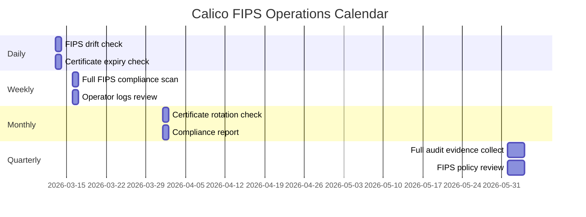

# How to Operationalize Calico FIPS Mode

Author: [nawazdhandala](https://github.com/nawazdhandala)

Tags: Calico, Kubernetes, Networking, FIPS, Operations, Compliance

Description: Build sustainable operational processes for maintaining Calico FIPS compliance including change control procedures, regular validation cadences, and incident response runbooks.

---

## Introduction

Operationalizing Calico FIPS mode means building processes that keep your cluster FIPS-compliant through the full lifecycle: initial deployment, Calico upgrades, node replacements, certificate rotations, and incident response. A one-time FIPS setup without operational processes will drift out of compliance as changes accumulate over time.

The operational framework for FIPS compliance needs to answer: Who is responsible for maintaining FIPS status? How are Calico upgrades validated for FIPS before production? What happens when a FIPS violation is detected? How is compliance evidence collected for audits? These questions require people, process, and tooling working together.

## Prerequisites

- Calico deployed with FIPS mode enabled
- Monitoring and alerting configured
- Git-based change management
- Incident response tooling

## Operational Cadence



## Runbook: Calico Upgrade in FIPS Environment

```markdown
## Runbook: Upgrade Calico in FIPS Environment

Pre-requisites:
- [ ] New Calico version has FIPS-enabled images available
- [ ] FIPS images tested in staging cluster for 72 hours
- [ ] Compliance team approval for version change

Steps:
1. Mirror FIPS images to private registry
   `./scripts/mirror-calico-fips-images.sh v3.28.0`

2. Verify FIPS build labels on new images
   `./scripts/verify-fips-image-labels.sh v3.28.0`

3. Generate new ImageSet with FIPS images
   `./scripts/generate-fips-imageset.sh v3.28.0`

4. Create PR for review
   - Include FIPS validation results from staging
   - Security team sign-off required

5. Apply to production after approval
   `flux reconcile kustomization calico-fips`

6. Run full FIPS validation
   `./scripts/validate-fips-full.sh`

7. Collect compliance evidence
   `./scripts/generate-fips-report.sh > reports/$(date +%Y%m%d)-post-upgrade.txt`

Rollback:
- Revert ImageSet to previous version
- Estimated time: 20 minutes
```

## Runbook: FIPS Violation Response

```markdown
## Runbook: Respond to FIPS Compliance Alert

Trigger: Alert "CalicoFIPSModeDrift" or "CalicoCertExpired"

Severity: P1 (FIPS mode disabled) / P2 (cert expiry within 7 days)

Steps:
1. Acknowledge alert
2. Identify the violation:
   `kubectl get installation default -o jsonpath='{.spec.fipsMode}'`
   `./scripts/validate-calico-certs-fips.sh`

3. If fipsMode disabled:
   a. Check who changed it: kubectl audit logs
   b. Re-enable: kubectl patch installation default \
        --type=merge -p '{"spec":{"fipsMode":"Enabled"}}'
   c. Notify compliance team within 1 hour

4. If certificate expired/expiring:
   a. Delete the secret to force regeneration:
      kubectl delete secret -n calico-system <cert-secret>
   b. Verify operator regenerates with FIPS algorithm
   c. Run certificate validation script

5. Document incident in compliance log
6. Update runbook if new failure mode discovered
```

## Evidence Collection for Audits

```bash
#!/bin/bash
# collect-fips-audit-evidence.sh
AUDIT_DIR="fips-audit-$(date +%Y%m%d)"
mkdir -p "${AUDIT_DIR}"

# Installation configuration
kubectl get installation default -o yaml > "${AUDIT_DIR}/installation.yaml"

# ImageSet(s)
kubectl get imageset -o yaml > "${AUDIT_DIR}/imagesets.yaml"

# TigeraStatus
kubectl get tigerastatus -o yaml > "${AUDIT_DIR}/tigerastatus.yaml"

# Pod images
kubectl get pods -n calico-system \
  -o jsonpath='{range .items[*]}{.metadata.name}{"\t"}{range .spec.containers[*]}{.image}{"\n"}{end}{end}' \
  > "${AUDIT_DIR}/pod-images.txt"

# Certificate details
for secret in calico-typha-tls calico-node-tls; do
  kubectl get secret -n calico-system "${secret}" \
    -o jsonpath='{.data.tls\.crt}' | base64 -d | \
    openssl x509 -noout -text 2>/dev/null \
    > "${AUDIT_DIR}/${secret}-cert.txt"
done

echo "Audit evidence collected in: ${AUDIT_DIR}/"
tar -czf "${AUDIT_DIR}.tar.gz" "${AUDIT_DIR}/"
echo "Archive: ${AUDIT_DIR}.tar.gz"
```

## Conclusion

Operationalizing Calico FIPS mode requires a structured approach to daily monitoring, upgrade processes, incident response, and audit evidence collection. By establishing clear ownership, runbooks for common scenarios, and automated evidence collection, you transform FIPS compliance from a snapshot state into a continuous, defensible posture. The most important operational habit is treating any FIPS drift alert as a P1 incident - the compliance clock starts the moment a violation occurs, and fast response is essential.
