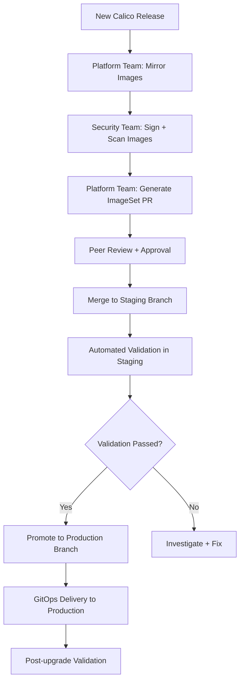

# How to Operationalize Calico ImageSet Management

Author: [nawazdhandala](https://github.com/nawazdhandala)

Tags: Calico, Kubernetes, Networking, ImageSet, Operations, GitOps

Description: Build production-grade operational processes for Calico ImageSet management including runbooks, change management workflows, and team ownership models.

---

## Introduction

Operationalizing Calico ImageSet management means turning a technical configuration into a reliable, repeatable process that your entire team can execute consistently. Without operational processes, ImageSet management becomes a hero task — one person who knows the exact steps required to upgrade Calico images, and everyone else blocked when that person is unavailable.

Good operationalization includes: documented runbooks for common tasks, defined change management processes for upgrades, clear ownership of the registry and ImageSet resources, and tested rollback procedures. These processes protect against both accidental misconfiguration and planned maintenance windows going wrong.

This guide provides the operational frameworks and runbook templates for managing Calico ImageSets in production environments.

## Prerequisites

- Calico installed via the Tigera Operator with ImageSet
- Git repository for GitOps delivery (Flux or ArgoCD)
- Team members with defined RACI ownership
- Incident response tooling

## Operational Model



## Runbook 1: Calico Version Upgrade via ImageSet

```markdown
## Runbook: Calico Version Upgrade via ImageSet

**Owner**: Platform Engineering
**Estimated Time**: 2-4 hours
**Risk Level**: Medium
**Rollback Time**: 15 minutes

### Pre-requisites
- [ ] New Calico version tested in staging cluster
- [ ] Images scanned for CVEs (zero critical)
- [ ] Change window scheduled
- [ ] On-call engineer available during window

### Steps
1. Mirror new version images to private registry
   `./scripts/mirror-calico-images.sh v3.28.0`

2. Sign mirrored images
   `./scripts/sign-calico-images.sh v3.28.0`

3. Generate new ImageSet manifest
   `./scripts/generate-imageset.sh v3.28.0`

4. Create PR with new ImageSet
   Review: `calico/imagesets/calico-v3.28.0.yaml`

5. Merge PR and monitor GitOps reconciliation
   `kubectl get tigerastatus -w`

6. Validate using standard validation script
   `./scripts/full-validate-imageset.sh`

### Rollback Procedure
1. Revert the PR in Git
2. Force GitOps reconciliation:
   `flux reconcile kustomization calico-imageset --with-source`
3. Verify previous ImageSet is active:
   `kubectl get installation default -o jsonpath='{.status.imageSet}'`
```

## Runbook 2: Emergency Rollback

```bash
#!/bin/bash
# emergency-rollback-imageset.sh
PREVIOUS_VERSION="${1:-v3.26.0}"
IMAGESET_NAME="calico-${PREVIOUS_VERSION}"

echo "Starting emergency rollback to ImageSet: ${IMAGESET_NAME}"

# Verify previous ImageSet exists
if ! kubectl get imageset "${IMAGESET_NAME}" > /dev/null 2>&1; then
  echo "ERROR: ImageSet ${IMAGESET_NAME} not found. Cannot rollback."
  exit 1
fi

# Patch Installation to reference previous ImageSet
# Note: The operator picks the ImageSet matching the version in the Installation
echo "Rolling back Calico version..."
kubectl patch installation default --type=merge \
  -p "{\"spec\":{\"version\":\"${PREVIOUS_VERSION}\"}}"

# Monitor rollback
echo "Monitoring rollback..."
kubectl rollout status ds/calico-node -n calico-system --timeout=300s

echo "Rollback complete. Validating..."
kubectl get pods -n calico-system
```

## Team RACI

| Task | Responsible | Accountable | Consulted | Informed |
|------|-------------|-------------|-----------|----------|
| Image Mirroring | Platform Eng | Platform Lead | Security | DevOps |
| Image Signing | Security | Security Lead | Platform | Compliance |
| ImageSet PR | Platform Eng | Platform Lead | Security | Team |
| Production Apply | Platform Eng | Platform Lead | On-call | Stakeholders |
| Validation | Platform Eng | Platform Lead | QA | Management |

## Change Management Integration

```bash
# Template for change ticket
cat <<'EOF'
CHANGE REQUEST: Calico ImageSet Update

Type: Standard Change
Risk: Medium
Impact: Cluster networking components restart (rolling)

Description:
  Update Calico ImageSet from calico-v3.26.0 to calico-v3.27.0.
  All images sourced from internal registry.
  Images scanned and signed by security team.

Rollback Plan:
  Revert Git commit and force Flux reconciliation.
  Estimated rollback time: 15 minutes.

Testing Done:
  - Validated in staging cluster for 48 hours
  - All CVE scans passed
  - Network policy tests passing
EOF
```

## Conclusion

Operationalizing Calico ImageSet management transforms image upgrades from ad-hoc procedures into reliable, team-executable workflows. Clear runbooks, defined ownership via RACI, GitOps-based delivery, and tested rollback procedures eliminate the "hero dependency" problem and make upgrades predictable. Treat your ImageSet management process with the same rigor you apply to other critical infrastructure changes — it controls the images running at the heart of your cluster's network fabric.
