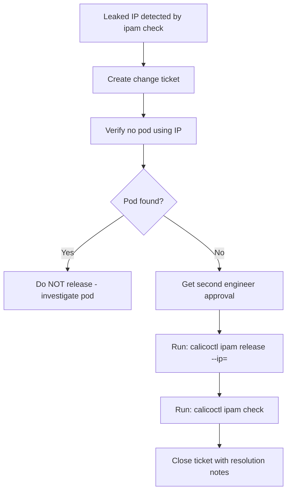

# How to Operationalize Calico IPAM Checks

Author: [nawazdhandala](https://github.com/nawazdhandala)

Tags: Calico, Kubernetes, Networking, IPAM, Operations

Description: Build operational processes for Calico IPAM management including regular health check schedules, IPPool expansion procedures, IP release approval workflows, and capacity planning guidelines.

---

## Introduction

Operationalizing Calico IPAM checks means making them part of regular team operations rather than reactive incident procedures. Three operational processes cover the full IPAM lifecycle: weekly health checks (detect issues early), IPPool expansion procedure (respond to growth), and IP release workflow (safely clean leaked allocations).

## Weekly IPAM Health Check Procedure

```markdown
## Weekly IPAM Health Check (Every Monday)

### Step 1: Run consistency check
calicoctl ipam check
Expected: "IPAM is consistent"
If inconsistent: create ticket IPAM-YYYYMMDD, investigate this week

### Step 2: Check utilization
calicoctl ipam show
Record current utilization %

Thresholds:
- < 70%: no action needed
- 70-85%: plan IPPool expansion for next sprint
- 85-95%: expand IPPool this week (P2 task)
- > 95%: immediate action (P1)

### Step 3: Review IPAM utilization trend
Compare to last 4 weeks' utilization
If growing >5%/week: escalate to capacity planning review
```

## IPPool Expansion Procedure

```bash
#!/bin/bash
# add-calico-ippool.sh
# Run after peer/network team approves new CIDR

NEW_CIDR="${1:?Provide new CIDR e.g. 10.250.0.0/16}"
POOL_NAME="pool-$(echo ${NEW_CIDR} | tr '/.' '-')"

echo "Adding IPPool ${POOL_NAME} with CIDR ${NEW_CIDR}"
echo "Ensure this CIDR does not overlap with existing networks"

calicoctl apply -f - << YAML
apiVersion: projectcalico.org/v3
kind: IPPool
metadata:
  name: ${POOL_NAME}
spec:
  cidr: ${NEW_CIDR}
  ipipMode: Always
  natOutgoing: true
YAML

echo "Verifying new pool..."
calicoctl get ippool "${POOL_NAME}" -o yaml
echo "Run calicoctl ipam show to verify pool appears in allocation table"
```

## IP Release Approval Workflow



## IPAM Capacity Planning

```markdown
## IPAM Capacity Planning Guide

### Calculate runway to exhaustion:
Current utilization: X%
Weekly growth rate: Y% per week
Runway = (85% - X%) / Y% weeks
(Target: maintain 85% as soft limit)

### IPPool sizing for common cluster sizes:
- < 100 nodes, < 50 pods/node: /18 pool (16,382 IPs)
- 100-500 nodes, < 50 pods/node: /16 pool (65,534 IPs)
- > 500 nodes or high pod density: multiple /16 pools
```

## Conclusion

Operationalizing IPAM checks requires three artifacts: a weekly check procedure with clear thresholds and escalation paths, an IPPool expansion procedure that can be executed in under 10 minutes when needed, and a gated IP release workflow that prevents accidental IP corruption. The capacity planning guide transforms reactive "we're at 95%" alerts into proactive expansion tasks initiated at 70% utilization, giving the team weeks rather than hours to respond.
