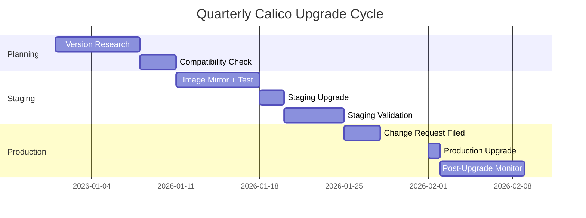

# How to Operationalize Calico on Kubernetes Upgrades

Author: [nawazdhandala](https://github.com/nawazdhandala)

Tags: Calico, Kubernetes, Networking, Upgrades, Operations

Description: Build a sustainable operational process for regular Calico upgrades including upgrade scheduling, team readiness, runbooks, and continuous improvement workflows.

---

## Introduction

Operationalizing Calico upgrades means establishing a regular upgrade cadence, clear team responsibilities, documented processes, and continuous improvement based on upgrade experience. Ad-hoc upgrades driven by security incidents are stressful and risky; planned quarterly upgrades are routine and low-risk.

## Quarterly Upgrade Cadence



## Upgrade Readiness Assessment

```bash
#!/bin/bash
# upgrade-readiness-check.sh
TARGET_VERSION="${1:?Provide target version}"
echo "=== Upgrade Readiness Check for ${TARGET_VERSION} ==="

# 1. Current state healthy?
echo "1. Current Calico health:"
kubectl get tigerastatus

# 2. Any pending pod restarts?
RESTARTS=$(kubectl get pods -n calico-system \
  -o jsonpath='{range .items[*]}{.status.containerStatuses[*].restartCount}{"\n"}{end}' | \
  awk '{sum += $1} END {print sum}')
echo "2. Total pod restarts in calico-system: ${RESTARTS}"
[[ "${RESTARTS}" -gt 10 ]] && echo "   WARNING: High restart count - investigate before upgrading"

# 3. Node health
NOT_READY=$(kubectl get nodes --no-headers | grep -v " Ready" | wc -l)
echo "3. NotReady nodes: ${NOT_READY} (should be 0)"

# 4. IP pool capacity
echo "4. IP pool status:"
calicoctl get ippools | head -5
```

## Upgrade Runbook (Abbreviated)

```markdown
## Runbook: Quarterly Calico Upgrade

**Owner**: Platform Engineering
**Frequency**: Quarterly (or sooner for security patches)
**Duration**: 2-4 hours

### Pre-Week Preparation
- [ ] Identify target Calico version (latest patch of current minor)
- [ ] Review release notes for breaking changes
- [ ] Mirror images to private registry
- [ ] Run CVE scans on new images
- [ ] Test in dev cluster

### Upgrade Day
- [ ] Maintenance window opened
- [ ] Run readiness check script
- [ ] Apply new ImageSet/Installation via GitOps PR
- [ ] Monitor upgrade progress (./monitor-calico-upgrade.sh)
- [ ] Run post-upgrade validation
- [ ] Close maintenance window

### Post-Upgrade (Next 24 hours)
- [ ] Monitor Felix latency for regressions
- [ ] Check for any support tickets related to networking
- [ ] Update upgrade log
```

## Upgrade Experience Log

```bash
# Maintain an upgrade log for continuous improvement
cat >> upgrade-log.md <<EOF

## Upgrade: Calico ${CURRENT_VERSION} → ${TARGET_VERSION}
**Date**: $(date +%Y-%m-%d)
**Duration**: XX minutes
**Affected Clusters**: [list]
**Issues Encountered**: [none / list issues]
**Lessons Learned**: [what to do differently next time]
**Runbook Updates Needed**: [yes/no - which sections]

EOF
```

## Conclusion

Operationalizing Calico upgrades through a quarterly cadence, readiness checks, standard runbooks, and experience logging transforms upgrades from unpredictable events into routine maintenance. The upgrade experience log is particularly valuable — it captures institutional knowledge about what goes wrong and how to prevent it, building team expertise over time. Treat upgrade issues as learning opportunities and update the runbook immediately after each upgrade while the experience is fresh.
