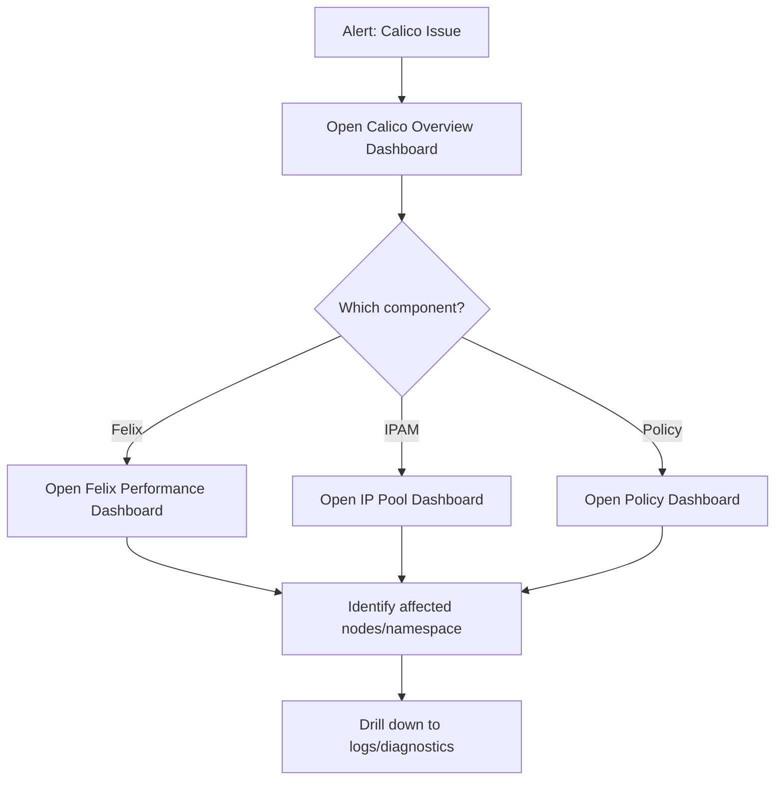

# How to Operationalize Calico Metrics Visualization

Author: [nawazdhandala](https://github.com/nawazdhandala)

Tags: Calico, Kubernetes, Networking, Metrics, Grafana, Operations

Description: Build operational processes around Calico Grafana dashboards including review cadences, on-call integration, capacity planning workflows, and dashboard governance.

---

## Introduction

Operationalizing Calico visualization means integrating dashboards into your team's daily workflows: using them for morning health checks, capacity planning reviews, on-call incident response, and post-incident analysis. Without these workflows, dashboards become shelfware that nobody looks at until there's a crisis - at which point unfamiliarity with the dashboards slows incident response.

## Daily Health Check Workflow

```markdown
## Daily Calico Networking Health Check (5 minutes)

Dashboard: Calico Overview

Check the following each morning:
1. IP Pool Utilization - is any pool above 80%?
2. Node Felix Status - any nodes missing metrics?
3. Policy Programming Latency - any spikes overnight?
4. calico-node Pod Status - all pods running?

Escalation criteria:
- IP pool >85% → Create capacity ticket
- Any node missing → Investigate calico-node on that node
- Latency >500ms p99 → Check for policy storms
```

## Capacity Planning with Dashboards

```promql
# IP pool forecast: at current growth rate, when will pool fill up?
predict_linear(
  sum(ipam_allocations_per_node)[7d:1h],
  7 * 24 * 3600  # predict 7 days out
)
# Compare to pool capacity to determine runway
```

## On-Call Dashboard Workflow



## Dashboard Governance

```markdown
## Dashboard Change Process

1. All dashboard changes via PR to Git repo
2. Changes tested in dev cluster first
3. Review by at least one peer
4. Changes deployed via GitOps (ConfigMap update)
5. Post-deploy validation run
6. CHANGELOG updated with panel/query changes
```

## Conclusion

Operationalizing Calico dashboards means integrating them into daily workflows, on-call procedures, and capacity planning processes. The dashboards are only valuable if engineers look at them regularly and trust their accuracy. Daily health check workflows build familiarity, capacity planning dashboards with forecasting enable proactive IP pool management, and clear on-call workflows ensure engineers know exactly which dashboard to open for each alert type.
