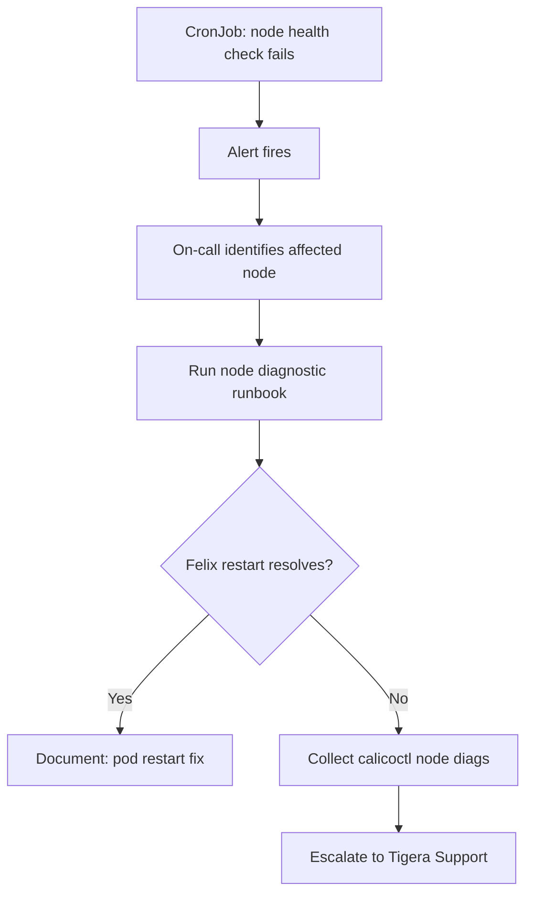

# How to Operationalize Calico Node Diagnostics

Author: [nawazdhandala](https://github.com/nawazdhandala)

Tags: Calico, Kubernetes, Networking, Diagnostics, Operations

Description: Build operational processes for Calico node diagnostics including node-specific runbooks, automated health checks, and escalation procedures for single-node Calico failures.

---

## Introduction

Operationalizing Calico node diagnostics means defining repeatable processes for detecting and responding to single-node Calico failures. Without a clear procedure, on-call engineers often treat single-node failures as cluster-wide issues, leading to unnecessary broad changes. Node-specific runbooks and automated health checks ensure the right response at the right scope.

## Node Diagnostic Runbook

```markdown
## Calico Single-Node Failure Runbook

### When to Use
- Pods on one specific node cannot communicate
- Other nodes are unaffected
- TigeraStatus shows all components Available

### Step 1: Identify the Affected Node
kubectl get pod <failing-pod> -n <ns> -o jsonpath='{.spec.nodeName}'

### Step 2: Find the Node's calico-node Pod
kubectl get pods -n calico-system -l k8s-app=calico-node \
  --field-selector=spec.nodeName=<affected-node>

### Step 3: Check Felix Health
kubectl exec -n calico-system <calico-pod> -c calico-node -- \
  calico-node -felix-live

### Step 4: Check Felix Logs
kubectl logs -n calico-system <calico-pod> -c calico-node | \
  grep -i "error\|panic" | tail -20

### Step 5: Attempt Fix
If Felix not live OR logs show panic:
kubectl delete pod -n calico-system <calico-pod>
Wait 60s, recheck connectivity

### Step 6: If Unresolved
Collect: calicoctl node diags
Escalate to Tigera Support with diag bundle + logs
```

## Automated Node Health Check CronJob

```yaml
apiVersion: batch/v1
kind: CronJob
metadata:
  name: calico-node-health-check
  namespace: calico-system
spec:
  schedule: "*/5 * * * *"
  jobTemplate:
    spec:
      template:
        spec:
          serviceAccountName: calico-diagnostics
          containers:
            - name: node-health
              image: bitnami/kubectl:latest
              command:
                - /bin/sh
                - -c
                - |
                  NOT_READY=$(kubectl get ds calico-node -n calico-system \
                    -o jsonpath='{.status.numberUnavailable}' 2>/dev/null || echo 0)
                  if [ "${NOT_READY}" -gt 0 ]; then
                    echo "ALERT: ${NOT_READY} calico-node pods not ready"
                    exit 1
                  fi
          restartPolicy: OnFailure
```

## Operational Flow



## Node Failure Severity Classification

```markdown
## Node Failure Severity Guide

| Condition | Severity | Action |
|-----------|----------|--------|
| 1 node affected, pod restart resolves | P3 | Document, monitor |
| 1 node affected, pod restart fails | P2 | Escalate to Tigera |
| 2-3 nodes affected simultaneously | P2 | Check for DaemonSet issue |
| >3 nodes affected or growing | P1 | Cluster-wide incident |
```

## Conclusion

Operationalizing Calico node diagnostics requires a clear severity classification that determines when a node failure is handled as a standard P3 (pod restart, document) versus escalated as a P2 requiring Tigera support involvement. The automated CronJob provides early detection, the runbook provides the response procedure, and the severity guide prevents under-reacting to patterns that indicate systemic issues.
