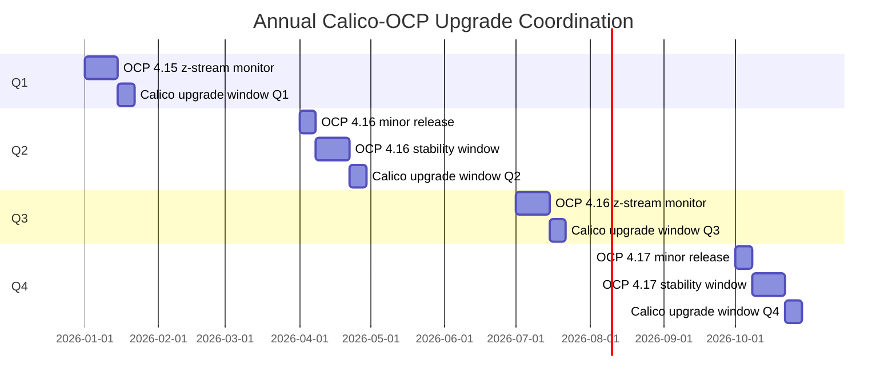

# How to Operationalize Calico on OpenShift Upgrades

Author: [nawazdhandala](https://github.com/nawazdhandala)

Tags: Calico, OpenShift, Kubernetes, Networking, Upgrade, Operations

Description: Build operational processes for regular Calico upgrades on OpenShift, coordinating with OCP upgrade cycles and Red Hat support requirements.

---

## Introduction

Operationalizing Calico upgrades on OpenShift requires coordinating with Red Hat's OpenShift release calendar. OCP releases follow a predictable cadence (minor versions every 4-6 months, z-stream patches monthly), and Calico upgrades should be scheduled to follow OCP stability windows - after OCP z-stream patches have been running for 2+ weeks without issues.

## OCP-Calico Upgrade Coordination Calendar



## OCP-Specific Upgrade Runbook Addition

```markdown
## Additional OCP Steps for Calico Upgrade Runbook

### Before Starting (OCP-Specific)
1. Check Red Hat Customer Portal for active OCP issues:
   https://access.redhat.com/articles/open-cluster-management-supportability

2. Verify no pending MachineConfig changes:
   `oc get mc | head -5`
   `oc get mcp`

3. Check cluster operator health:
   `oc get co | grep -v "True.*False.*False"`
   All should show: True/False/False (Available/Progressing/Degraded)

### After Upgrade (OCP-Specific)
1. Verify no new MachineConfigs were created by upgrade:
   `oc get mc | grep calico`

2. Run must-gather if any issues:
   `oc adm must-gather`

3. Open Red Hat support ticket if upgrade causes cluster operator degradation:
   Include calico-system logs and tigerastatus output
```

## Escalation Path for OCP-Calico Issues

```markdown
## Issue Escalation Matrix

| Issue | First Response | Escalation |
|-------|---------------|------------|
| SCC binding failure | Platform Engineering | Red Hat Support |
| OCP Network CO degraded | Platform Engineering | Red Hat Support (P1) |
| Calico-specific failure | Platform Engineering | Tigera Support |
| OCP + Calico interaction | Platform Engineering | Both vendors |

## Red Hat Support Ticket Requirements
- OCP version: `oc version`
- must-gather: `oc adm must-gather`
- Calico version: `kubectl get installation default -o yaml`
- TigeraStatus: `kubectl get tigerastatus -o yaml`
```

## Conclusion

Operationalizing Calico upgrades on OpenShift requires coordination with Red Hat's release calendar, maintaining escalation paths to both Red Hat and Tigera support, and scheduling upgrades during OCP stability windows. The OCP-specific runbook additions and escalation matrix ensure your team knows exactly what to do and who to contact when OCP-specific issues arise during Calico upgrades.
