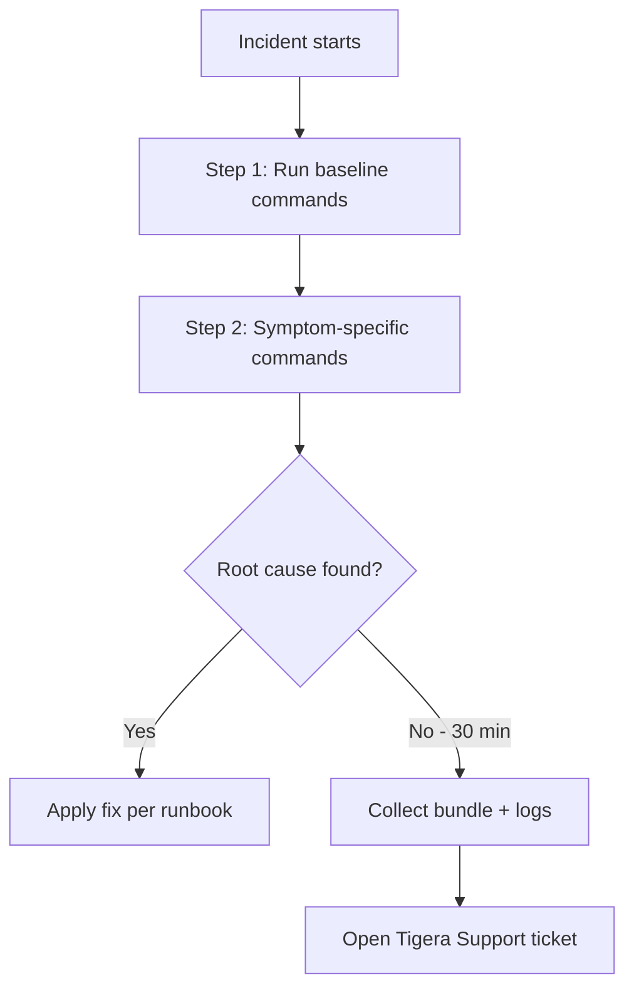

# How to Operationalize Calico Troubleshooting Commands

Author: [nawazdhandala](https://github.com/nawazdhandala)

Tags: Calico, Kubernetes, Networking, Troubleshooting, Operations

Description: Build operational processes around Calico troubleshooting commands including command reference cards, on-call training requirements, runbook integration, and quarterly toolkit validation procedures.

---

## Introduction

Operationalizing Calico troubleshooting commands means embedding them into team workflows so they are used consistently: in runbooks, on-call training, and incident templates. The goal is to ensure any engineer on the team can run the right Calico diagnostic commands in the right order, regardless of their depth of Calico expertise.

## Calico Command Reference Card

```markdown
## Calico Quick Reference (On-Call Card)

### First 5 Minutes of Any Calico Incident

1. `kubectl get tigerastatus`
   → Are all components Available?

2. `kubectl get pods -n calico-system`
   → Are all pods Running? Any CrashLoopBackOff?

3. `calicoctl get felixconfiguration -o yaml | grep logSeverity`
   → Is Debug logging enabled? (If yes, revert immediately)

4. `kubectl logs -n calico-system -l app=calico-node -c calico-node --tail=30 | grep -i error`
   → Any Felix errors related to the symptom?

5. `calicoctl ipam show`
   → IPAM utilization normal?

### If BGP-related
- `calicoctl node status` (on affected node's calico-node pod)
- `calicoctl get bgppeer`

### If Policy-related
- `calicoctl get globalnetworkpolicy`
- `calicoctl get networkpolicy -n <namespace>`
```

## On-Call Training Curriculum

```markdown
## Calico Troubleshooting Command Training

### Required Before First On-Call Shift:
1. Install and configure calicoctl on workstation
2. Run validate-calico-commands.sh against staging cluster - all PASS
3. Practice collecting diagnostic bundle in non-prod environment
4. Review on-call reference card - explain each command's purpose

### Lab Exercises:
1. Simulate: Deploy a NetworkPolicy, break pod connectivity, diagnose with calicoctl get
2. Simulate: Exhaust IPAM in a namespace, detect with calicoctl ipam show
3. Simulate: Break a BGP peer, diagnose with calicoctl node status
```

## Incident Runbook Integration

```markdown
## Calico Networking Incident Runbook (Standard Steps)

### Step 1 - Baseline Collection (always first)
kubectl get tigerastatus
kubectl get pods -n calico-system
calicoctl ipam show

### Step 2 - Symptom-Specific Commands
*See: symptom index below*

### Step 3 - Log Collection
Run: ./calico-diag-bundle.sh
Attach bundle to incident ticket

### Escalation: If unresolved in 30 minutes
Run: ./collect-calico-logs.sh
Open Tigera Support ticket with bundle + logs
```

## Operational Flow



## Quarterly Toolkit Review

```markdown
## Quarterly Calico Command Toolkit Review

1. Run validate-calico-commands.sh against production
2. Update calicoctl if cluster version has changed
3. Review any new calicoctl commands from Calico release notes
4. Run tabletop exercise: simulate 1 BGP + 1 IPAM incident
5. Update on-call reference card with any new commands
```

## Conclusion

Operationalizing Calico troubleshooting commands requires embedding them into three artifacts: a quick reference card for on-call engineers, training requirements that ensure command fluency before the first shift, and runbook integration that prescribes the exact commands to run for each symptom type. Quarterly toolkit reviews keep the reference current with new Calico versions and prevent drift between the documented commands and what's actually available in the cluster.
