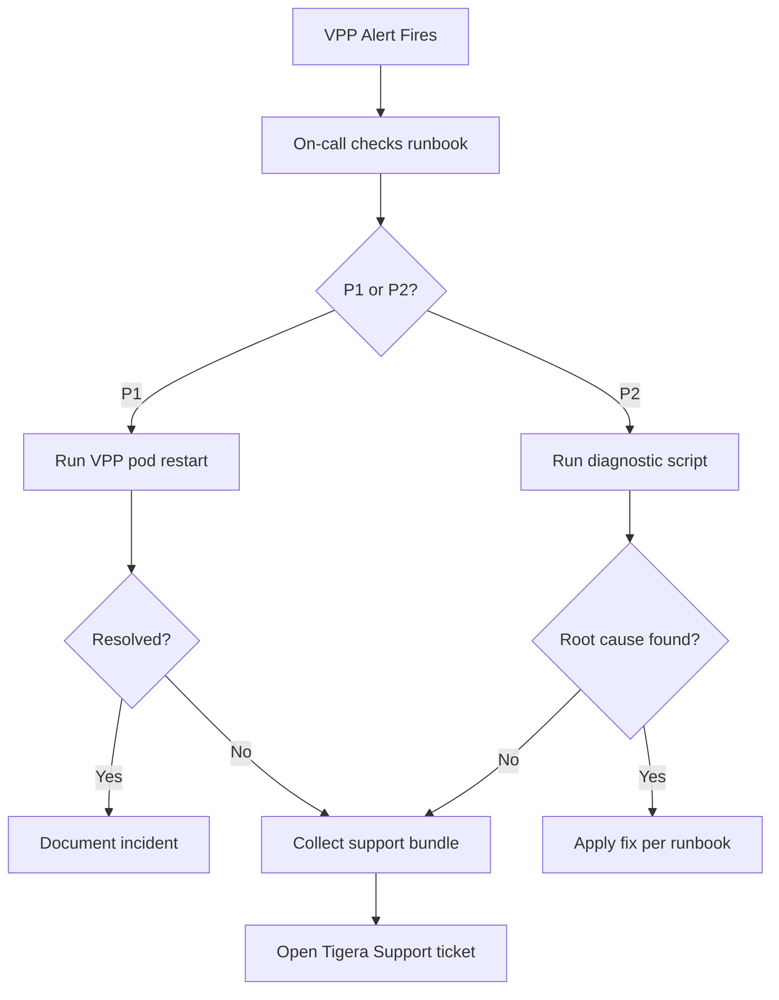

# How to Operationalize Calico VPP Troubleshooting

Author: [nawazdhandala](https://github.com/nawazdhandala)

Tags: Calico, VPP, Kubernetes, Networking, Troubleshooting, Operations

Description: Build operational processes for Calico VPP troubleshooting including runbooks, on-call procedures, diagnostic bundle standards, and escalation paths to Tigera support for VPP-specific issues.

---

## Introduction

Operationalizing Calico VPP troubleshooting means creating repeatable processes so any on-call engineer can diagnose VPP issues without needing deep VPP expertise. The key is documenting the VPP-specific diagnostic commands, establishing a clear escalation path to Tigera support, and maintaining a pre-collected diagnostic bundle format that Tigera support requires for VPP issues.

## VPP Incident Runbook

```markdown
## Calico VPP Incident Runbook

### Severity Classification
- **P1**: All pods on a node cannot communicate (VPP down)
- **P2**: Subset of pods or services unreachable
- **P3**: Performance degradation, no outage

### P1 Response (< 15 minutes)
1. Identify affected nodes:
   kubectl get pods -n calico-vpp-dataplane | grep -v Running

2. Collect immediate state:
   kubectl logs -n calico-vpp-dataplane <vpp-pod> -c vpp | tail -100
   kubectl logs -n calico-vpp-dataplane <vpp-pod> -c calico-vpp-manager | tail -100

3. Attempt VPP restart (if confirmed VPP process is dead):
   kubectl delete pod -n calico-vpp-dataplane <vpp-pod>
   # DaemonSet will recreate it

4. If restart doesn't resolve: Escalate to Tigera Support
```

## Diagnostic Bundle for Tigera Support

```bash
#!/bin/bash
# collect-vpp-support-bundle.sh
BUNDLE="vpp-support-$(date +%Y%m%d-%H%M%S)"
mkdir -p "${BUNDLE}"

VPP_NS="calico-vpp-dataplane"

# Kubernetes state
kubectl get all -n "${VPP_NS}" > "${BUNDLE}/k8s-state.txt"
kubectl get installation default -o yaml > "${BUNDLE}/installation.yaml"
kubectl get felixconfiguration default -o yaml > "${BUNDLE}/felixconfig.yaml"

# Per-node VPP state
for pod in $(kubectl get pods -n "${VPP_NS}" \
  -l app=calico-vpp-node -o jsonpath='{.items[*].metadata.name}'); do
  NODE=$(kubectl get pod -n "${VPP_NS}" "${pod}" -o jsonpath='{.spec.nodeName}')
  mkdir -p "${BUNDLE}/nodes/${NODE}"

  for cmd in "show version" "show interface" "show ip fib" \
             "show error" "show nat44 summary" "show hardware-interfaces"; do
    FNAME=$(echo "${cmd}" | tr ' ' '-')
    kubectl exec -n "${VPP_NS}" "${pod}" -c vpp -- \
      vppctl ${cmd} > "${BUNDLE}/nodes/${NODE}/${FNAME}.txt" 2>/dev/null || true
  done

  kubectl logs -n "${VPP_NS}" "${pod}" -c vpp \
    > "${BUNDLE}/nodes/${NODE}/vpp-logs.txt" 2>/dev/null || true
  kubectl logs -n "${VPP_NS}" "${pod}" -c calico-vpp-manager \
    > "${BUNDLE}/nodes/${NODE}/manager-logs.txt" 2>/dev/null || true
done

tar -czf "${BUNDLE}.tar.gz" "${BUNDLE}/"
echo "Support bundle: ${BUNDLE}.tar.gz"
```

## Operational Process



## On-Call Training Requirements

```markdown
## VPP On-Call Prerequisites

Before handling VPP incidents independently, engineers must complete:

1. **Lab exercise**: Deploy Calico VPP in test cluster, break connectivity,
   diagnose using vppctl show error and trace commands

2. **Command fluency**: Be able to run from memory:
   - vppctl show interface | show ip fib | show error | show nat44 summary
   - Collect diagnostic bundle using support script

3. **Escalation judgment**: Know when to escalate vs. attempt restart:
   - Escalate if: VPP process keeps restarting (CrashLoopBackOff)
   - Escalate if: DPDK initialization errors appear in logs
   - Restart attempt safe if: VPP pod is "Running" but vppctl times out
```

## Conclusion

Operationalizing Calico VPP troubleshooting requires a runbook with clear P1/P2 severity levels, a standard diagnostic bundle format that Tigera support can use immediately, and on-call training that builds vppctl command fluency. The most important operational investment is the pre-built support bundle script — when VPP incidents occur, having a single command that collects all required diagnostics reduces time-to-escalation from 30 minutes to under 5 minutes.
