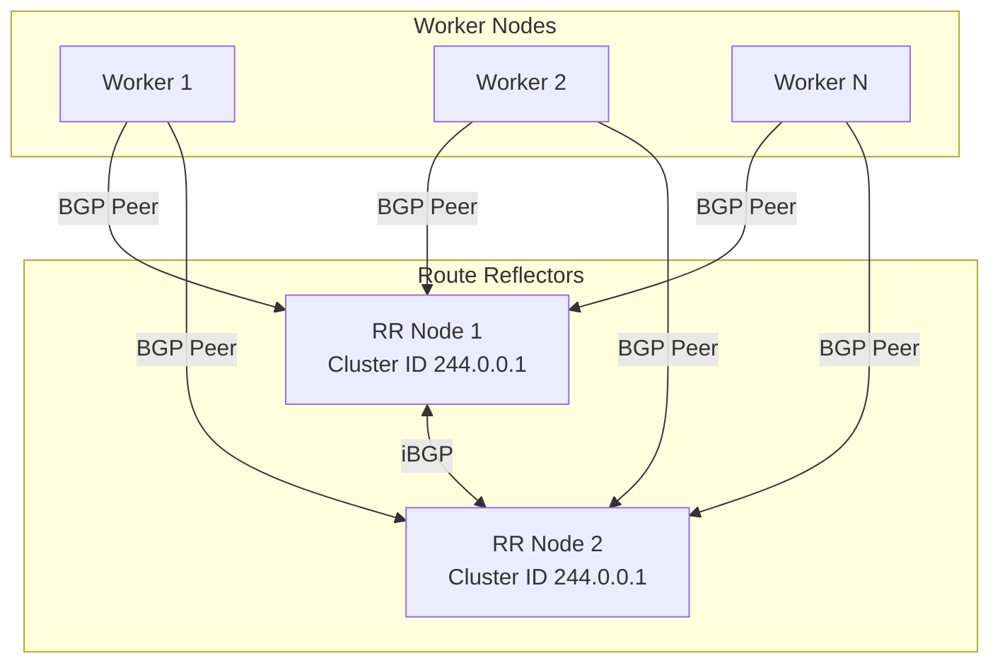

# How to Optimize BGP Peering in Calico for Production

Author: [nawazdhandala](https://github.com/nawazdhandala)

Tags: Calico, Kubernetes, BGP, Networking, Performance

Description: Optimize Calico BGP peering for production environments by tuning hold timers, configuring route reflectors, and implementing prefix limits to ensure network stability at scale.

---

## Introduction

The default Calico BGP configuration is designed for correctness and ease of setup, not for production-scale performance and resilience. As clusters grow beyond tens of nodes, the default full-mesh BGP topology creates O(n²) session complexity, straining CPU and memory resources. Route flapping, large routing tables, and slow convergence times all become operational challenges.

Optimizing BGP peering for production involves switching from full-mesh to route reflector topology, tuning BGP timer values for faster failure detection, setting prefix limits to protect against route leaks, and enabling Graceful Restart so that maintenance events do not cause widespread traffic disruption.

This guide covers the key production optimization strategies for Calico BGP peering that can improve convergence, reduce resource usage, and increase overall cluster network resilience.

## Prerequisites

- Calico v3.26+ with BGP enabled
- Cluster with 10+ nodes (full-mesh limitations become apparent here)
- `calicoctl` v3.26+
- Understanding of BGP concepts (AS numbers, route reflectors)

## Switch to Route Reflector Topology

Disable the default full-mesh and designate dedicated route reflector nodes:

```bash
# Disable node-to-node mesh
calicoctl patch bgpconfiguration default --type merge \
  --patch '{"spec":{"nodeToNodeMeshEnabled":false}}'
```

Label route reflector nodes and annotate with their cluster ID:

```bash
kubectl label node rr-node-1 calico-route-reflector=true
calicoctl patch node rr-node-1 --type merge \
  --patch '{"spec":{"bgp":{"routeReflectorClusterID":"244.0.0.1"}}}'
```

Create a BGPPeer to connect all nodes to the route reflectors:

```yaml
apiVersion: projectcalico.org/v3
kind: BGPPeer
metadata:
  name: peer-with-route-reflectors
spec:
  nodeSelector: "!has(calico-route-reflector)"
  peerSelector: "has(calico-route-reflector)"
```

```bash
calicoctl apply -f rr-peer.yaml
```

## Tune BGP Timers

Reduce hold and keepalive timers for faster failure detection:

```yaml
apiVersion: projectcalico.org/v3
kind: BGPConfiguration
metadata:
  name: default
spec:
  nodeToNodeMeshEnabled: false
  asNumber: 64512
  keepOriginalNextHop: false
  logSeverityScreen: Warning
```

For external peers, set timer values in the BGPPeer resource:

```yaml
apiVersion: projectcalico.org/v3
kind: BGPPeer
metadata:
  name: external-router
spec:
  peerIP: 192.168.1.1
  asNumber: 64513
  keepOriginalNextHop: false
```

## Enable Graceful Restart

Configure Graceful Restart to maintain forwarding during BGP session restarts:

```bash
calicoctl patch bgpconfiguration default --type merge \
  --patch '{"spec":{"gracefulRestart":{"enabled":true,"restartTime":120}}}'
```

## Route Reflector Scale Model



## Set Prefix Limits

Protect against route table exhaustion by setting prefix limits on peers:

```yaml
apiVersion: projectcalico.org/v3
kind: BGPPeer
metadata:
  name: external-router-limited
spec:
  peerIP: 192.168.1.1
  asNumber: 64513
  maxRestartTime: 10s
```

## Conclusion

Optimizing Calico BGP peering for production requires transitioning to a route reflector architecture, tuning timers for your failure detection requirements, and enabling Graceful Restart to survive maintenance events without dropping pod traffic. These changes reduce the O(n²) complexity of full-mesh BGP and give you a scalable, resilient networking foundation for large Kubernetes clusters.
