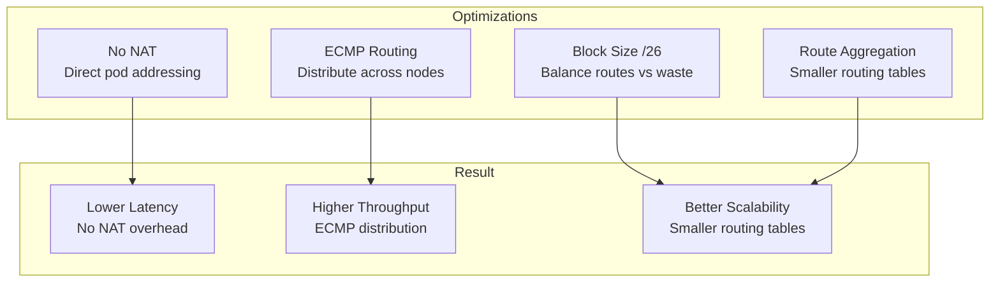

# How to Optimize BGP to Workload Connectivity in Calico for Production

Author: [nawazdhandala](https://github.com/nawazdhandala)

Tags: Calico, Kubernetes, BGP, Networking, Performance

Description: Optimize Calico BGP-to-workload connectivity for production by tuning ECMP routing, disabling unnecessary NAT, and configuring optimal IP pool block sizes.

---

## Introduction

BGP-to-workload connectivity in Calico offers significant performance advantages over NAT-based approaches, but achieving optimal performance requires careful configuration. The default settings prioritize compatibility over performance, and several knobs need adjustment to realize the full benefit of native BGP routing.

Key optimization areas include: configuring Equal-Cost Multi-Path (ECMP) routing on upstream routers to distribute traffic across multiple nodes hosting the same workload, tuning IP pool block sizes to reduce routing table size, disabling unnecessary NAT to eliminate per-packet processing overhead, and ensuring MTU settings match the native path (no encapsulation overhead).

## Prerequisites

- Calico BGP mode with external BGP peers
- ECMP-capable upstream routers
- Production workloads running in the cluster

## Enable ECMP for Load Balancing

When multiple pods serve the same application, configure BGP to use ECMP for traffic distribution. Enable `maxNextHops` on your external router and use equal-cost paths:

```bash
# Verify multiple BGP routes to the same destination
ip route show | grep "10.48"
# Should show multiple nexthops if ECMP is active
```

Configure Calico to announce node IPs alongside pod CIDRs for ECMP:

```bash
calicoctl patch bgpconfiguration default --type merge \
  --patch '{"spec":{"serviceLoadBalancerIPs":[{"cidr":"10.48.0.0/16"}]}}'
```

## Tune IP Pool Block Size

Smaller block sizes mean more precise routing but larger routing tables. Larger blocks reduce routing table size but may waste IPs. For most clusters, a /26 block size (64 IPs per node) is optimal:

```yaml
apiVersion: projectcalico.org/v3
kind: IPPool
metadata:
  name: default-ipv4-ippool
spec:
  cidr: 10.48.0.0/16
  blockSize: 26
  ipipMode: Never
  vxlanMode: Never
  natOutgoing: false
```

## Disable NAT for Direct-Access Pools

For workloads that need direct external access, ensure NAT is disabled:

```bash
calicoctl patch ippool default-ipv4-ippool --type merge \
  --patch '{"spec":{"natOutgoing":false}}'
```

## Optimize BGP Route Aggregation

Reduce route table size by aggregating pod CIDRs at the pool level. Configure Calico to advertise the entire pool CIDR rather than individual node blocks:

```bash
calicoctl patch bgpconfiguration default --type merge \
  --patch '{"spec":{"prefixAdvertisements":[{"cidr":"10.48.0.0/16","communities":["65000:100"]}]}}'
```

## Performance Optimization Architecture



## Conclusion

Optimizing Calico BGP-to-workload connectivity requires disabling NAT for direct-access workloads, tuning block sizes for the routing table scale you need, enabling ECMP on upstream routers for traffic distribution, and considering route aggregation to keep routing tables manageable. These changes together deliver the low-latency, high-throughput pod connectivity that makes native BGP routing superior to encapsulation-based approaches.
