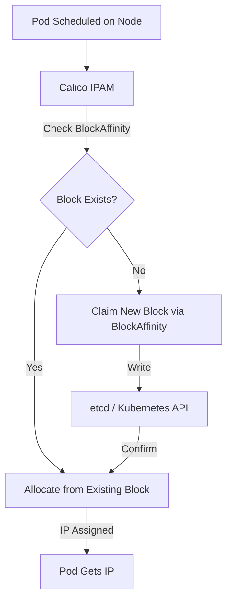

# How to Optimize BlockAffinity Behavior in Calico

Author: [nawazdhandala](https://github.com/nawazdhandala)

Tags: Calico, Kubernetes, IPAM, BlockAffinity, Networking, IP Management, Optimization

Description: Learn how to optimize Calico's BlockAffinity behavior to improve IP allocation efficiency, reduce IPAM fragmentation, and ensure predictable block assignments to nodes.

---

## Introduction

Calico IPAM allocates IP addresses in blocks (default /26, 64 IPs per block) and associates these blocks with nodes through the BlockAffinity mechanism. When BlockAffinity is managed suboptimally, clusters can experience IPAM fragmentation, inefficient IP utilization, and slow pod scheduling due to IP borrowing from non-local blocks.

Optimizing BlockAffinity behavior involves tuning block sizes, controlling how blocks are claimed and released, and ensuring nodes have pre-allocated blocks ready when new pods are scheduled. In large clusters, poor BlockAffinity behavior can lead to IP exhaustion on some nodes while other nodes have unused blocks.

This guide covers how to tune and monitor Calico BlockAffinity for optimal IPAM performance.

## Prerequisites

- Calico v3.20+ with Calico IPAM
- `calicoctl` CLI installed and configured
- `kubectl` access with cluster-admin permissions

## Step 1: Understand BlockAffinity Resources

BlockAffinity resources track which nodes have affinity to which IP blocks.

```bash
# List all BlockAffinity resources in the cluster
calicoctl get blockaffinity -o wide

# View a specific BlockAffinity in detail
calicoctl get blockaffinity <affinity-name> -o yaml

# Count blocks per node to identify imbalances
calicoctl get blockaffinity -o json | \
  jq -r '.items[].spec.node' | sort | uniq -c | sort -rn
```

## Step 2: Tune IPAM Block Size

Adjust block size for your cluster's pod density to reduce waste and fragmentation.

```yaml
# ippool-tuned-block-size.yaml
# IPPool with tuned block size for optimal allocation in medium-density clusters
apiVersion: projectcalico.org/v3
kind: IPPool
metadata:
  name: default-ipv4-ippool
spec:
  cidr: 192.168.0.0/16
  blockSize: 26              # /26 = 64 IPs per block (default, good for most clusters)
  ipipMode: Never
  natOutgoing: true
  disabled: false
```

For large clusters with many pods per node, consider `/24` blocks:

```yaml
# ippool-large-block-size.yaml
# IPPool with larger block size for high-density nodes (100+ pods per node)
apiVersion: projectcalico.org/v3
kind: IPPool
metadata:
  name: high-density-pool
spec:
  cidr: 10.244.0.0/16
  blockSize: 24              # /24 = 256 IPs per block - better for high-density nodes
  natOutgoing: true
```

## Step 3: Monitor Block Allocation Efficiency

Audit block assignments to detect waste and fragmentation.

```bash
# Show all blocks and their allocation status
calicoctl ipam show --show-blocks

# Check IPAM utilization summary
calicoctl ipam show

# Find blocks with low utilization (many free IPs)
calicoctl get ipamblock -o json | \
  jq -r '.items[] | select(.spec.allocations | length < 10) |
  "\(.metadata.cidr) has \(.spec.allocations | length) allocations"'
```

## Step 4: Release Unused Block Affinities

Clean up stale BlockAffinity entries from decommissioned nodes.

```bash
# Check for BlockAffinity entries referencing non-existent nodes
calicoctl get blockaffinity -o json | \
  jq -r '.items[].spec.node' | sort -u > /tmp/calico-nodes.txt

kubectl get nodes -o jsonpath='{.items[*].metadata.name}' | tr ' ' '\n' | sort > /tmp/k8s-nodes.txt

# Find stale BlockAffinity entries
comm -23 /tmp/calico-nodes.txt /tmp/k8s-nodes.txt

# Release stale IPAM data after node removal
calicoctl ipam release --ip=<orphaned-block-cidr>
```

## Step 5: Configure IPAM Pre-Allocation

Enable IP pre-allocation so nodes have blocks ready before pods are scheduled.

```bash
# Check current IPAM configuration
calicoctl get ipamconfig default -o yaml
```

```yaml
# ipamconfig-preallocation.yaml
# IPAMConfig enabling block pre-allocation for faster pod scheduling
apiVersion: projectcalico.org/v3
kind: IPAMConfig
metadata:
  name: default
spec:
  autoAllocateBlocks: true       # Automatically allocate blocks to nodes
  strictAffinity: false          # Allow borrowing from other blocks when needed
  maxBlocksPerHost: 4            # Max IP blocks per node to prevent over-allocation
```

## Block Allocation Flow



## Best Practices

- Set `blockSize` before cluster creation; changing it later requires IPAM migration
- Use `maxBlocksPerHost` to prevent single nodes from monopolizing the IP space
- Run `calicoctl ipam check` regularly to detect IPAM consistency issues
- Clean up BlockAffinity for decommissioned nodes immediately to free blocks
- Monitor IP utilization per pool and per node to detect allocation imbalances

## Conclusion

Optimizing BlockAffinity behavior in Calico IPAM ensures efficient IP allocation, prevents fragmentation, and keeps pod scheduling fast. By tuning block sizes, monitoring allocation efficiency, and cleaning up stale affinities, you maintain a healthy IPAM state that scales predictably as your cluster grows. Regular audits and the right IPAM configuration settings are the foundation of reliable IP address management in production Calico clusters.
