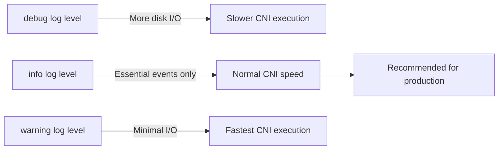

# Optimize Calico CNI Plugin

Author: [nawazdhandala](https://github.com/nawazdhandala)

Tags: Calico, Kubernetes, Networking, CNI, Plugins, Performance, Optimization

Description: Performance optimization techniques for the Calico CNI plugin to reduce pod startup time, improve IPAM allocation efficiency, and minimize CNI execution overhead.

---

## Introduction

The Calico CNI plugin runs synchronously during pod startup - if it's slow, pod startup latency increases proportionally. In clusters with high pod churn (CI/CD pipelines, batch jobs), CNI performance directly affects throughput. Optimizations focus on reducing IPAM lookup time, minimizing Kubernetes API calls during CNI execution, and ensuring CNI configuration is always available on nodes.

## Prerequisites

- Calico CNI installed and operational
- Pod startup time measurements available
- `kubectl` with cluster admin access

## Optimization 1: Use Kubernetes API Datastore (not etcd)

The Kubernetes API datastore (KDD) mode provides better CNI performance because it uses the Kubernetes API server's built-in caching:

```json
{
  "datastore_type": "kubernetes",
  "nodename": "__KUBERNETES_NODE_NAME__"
}
```

vs. etcd mode which requires direct etcd connections for each CNI invocation.

## Optimization 2: Right-Size IPAM Block Size

Larger IPAM blocks mean fewer allocation operations per node. When a block is exhausted, Calico allocates a new one - a relatively expensive operation:

```bash
# Check current block size
calicoctl get ippool default-ipv4-ippool -o yaml | grep blockSize

# For high pod churn nodes, use /23 (512 IPs) to reduce block allocations
calicoctl patch ippool default-ipv4-ippool \
  --patch='{"spec":{"blockSize":23}}'
```

## Optimization 3: Pre-Warm IPAM Blocks

Ensure nodes always have pre-allocated IPAM blocks ready:

```bash
# Felix pre-allocates IPAM blocks when nodes join
# Configure warmup in Felix
kubectl patch felixconfiguration default \
  --type=merge \
  --patch='{"spec":{"ipIpMtu":1440}}'

# Pre-allocation happens automatically, but verify
calicoctl ipam show --show-blocks | grep <node-name>
```

## Optimization 4: Configure CNI Log Level



Set appropriate log level:

```json
{
  "log_level": "warning",
  "log_file_path": "/var/log/calico/cni/cni.log"
}
```

## Optimization 5: Reduce API Server Calls

Configure CNI to batch Kubernetes API calls where possible:

```json
{
  "kubernetes": {
    "kubeconfig": "__KUBECONFIG_FILEPATH__",
    "k8s_api_root": "https://kubernetes.default.svc",
    "node_name": "__KUBERNETES_NODE_NAME__"
  }
}
```

Use local node caching to reduce API server latency:

```bash
# Ensure calico-node's node cache is warm
# This is automatic but can be tuned via Felix watch interval
kubectl patch felixconfiguration default \
  --type=merge \
  --patch='{"spec":{"k8sNodeCacheTTL":"60s"}}'
```

## Optimization 6: Profile CNI Execution Time

Measure actual CNI execution time:

```bash
# On a node, time a CNI invocation
kubectl run timing-test --image=busybox \
  --dry-run=server -o json | jq .

# More practically, measure pod startup p99
kubectl get events --sort-by='.lastTimestamp' \
  -A --field-selector=reason=Started | \
  tail -100 | awk '{print $1}' | sort | uniq -c
```

## Conclusion

Optimizing Calico CNI performance focuses on using the Kubernetes API datastore mode for better caching, right-sizing IPAM blocks to minimize allocation operations, setting production-appropriate log levels (warning rather than debug), and profiling actual CNI execution time to identify bottlenecks. In high-churn environments, the difference between a 50ms and 500ms CNI execution time can significantly impact your pod deployment throughput.
