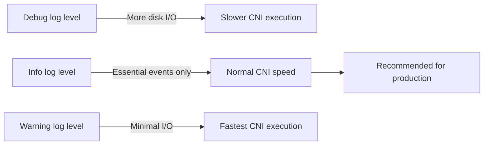

# Optimize Calico CNI Plugin

Author: [nawazdhandala](https://github.com/nawazdhandala)

Tags: Calico, Kubernetes, Networking, CNI, Plugin, Performance, Optimization

Description: Performance optimization techniques for the Calico CNI plugin to reduce pod startup time, improve IPAM allocation efficiency, and minimize CNI execution overhead.

---

## Introduction

The Calico CNI plugin runs synchronously during pod startup - if it's slow, pod startup latency increases proportionally. In clusters with high pod churn (CI/CD pipelines, batch jobs), CNI performance directly affects throughput. Optimizations focus on reducing IPAM lookup time, minimizing Kubernetes API calls during CNI execution, and ensuring CNI configuration is always available on nodes.

## Prerequisites

- Calico CNI installed and operational
- Pod startup time measurements available
- `kubectl` with cluster admin access

## Optimization 1: Use Kubernetes API Datastore (not etcd)

The Kubernetes API datastore (KDD) mode provides better CNI performance because it uses the Kubernetes API server's built-in caching:

```json
{
  "datastore_type": "kubernetes",
  "nodename": "__KUBERNETES_NODE_NAME__"
}
```

vs. etcd mode which requires direct etcd connections for each CNI invocation.

## Optimization 2: Right-Size IPAM Block Size

Larger IPAM blocks mean fewer allocation operations per node. When a block is exhausted, Calico allocates a new one - a relatively expensive operation:

```bash
# Check current block size

calicoctl get ippool default-ipv4-ippool -o yaml | grep blockSize
```

The `blockSize` field on an IPPool is immutable after creation. To use a larger block size, create a new IPPool (and migrate workloads off the old one):

```bash
# For high pod churn, create a new pool with /23 (512 IPs) blocks
cat <<EOF | calicoctl apply -f -
apiVersion: projectcalico.org/v3
kind: IPPool
metadata:
  name: pool-larger-blocks
spec:
  cidr: 10.100.0.0/16
  blockSize: 23
  ipipMode: Always
  natOutgoing: true
EOF
```

## Optimization 3: Pre-Warm IPAM Blocks

Ensure nodes always have IPAM blocks affined to them. This is controlled by the `IPAMConfiguration` resource, not FelixConfiguration:

```bash
# Cap blocks per host and prefer keeping allocations on the same node
cat <<EOF | calicoctl apply -f -
apiVersion: projectcalico.org/v3
kind: IPAMConfiguration
metadata:
  name: default
spec:
  strictAffinity: false
  maxBlocksPerHost: 4
EOF

# Verify blocks are allocated per node
calicoctl ipam show --show-blocks | grep <node-name>
```

## Optimization 4: Configure CNI Log Level


```mermaid
graph LR
    A[Debug log level] -->|More disk I/O| B[Slower CNI execution]
    C[Info log level] -->|Essential events only| D[Normal CNI speed]
    E[Warning log level] -->|Minimal I/O| F[Fastest CNI execution]
    D --> G[Recommended for production]
```

Set an appropriate log level (Calico CNI accepts `Debug`, `Info`, `Warning`, `Error`, `Fatal`):

```json
{
  "log_level": "Warning",
  "log_file_path": "/var/log/calico/cni/cni.log"
}
```

## Optimization 5: Reduce API Server Calls

Configure CNI to batch Kubernetes API calls where possible:

```json
{
  "kubernetes": {
    "kubeconfig": "__KUBECONFIG_FILEPATH__",
    "k8s_api_root": "https://kubernetes.default.svc",
    "node_name": "__KUBERNETES_NODE_NAME__"
  }
}
```

Felix maintains its own watch-based cache of Kubernetes resources, so explicit CNI batching is not required. To reduce the frequency of local interface and route rescans (which compete with the CNI for resources), tune the refresh intervals on Felix:

```bash
# Defaults are 90s for both; raise on stable nodes to reduce overhead
kubectl patch felixconfiguration default \
  --type=merge \
  --patch='{"spec":{"interfaceRefreshInterval":"180s","routeRefreshInterval":"180s"}}'
```

## Optimization 6: Profile CNI Execution Time

Measure actual CNI execution time:

```bash
# On a node, time a CNI invocation
kubectl run timing-test --image=busybox \
  --dry-run=server -o json | jq .

# More practically, measure pod startup p99
kubectl get events --sort-by='.lastTimestamp' \
  -A --field-selector=reason=Started | \
  tail -100 | awk '{print $1}' | sort | uniq -c
```

## Conclusion

Optimizing Calico CNI performance focuses on using the Kubernetes API datastore mode for better caching, right-sizing IPAM blocks to minimize allocation operations, setting production-appropriate log levels (warning rather than debug), and profiling actual CNI execution time to identify bottlenecks. In high-churn environments, the difference between a 50ms and 500ms CNI execution time can significantly impact your pod deployment throughput.
