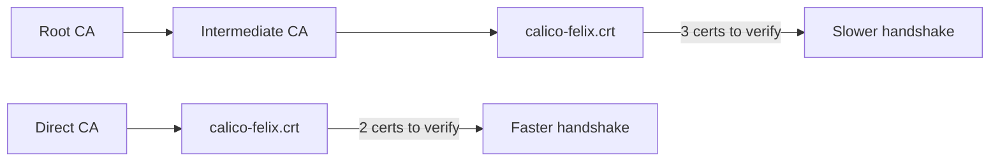

# Optimize Calico etcd Certificate Generation

Author: [nawazdhandala](https://github.com/nawazdhandala)

Tags: Calico, Kubernetes, Networking, etcd, TLS, Certificates, Performance, Optimization

Description: Techniques for optimizing Calico etcd TLS certificate configuration to reduce connection establishment overhead and improve throughput between Calico components and etcd.

---

## Introduction

TLS certificate configuration affects more than just security - it also impacts the performance of every connection that Calico components establish with etcd. Certificate chain length, key algorithm choice, session resumption configuration, and the frequency of certificate rotation all contribute to the latency and CPU cost of Calico's etcd communication.

In high-throughput clusters where Felix, the CNI plugin, and the API server make frequent etcd requests, these small per-connection costs can accumulate into measurable performance overhead. Optimizing certificate configuration reduces this overhead without compromising security.

## Prerequisites

- Calico etcd TLS certificates deployed
- etcd and Calico components running
- Performance monitoring for etcd connection metrics

## Optimization 1: Use ECDSA Over RSA

ECDSA certificates (P-256) provide equivalent security to RSA-2048 with significantly smaller key sizes and faster TLS handshakes:

```bash
# Generate ECDSA key for Felix (faster than RSA-2048)
openssl ecparam -name prime256v1 -genkey -noout -out calico-felix.key

# Generate ECDSA certificate signing request
openssl req -new -key calico-felix.key \
  -out calico-felix.csr \
  -subj "/CN=calico-felix/O=calico"
```

Performance comparison:

| Algorithm | Key Size | Handshake Speed |
|-----------|----------|----------------|
| RSA | 4096 | Slowest |
| RSA | 2048 | Moderate |
| ECDSA P-384 | 384-bit | Fast |
| ECDSA P-256 | 256-bit | Fastest |

## Optimization 2: Minimize Certificate Chain Length

A shorter certificate chain (CA → client cert) is faster to validate than a deep chain (Root CA → Intermediate CA → client cert):



Use a direct single-level CA for Calico etcd certificates rather than a multi-level hierarchy.

## Optimization 3: Enable TLS Session Resumption

Configure etcd to support TLS session tickets, allowing clients to resume sessions without a full handshake:

```bash
# etcd configuration (TLS 1.3 handles session resumption automatically)
# Ensure TLS 1.3 is enabled
etcd --auto-tls=false \
     --cipher-suites="TLS_AES_128_GCM_SHA256,TLS_AES_256_GCM_SHA384" \
     --tls-min-version=VersionTLS12
```

## Optimization 4: Tune Certificate Validity for Renewal Frequency

Very short-lived certificates increase rotation frequency, which creates more TLS handshakes and more load on the CA. Balance security and performance:

```yaml
# cert-manager Certificate - balanced validity
apiVersion: cert-manager.io/v1
kind: Certificate
metadata:
  name: calico-felix-etcd-cert
spec:
  duration: 720h      # 30 days - reasonable TTL
  renewBefore: 168h   # Renew 7 days before expiry
  # Avoid: 24h duration - creates too many renewals per year
```

## Optimization 5: Connection Pooling

Reduce per-request TLS handshake overhead by ensuring Calico components maintain persistent connections to etcd:

```bash
# Verify Felix maintains persistent etcd connection
kubectl exec -n kube-system ds/calico-node -- \
  netstat -anp | grep "2379.*ESTABLISHED"

# Should show 1-2 persistent connections, not many short-lived ones
```

## Optimization 6: Profile TLS Handshake Timing

Measure actual TLS handshake performance:

```bash
# Measure TLS connection time to etcd
time openssl s_client \
  -connect etcd:2379 \
  -cert calico-felix.crt \
  -key calico-felix.key \
  -CAfile calico-etcd-ca.crt \
  -verify_return_error < /dev/null

# Compare RSA vs ECDSA certificates
```

## Conclusion

Optimizing Calico etcd TLS certificates centers on using ECDSA P-256 for faster handshakes, keeping the certificate chain short, balancing certificate validity periods to reduce renewal churn, and ensuring persistent connections to minimize handshake frequency. These optimizations are particularly impactful in large clusters where etcd handles thousands of connections from Calico components.
