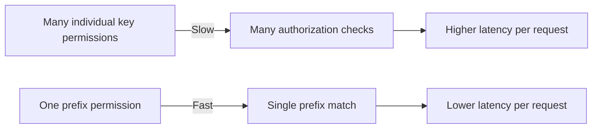

# Optimize Calico etcd RBAC

Author: [nawazdhandala](https://github.com/nawazdhandala)

Tags: Calico, Kubernetes, Networking, Etcd, RBAC, Performance, Optimization

Description: Techniques for optimizing Calico etcd RBAC configuration to reduce authentication overhead and improve etcd performance in large-scale Kubernetes deployments.

---

## Introduction

While etcd RBAC is a critical security control, a poorly structured RBAC configuration can introduce performance overhead. Each etcd request must pass through the RBAC authorization layer, and overly complex role structures or excessive permission checks can add latency to Calico's etcd operations - slowing down policy updates, IP allocations, and Felix synchronization.

Optimization focuses on structuring roles to minimize authorization checks per request, tuning etcd performance parameters that affect the RBAC evaluation path, and reducing the total number of etcd operations that Calico components perform.

## Prerequisites

- etcd v3.x with RBAC enabled
- Prometheus metrics exposed from etcd
- Calico in production with measurable baseline performance
- `etcdctl` with root credentials

## Optimization 1: Consolidate Roles to Reduce Complexity

A user assigned multiple roles requires the authorization layer to union all permissions. Keeping role assignments simple reduces this overhead:

```bash
# Check how many roles each user has
etcdctl ... user get calico-felix
etcdctl ... user get calico-cni

# Prefer: one role per user with all needed permissions
# Rather than: three partial roles combined per user
```

Example of consolidated role:

```bash
etcdctl role add calico-felix-complete
# Add all required permissions in one role
etcdctl role grant-permission calico-felix-complete --prefix=true readwrite /calico/v1/host/
etcdctl role grant-permission calico-felix-complete --prefix=true read /calico/v1/policy/
etcdctl role grant-permission calico-felix-complete --prefix=true read /calico/v1/config/
etcdctl role grant-permission calico-felix-complete --prefix=true readwrite /calico/felix/v1/
```

## Optimization 2: Use Prefix Permissions Efficiently



Prefix-based permissions are more efficient than granting individual key permissions:

```bash
# Inefficient: individual key grants
etcdctl role grant-permission calico-felix read /calico/v1/config/global
etcdctl role grant-permission calico-felix read /calico/v1/config/felix

# Efficient: prefix grant
etcdctl role grant-permission calico-felix --prefix=true read /calico/v1/config/
```

## Optimization 3: Reduce Calico Watch Operations

Excessive etcd watch operations add load to both etcd and the RBAC authorization layer. Tune Felix's watch behavior:

```bash
kubectl patch felixconfiguration default \
  --type=merge \
  --patch='{"spec":{"etcdDriverPollInterval":"10s"}}'
```

## Optimization 4: Monitor Authorization Latency

etcd exposes metrics for authorization performance:

```bash
curl http://etcd:2381/metrics | grep etcd_server_slow_read_indexes_total
curl http://etcd:2381/metrics | grep etcd_auth_*
```

Create a Prometheus alert for high authorization latency:

```yaml
- alert: EtcdAuthorizationSlow
  expr: histogram_quantile(0.99, etcd_grpc_unary_requests_duration_seconds_bucket{grpc_method="Range"}) > 0.1
  for: 5m
  labels:
    severity: warning
  annotations:
    summary: "etcd authorization latency is high"
```

## Optimization 5: Dedicated etcd for Calico

Separating Calico's etcd from Kubernetes etcd reduces contention and allows independent tuning:

```bash
# Verify Calico is using its own etcd endpoint
kubectl get configmap calico-config -n kube-system -o jsonpath='{.data.etcd_endpoints}'
```

If sharing etcd, consider migrating Calico to Kubernetes API datastore mode to eliminate etcd dependency entirely:

```bash
# Migrate Calico from etcd to kdd (Kubernetes datastore)
calicoctl datastore migrate export > calico-state.yaml
# Update CALICO_DATASTORE_TYPE=kubernetes in DaemonSet
calicoctl datastore migrate import -f calico-state.yaml
```

## Conclusion

Optimizing Calico etcd RBAC centers on minimizing authorization complexity through consolidated roles, using prefix permissions for efficiency, and reducing unnecessary etcd operations. In large clusters where etcd performance is a bottleneck, migrating from etcd to the Kubernetes API datastore mode can eliminate the RBAC overhead entirely while maintaining strong access controls through Kubernetes RBAC.
