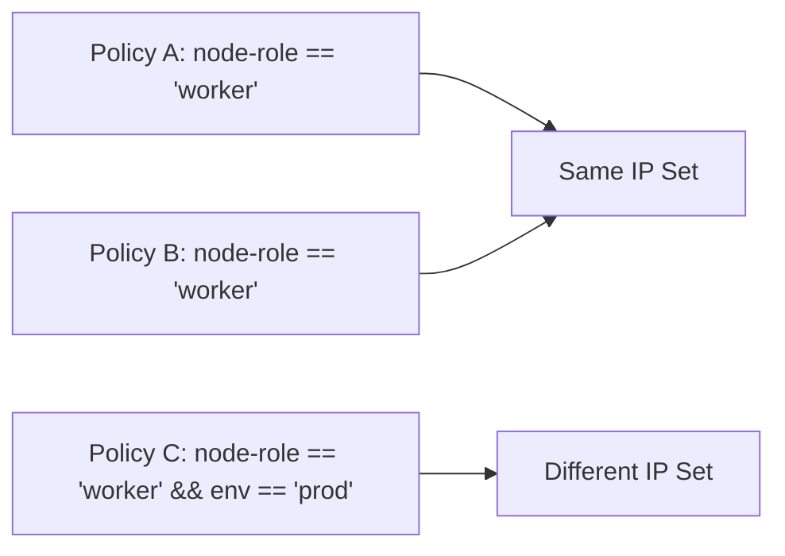

# Optimize Calico Host Endpoint Selectors

Author: [nawazdhandala](https://github.com/nawazdhandala)

Tags: Calico, Kubernetes, Networking, Host Endpoint, Selectors, Performance, Optimization

Description: Techniques for optimizing Calico host endpoint selector expressions to minimize policy recalculation overhead and improve network performance on Kubernetes nodes.

---

## Introduction

Every time a node label or HostEndpoint label changes, Calico's Felix agent must re-evaluate all selectors to determine which policies still apply. In large clusters or environments with frequent label changes, this recalculation can create spikes in CPU usage and brief periods of policy inconsistency. Optimizing selectors reduces the frequency and cost of this recalculation work.

Optimization strategies include reducing selector complexity, minimizing the number of distinct selectors across policies, using IP sets effectively, and batching label changes to avoid cascading recalculations. This guide covers practical techniques applicable to any Calico deployment.

## Prerequisites

- Calico installed with host endpoints configured
- Prometheus metrics enabled for Felix
- `calicoctl` and `kubectl` with cluster admin access

## Optimization 1: Minimize Unique Selector Expressions

Each unique selector expression creates a separate IP set in the kernel. Reducing the number of unique selectors reduces kernel memory usage and recalculation work:

```bash
# Audit unique selectors across all policies
calicoctl get globalnetworkpolicies -o yaml | \
  python3 -c "
import sys, yaml
selectors = set()
for doc in yaml.safe_load_all(sys.stdin):
  for item in doc.get('items', []):
    s = item.get('spec', {}).get('selector', '')
    if s: selectors.add(s)
print(f'Unique selectors: {len(selectors)}')
for s in selectors: print(' -', s)
"
```

## Optimization 2: Consolidate Similar Selectors



When multiple policies share the same selector, Calico reuses the underlying IP set, reducing overhead. Group policies with identical selectors:

```yaml
# Prefer: one policy with multiple rule blocks over many policies with same selector
apiVersion: projectcalico.org/v3
kind: GlobalNetworkPolicy
metadata:
  name: worker-node-policy
spec:
  selector: "node-role == 'worker'"
  order: 10
  ingress:
    - action: Allow
      protocol: TCP
      destination:
        ports: [22]
      source:
        nets: ["10.0.0.0/8"]
    - action: Allow
      protocol: TCP
      destination:
        ports: [10250]
    - action: Deny
```

## Optimization 3: Avoid Wildcard Selectors in High-Churn Environments

The `all()` selector matches every endpoint and is recalculated on every label change. In clusters with many nodes or frequent label updates, prefer specific selectors:

```yaml
# High overhead in large clusters
selector: "all()"

# Lower overhead - only recalculated when node-role changes
selector: "has(node-role)"
```

## Optimization 4: Batch Label Changes

When updating labels on multiple nodes, batch the changes to trigger fewer recalculation cycles:

```bash
# Single kubectl command to update many nodes
kubectl label nodes node1 node2 node3 node4 security-tier=standard --overwrite
```

This triggers a single recalculation pass rather than four separate ones.

## Optimization 5: Monitor Selector Recalculation Time

Track Felix's policy recalculation latency:

```bash
kubectl exec -n calico-system ds/calico-node -- \
  curl -s localhost:9091/metrics | grep felix_calc_graph_update_time
```

Create a Prometheus alert for slow recalculation:

```yaml
- alert: CalicoSelectorRecalcSlow
  expr: felix_calc_graph_update_time_seconds > 1.0
  for: 5m
  labels:
    severity: warning
  annotations:
    summary: "Calico selector recalculation taking > 1s on {{ $labels.node }}"
```

## Optimization 6: Pre-compute Aggregated Labels

Instead of compound selectors evaluated at runtime, pre-compute aggregated labels:

```bash
# Run during node provisioning
kubectl label node worker-1 calico-security-group=prod-worker
```

```yaml
# Simple, fast selector
selector: "calico-security-group == 'prod-worker'"

# vs. slower compound selector avoided
# selector: "env == 'prod' && node-role == 'worker' && !has(spot)"
```

## Conclusion

Optimizing Calico host endpoint selectors is about reducing the number of unique IP sets in the kernel, batching label changes to minimize recalculation frequency, and monitoring selector evaluation latency. In large clusters, the difference between well-optimized and poorly structured selectors can be significant in terms of Felix CPU usage and the consistency window after label changes.
