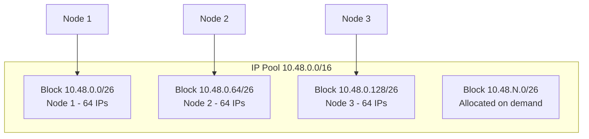

# How to Optimize Calico IPAM for Large Clusters

Author: [nawazdhandala](https://github.com/nawazdhandala)

Tags: Calico, Kubernetes, IPAM, Networking, IP Management

Description: Optimize Calico IPAM for large clusters by tuning block sizes, configuring topology-aware allocation, and pre-allocating blocks for predictable performance.

---

## Introduction

Calico IPAM (IP Address Management) is responsible for assigning IP addresses to pods from configured IP pools. Unlike simpler CNIs that pre-allocate large blocks per node, Calico IPAM uses a dynamic block allocation scheme where each node is assigned blocks (default /26, 64 IPs) on demand as pods are created. This allows for efficient IP utilization across large clusters with variable pod density.

The IPAM system tracks allocations in the Calico datastore (Kubernetes CRDs or etcd), maintains block affinity mappings between nodes and CIDR blocks, and supports advanced features like topology-aware allocation, IP pool selection via node selectors, and specific IP assignment for pods that need consistent addressing.

## Prerequisites

- Calico v3.20+ installed
- kubectl and calicoctl configured
- IP pools configured

## Optimize Calico IPAM

```bash
# View current IPAM allocations
calicoctl ipam show --show-blocks

# Check IP pool utilization
calicoctl ipam show --summary

# View node block assignments
kubectl get ippamhandles -A

# Check for leaked allocations
calicoctl ipam check
```

## Configure IPAM Settings

```yaml
apiVersion: operator.tigera.io/v1
kind: Installation
metadata:
  name: default
spec:
  calicoNetwork:
    ipPools:
    - cidr: 10.48.0.0/16
      blockSize: 26
      natOutgoing: Enabled
      encapsulation: VXLAN
```

## IPAM Block Allocation



## Verify IPAM Health

```bash
# Run IPAM consistency check
calicoctl ipam check --output=report

# List all allocated IPs
calicoctl ipam show --ip=all

# Check for orphaned allocations
calicoctl ipam check --show-problem-ips
```

## Conclusion

Calico IPAM provides flexible, efficient IP address management for Kubernetes clusters. The block-based allocation scheme balances per-node IP availability with overall pool utilization. Regular IPAM health checks catch orphaned allocations and pool exhaustion before they cause pod scheduling failures. Monitor IP pool utilization and expand pools proactively before exhaustion affects your cluster.
