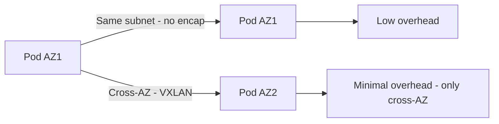

# Optimize Calico Networking on AWS

Author: [nawazdhandala](https://github.com/nawazdhandala)

Tags: Calico, Kubernetes, Networking, AWS, Cloud, Performance, Optimization

Description: Performance optimization techniques for Calico networking on AWS, including encapsulation mode tuning, IPAM block sizing, and cross-AZ traffic reduction strategies.

---

## Introduction

Calico networking on AWS has several performance optimization opportunities that are specific to the AWS environment. Cross-AZ encapsulation adds overhead and cost; IPAM block sizing affects how efficiently IP addresses are allocated; and the choice between iptables and eBPF dataplanes has significant throughput implications on modern EC2 instance types with Linux kernel 5.3+.

Optimization on AWS also has a cost dimension — cross-AZ data transfer is billed per GB, so reducing unnecessary cross-AZ pod traffic directly reduces infrastructure costs. This guide covers both performance and cost optimizations for Calico on AWS.

## Prerequisites

- Calico installed on AWS self-managed Kubernetes
- Ability to modify Calico configuration
- AWS CLI access for instance and VPC configuration

## Optimization 1: Use CrossSubnet Encapsulation Mode

CrossSubnet mode uses native routing within the same AZ subnet (no overhead) and only applies VXLAN for cross-AZ traffic:

```yaml
apiVersion: projectcalico.org/v3
kind: IPPool
metadata:
  name: aws-pod-pool
spec:
  cidr: 192.168.0.0/16
  ipipMode: CrossSubnet
  vxlanMode: CrossSubnet
  natOutgoing: true
```



## Optimization 2: Right-Size IPAM Block Size

The `blockSize` determines how many IPs are reserved per node. Too large wastes IPs; too small causes frequent IPAM operations:

```yaml
# For clusters with 50-500 nodes, /24 (256 IPs) per node is typical
spec:
  blockSize: 24   # /24 = 256 IPs per node

# For large pods-per-node workloads
spec:
  blockSize: 23   # /23 = 512 IPs per node
```

Calculate: `blockSize` = log2(max_pods_per_node * 2) rounded up to nearest /N.

## Optimization 3: Enable eBPF Dataplane

On EC2 instances running Amazon Linux 2023 or Ubuntu 22.04 (kernel 5.15+):

```bash
kubectl patch installation default \
  --type=merge \
  -p '{"spec":{"calicoNetwork":{"linuxDataplane":"BPF"}}}'
```

eBPF provides 40-60% better throughput than iptables on high-traffic nodes.

## Optimization 4: Reduce Cross-AZ Traffic with Topology-Aware Routing

Use Kubernetes topology-aware routing to prefer same-AZ pod communication:

```yaml
apiVersion: v1
kind: Service
metadata:
  name: my-service
  annotations:
    service.kubernetes.io/topology-mode: "Auto"
```

Add topology labels to nodes:

```bash
kubectl label node worker-az1-1 topology.kubernetes.io/zone=us-east-1a
```

## Optimization 5: Use Enhanced Networking Instance Types

Select EC2 instance types with Elastic Network Adapter (ENA) for best network performance:

```bash
# Verify ENA is enabled
aws ec2 describe-instance-attribute \
  --instance-id i-0123456789 \
  --attribute enaSupport
```

Recommended instance families for network-intensive workloads: c5n, m5n, r5n, c6gn.

## Optimization 6: Tune MTU for VXLAN

VXLAN adds a 50-byte header. Set the correct MTU to avoid fragmentation:

```bash
# AWS VPC default MTU is 9001 (jumbo frames)
# Set Calico MTU accounting for VXLAN overhead
kubectl patch felixconfiguration default \
  --type=merge \
  --patch='{"spec":{"mtu":8951}}'
# 9001 - 50 (VXLAN overhead) = 8951
```

## Conclusion

Optimizing Calico on AWS involves choosing CrossSubnet encapsulation mode to minimize overhead, right-sizing IPAM blocks for your workload, enabling eBPF on supported kernel versions, and implementing topology-aware routing to reduce expensive cross-AZ traffic. MTU tuning for VXLAN prevents fragmentation on AWS's jumbo frame-capable VPC network. Together, these optimizations significantly improve both performance and cost efficiency.
