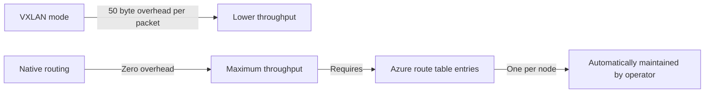

# Optimize Calico Networking on Azure

Author: [nawazdhandala](https://github.com/nawazdhandala)

Tags: Calico, Kubernetes, Networking, Azure, Cloud, Performance, Optimization

Description: Performance optimization strategies for Calico networking on Azure, including accelerated networking, VXLAN tuning, and route table-based native routing for maximum pod network throughput.

---

## Introduction

Azure offers several performance features that significantly improve Calico networking throughput when properly leveraged. Accelerated Networking (SR-IOV) bypasses the hypervisor for NIC operations and dramatically reduces latency and CPU overhead. For clusters where VXLAN encapsulation overhead is a concern, Azure route table-based native routing eliminates encapsulation entirely for pods in the same VNet.

On Azure, MTU sizing is also critical — Azure's default MTU varies by networking mode, and VXLAN adds overhead that can cause fragmentation if not properly configured. This guide covers the key optimization techniques for Calico on Azure.

## Prerequisites

- Self-managed Kubernetes on Azure with Calico installed
- VM sizes that support Accelerated Networking (most D, E, F-series VMs)
- Azure CLI access

## Optimization 1: Enable Accelerated Networking

Accelerated Networking uses SR-IOV to bypass the Azure hypervisor, reducing latency by up to 70% and increasing throughput by up to 30x:

```bash
# Enable accelerated networking on all worker VMs
# Note: VM must be stopped/deallocated first
for vm in worker-1 worker-2 worker-3; do
  az vm deallocate -g k8s-rg -n $vm

  NIC_ID=$(az vm show -g k8s-rg -n $vm \
    --query "networkProfile.networkInterfaces[0].id" -o tsv)

  az network nic update --ids $NIC_ID \
    --accelerated-networking true

  az vm start -g k8s-rg -n $vm
done
```

## Optimization 2: Native Routing via Azure Route Tables



Configure Calico for native routing:

```yaml
apiVersion: projectcalico.org/v3
kind: IPPool
metadata:
  name: azure-pod-pool-native
spec:
  cidr: 192.168.0.0/16
  ipipMode: Never
  vxlanMode: Never
  natOutgoing: true
  blockSize: 24
```

Maintain Azure route table entries (automate with a controller):

```bash
# Helper script - run after each node joins
function add_node_route() {
  local node=$1
  local pod_cidr=$2
  local node_ip=$3

  az network route-table route create \
    --resource-group k8s-rg \
    --route-table-name k8s-pod-routes \
    --name "${node}-pod-cidr" \
    --address-prefix "$pod_cidr" \
    --next-hop-type VirtualAppliance \
    --next-hop-ip-address "$node_ip"
}
```

## Optimization 3: Configure MTU Correctly

Azure VNet supports jumbo frames (9000 bytes). With Accelerated Networking and VXLAN:

```bash
# Without VXLAN (native routing): set MTU to 1500 or jumbo frame size
kubectl patch felixconfiguration default \
  --type=merge \
  --patch='{"spec":{"mtu":1450}}'

# With VXLAN: account for 50-byte VXLAN overhead
# If Azure VNet MTU = 1500: set Calico MTU to 1450
# If Accelerated Networking with jumbo frames: 8950
```

## Optimization 4: Use eBPF Dataplane

On Ubuntu 22.04 or later VM images with kernel 5.15+:

```bash
kubectl patch installation default \
  --type=merge \
  -p '{"spec":{"calicoNetwork":{"linuxDataplane":"BPF"}}}'
```

eBPF provides significantly better throughput than iptables for large policy sets.

## Optimization 5: Right-Size VMs for Network Performance

Recommended Azure VM sizes for network-intensive Calico workloads:

| VM Size | vCPU | Network Bandwidth | Notes |
|---------|------|-------------------|-------|
| Standard_D8s_v5 | 8 | Up to 12.5 Gbps | Good general worker |
| Standard_F16s_v2 | 16 | Up to 12.5 Gbps | CPU-optimized |
| Standard_D32ds_v5 | 32 | Up to 16 Gbps | High-throughput |

## Conclusion

Optimizing Calico on Azure prioritizes three changes: enabling Accelerated Networking for SR-IOV-based NIC performance, using native routing via Azure route tables to eliminate VXLAN overhead, and configuring MTU correctly to prevent fragmentation. Together, these optimizations can reduce Calico's contribution to pod-to-pod latency by 50-70% compared to default VXLAN mode on standard VMs.
