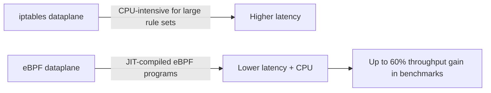

# Optimize Calico Networking on IBM Cloud

Author: [nawazdhandala](https://github.com/nawazdhandala)

Tags: Calico, Kubernetes, Networking, IBM Cloud, Performance, Optimization

Description: Performance optimization strategies for Calico networking on IBM Cloud, including VPC network bandwidth selection, VXLAN tuning, and eBPF dataplane configuration.

---

## Introduction

IBM Cloud offers several hardware and software options that directly impact Calico networking performance. IBM Cloud VPC provides high-bandwidth instance profiles with up to 100 Gbps network performance. The choice between VXLAN overlay and native routing, the eBPF dataplane availability, and correct MTU configuration all contribute to achieving optimal pod network throughput.

For IKS clusters, IBM manages the Calico version and some configuration, but you can still optimize IP pool block sizes, enable eBPF on supported worker profiles, and tune Felix parameters. For self-managed clusters, the full optimization toolkit is available.

## Prerequisites

- Calico on IBM Cloud (IKS or self-managed)
- IBM Cloud CLI for instance profile management
- `kubectl` and `calicoctl` with admin access

## Optimization 1: Select High-Performance VPC Instance Profiles

IBM Cloud VPC instance profiles with high network bandwidth:

| Profile | vCPU | Network Bandwidth | Notes |
|---------|------|-------------------|-------|
| bx2-8x32 | 8 | 16 Gbps | Balanced |
| cx2-16x32 | 16 | 24 Gbps | Compute-optimized |
| mx2-32x256 | 32 | 24 Gbps | Memory-optimized |
| bx2-64x256 | 64 | 80 Gbps | High-throughput |

```bash
# View available profiles with network performance
ibmcloud is instance-profiles --output json | \
  jq '.[] | {name: .name, vcpu: .vcpu.count, bandwidth: .bandwidth}'
```

## Optimization 2: Enable eBPF Dataplane

For IKS workers running Ubuntu 20.04 or later (check kernel version ≥ 5.8):

```bash
# Check kernel version on worker nodes
kubectl debug node/worker-1 -it --image=ubuntu -- uname -r
```

Enable eBPF:

```bash
kubectl patch installation default \
  --type=merge \
  -p '{"spec":{"calicoNetwork":{"linuxDataplane":"BPF"}}}'
```



## Optimization 3: Right-Size IPAM Block Size

Match block size to your maximum pods per node:

```bash
# Check current block size
calicoctl get ippool default-ipv4-ippool -o yaml | grep blockSize

# For IBM Cloud workers with default 110 pods max:
# /24 (256 IPs) is sufficient

# For high-density workers:
# Modify block size to /23 (512 IPs)
calicoctl patch ippool default-ipv4-ippool \
  --patch='{"spec":{"blockSize":23}}'
```

## Optimization 4: Configure MTU for IBM Cloud VPC

IBM Cloud VPC standard MTU is 1500 bytes:

```bash
# VXLAN mode: subtract 50 bytes
kubectl patch felixconfiguration default \
  --type=merge \
  --patch='{"spec":{"mtu":1450}}'

# Native routing (no VXLAN): full 1500 bytes
kubectl patch felixconfiguration default \
  --type=merge \
  --patch='{"spec":{"mtu":1500}}'
```

## Optimization 5: Reduce Felix Policy Recalculation

For clusters with frequent pod churn (CI/CD workloads):

```bash
kubectl patch felixconfiguration default \
  --type=merge \
  --patch='{"spec":{"iptablesRefreshInterval":"90s","routeRefreshInterval":"90s"}}'
```

## Optimization 6: Use Network Interface Bonding for Classic Infrastructure

For IBM Cloud Classic Infrastructure, bonded network interfaces provide higher bandwidth:

```bash
# Check bonded interface on classic worker
ls /sys/class/net | grep bond

# Calico should use the bond interface
kubectl patch felixconfiguration default \
  --type=merge \
  --patch='{"spec":{"interfacePrefix":"cali","deviceRouteSourceAddress":""}}'
```

## Conclusion

Optimizing Calico on IBM Cloud starts with selecting instance profiles with sufficient network bandwidth for your workload, enabling eBPF on supported kernel versions, and correctly tuning MTU for IBM Cloud VPC's 1500-byte standard MTU. For large clusters with high pod density, adjusting IPAM block sizes prevents frequent allocations. IBM Cloud IKS provides a good default configuration, but these targeted optimizations can significantly improve throughput for network-intensive applications.
