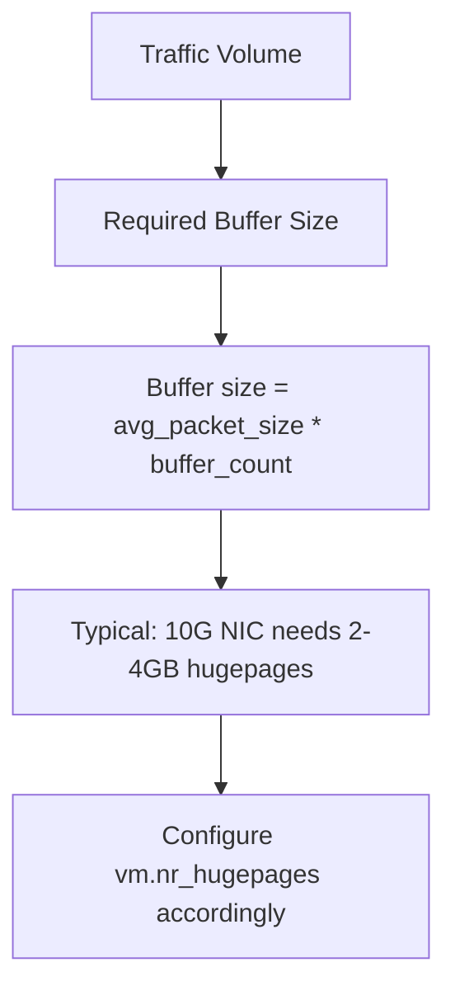

# Optimize Calico VPP Host Networking

Author: [nawazdhandala](https://github.com/nawazdhandala)

Tags: Calico, Kubernetes, Networking, VPP, DPDK, Performance, Optimization

Description: Advanced performance optimization techniques for Calico VPP, including CPU affinity, DPDK poll-mode configuration, hugepage sizing, and vector size tuning.

---

## Introduction

Calico VPP achieves its highest performance when VPP worker threads have dedicated CPU cores, memory bandwidth is not shared with other processes, and the VPP processing parameters are tuned for the traffic characteristics of your workload. The default VPP configuration is conservative to be widely compatible; production deployments benefit significantly from explicit tuning.

This guide covers the key VPP parameters that affect networking performance: CPU core allocation, hugepage memory sizing, DPDK poll mode configuration, and vector size tuning.

## Prerequisites

- Calico VPP deployed and baseline performance measured
- Nodes with multi-core CPUs (preferably NUMA-aware)
- DPDK-compatible NICs for maximum performance
- VPP metrics exposed for performance measurement

## Optimization 1: Dedicate CPU Cores to VPP

VPP achieves best performance with dedicated CPU cores that are not shared with other processes:

```bash
# Isolate CPUs from the Linux scheduler for VPP
# Add to kernel boot parameters (GRUB_CMDLINE_LINUX)
isolcpus=2,3,4,5 nohz_full=2,3,4,5 rcu_nocbs=2,3,4,5
```

Configure VPP to use isolated cores:

```yaml
# VPP startup configuration
data:
  VPP_STARTUP_CONF: |
    cpu {
      workers 4
      corelist-workers 2-5
      main-core 1
    }
    dpdk {
      dev 0000:00:0a.0 {
        num-rx-queues 4
        num-rx-desc 2048
      }
    }
```

## Optimization 2: Right-Size Hugepage Memory



Calculate required hugepages:

```bash
# For 10G NIC at full line rate
# Average packet size: 1000 bytes
# Buffer count: 2M buffers
# 1000 * 2,000,000 = 2GB minimum
# Add 50% overhead: 3GB

echo "nr_hugepages = 1536" > /etc/sysctl.d/vpp-hugepages.conf
# 1536 * 2MB = 3GB hugepages
```

## Optimization 3: Tune DPDK Poll Mode Parameters

```yaml
# VPP startup.conf optimizations
data:
  VPP_STARTUP_CONF: |
    buffers {
      buffers-per-numa 2097152
      page-size 2m
    }
    dpdk {
      dev 0000:00:0a.0 {
        num-rx-queues 8
        num-tx-queues 8
        num-rx-desc 4096
        num-tx-desc 4096
      }
      no-tx-checksum-offload
    }
    punt {
      punt-pool-size 2097152
    }
```

## Optimization 4: Configure NUMA-Aware Memory

For multi-socket servers, allocate hugepages on the NUMA node closest to the NIC:

```bash
# Allocate hugepages on NUMA node 0 (where NIC is connected)
echo 1024 > /sys/devices/system/node/node0/hugepages/hugepages-2048kB/nr_hugepages
echo 512 > /sys/devices/system/node/node1/hugepages/hugepages-2048kB/nr_hugepages
```

## Optimization 5: Tune VPP Vector Size

VPP processes packets in vectors. Larger vectors improve throughput but increase latency:

```yaml
# Tune for throughput (large vectors)
VPP_STARTUP_CONF: |
  buffers {
    buffers-per-numa 4194304
  }

# Tune for latency (small vectors)
# Use fewer buffers, more polling cycles
```

## Optimization 6: Enable RSS for Multiple Queues

Receive Side Scaling (RSS) distributes packets across multiple NIC queues and VPP workers:

```bash
# Verify RSS is configured
kubectl exec -n calico-vpp-dataplane ds/calico-vpp-node -c vpp -- \
  vppctl show dpdk version
# Should show multiple RX queues active

# Check packets are distributed across workers
kubectl exec -n calico-vpp-dataplane ds/calico-vpp-node -c vpp -- \
  vppctl show dpdk statistics
```

## Benchmark Results Template

Document your optimization results:

```
| Configuration | Throughput | Latency (p99) |
|--------------|-----------|---------------|
| Baseline (iptables) | 5 Gbps | 2ms |
| VPP af_packet default | 15 Gbps | 500us |
| VPP DPDK, 4 workers | 30 Gbps | 150us |
| VPP DPDK, isolated CPUs | 40+ Gbps | 50us |
```

## Conclusion

Optimizing Calico VPP for maximum performance requires dedicated isolated CPU cores for VPP workers, properly sized hugepage memory based on traffic volume, NUMA-aware memory allocation for multi-socket servers, and DPDK configuration tuned for your NIC and queue count. The combination of CPU isolation and right-sized hugepages typically delivers 3-5x improvement over the VPP defaults, approaching the theoretical maximum throughput of the physical NIC.
