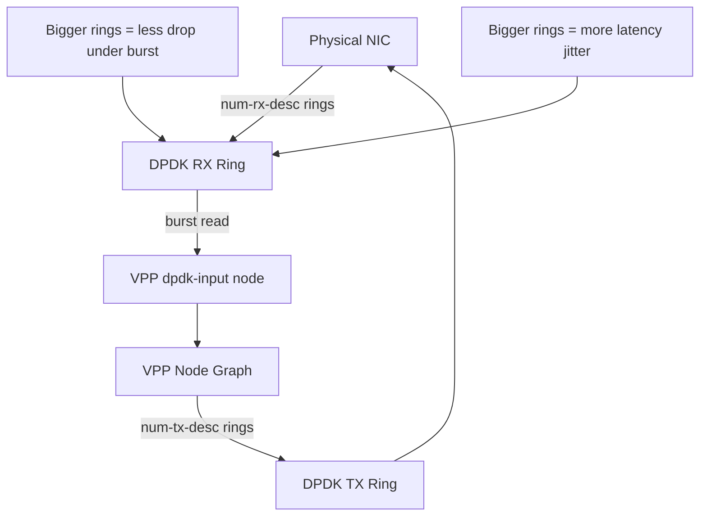

# Optimize Calico VPP Technical Details

Author: [nawazdhandala](https://github.com/nawazdhandala)

Tags: Calico, Kubernetes, Networking, VPP, DPDK, Performance, Optimization, Technical

Description: Advanced technical optimization of Calico VPP's internal parameters, including node graph tuning, buffer sizing algorithms, and DPDK queue configuration for maximum throughput.

---

## Introduction

Deep technical optimization of Calico VPP targets the internal processing parameters that determine how efficiently VPP processes packets. Beyond the operational optimizations (CPU core allocation, hugepage sizing), there are VPP-specific parameters such as vector sizes, queue depths, hash table dimensions, and node scheduling that can be tuned for specific workload characteristics.

Understanding the relationship between these parameters and performance metrics like vector rates, cache hit rates, and context switch frequencies enables informed tuning decisions.

## Prerequisites

- Calico VPP deployed with baseline performance measured
- VPP runtime statistics accessible
- Understanding of VPP node graph internals

## Optimization 1: Tune Packet Buffer Pool

The optimal buffer pool size depends on your traffic profile:

```
# Buffer calculation formula:
# Total_buffers = NIC_line_rate (bps) × buffer_hold_time (s) / avg_packet_size (bytes) × 8
# For 10G NIC, 1ms hold time, 1000B average:
# 10e9 × 0.001 / 1000 × 8 = 1,250,000 buffers (round to 2M)

# Adjust in startup.conf
buffers {
  buffers-per-numa 2097152    # 2M buffers (2M × 2KB = 4GB from hugepages)
  page-size 2m
  default data-size 2048
}
```

## Optimization 2: Tune DPDK Queue Depths



```yaml
# For throughput-optimized deployment (larger queues)
dpdk {
  dev 0000:00:0a.0 {
    num-rx-queues 8
    num-tx-queues 8
    num-rx-desc 4096     # Larger ring for burst absorption
    num-tx-desc 4096
  }
}

# For latency-optimized deployment (smaller queues)
dpdk {
  dev 0000:00:0a.0 {
    num-rx-queues 4
    num-tx-queues 4
    num-rx-desc 512      # Smaller ring for lower queue delay
    num-tx-desc 512
  }
}
```

## Optimization 3: Enable Turbo Boost and Frequency Scaling

VPP benefits from maximum CPU frequency:

```bash
# Set CPU to performance governor
for cpu in /sys/devices/system/cpu/cpu*/cpufreq/scaling_governor; do
  echo performance > $cpu
done

# Disable C-states (prevent CPU frequency drops)
for state in /sys/devices/system/cpu/cpu*/cpuidle/state*/disable; do
  echo 1 > $state 2>/dev/null
done
```

## Optimization 4: Optimize ACL Hash Table Size

```bash
# Check current ACL hash table capacity
kubectl exec -n calico-vpp-dataplane ds/calico-vpp-node -c vpp -- \
  vppctl show acl-plugin statistics | grep "hash table"

# Pre-size hash tables for your policy count
# Configure via vpp startup.conf
acl-plugin {
  hash-lookup-heap-size 64M
  hash-lookup-mheap-size 4G
}
```

## Optimization 5: VPP Thread Scheduling

```yaml
# Optimize VPP scheduler for dedicated cores
cpu {
  main-core 0
  corelist-workers 2-9        # 8 dedicated workers
  # Disable hyperthreading siblings for consistency
  skip-cores 0                # Start from first worker core
}

# Configure per-thread queue counts
dpdk {
  dev 0000:00:0a.0 {
    num-rx-queues 8           # Match worker count
    num-tx-queues 8
    rss {                     # Spread load across all queues
      ipv4-tcp
      ipv4-udp
      ipv4
      ipv6-tcp
      ipv6-udp
    }
  }
}
```

## Optimization 6: Measure and Compare

Before and after each optimization, measure with iperf3:

```bash
# Generate benchmark traffic
kubectl run server --image=networkstatic/iperf3 -n perf-test -- -s
SERVER_IP=$(kubectl get pod server -n perf-test -o jsonpath='{.status.podIP}')

# Multi-stream TCP test
kubectl run client --image=networkstatic/iperf3 -n perf-test -- \
  -c $SERVER_IP -t 30 -P 8 -J 2>&1 | \
  python3 -c "import json,sys; d=json.load(sys.stdin); print(f'Sum: {d[\"end\"][\"sum_received\"][\"bits_per_second\"]/1e9:.2f} Gbps')"
```

## Conclusion

Advanced VPP optimization combines buffer pool sizing based on traffic characteristics, DPDK queue depth tuning for throughput vs. latency tradeoffs, CPU frequency management, and ACL hash table pre-sizing. Each optimization should be measured independently to understand its contribution. The goal is not to maximize any single parameter but to find the combination that delivers the best performance for your specific workload pattern.
