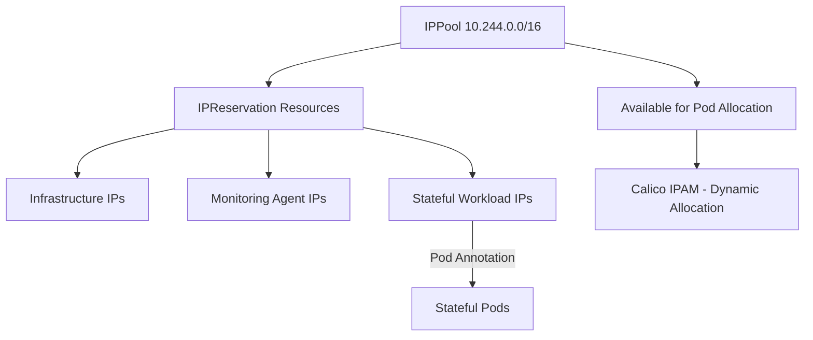

# How to Optimize IP Reservation in Calico for Large Clusters

Author: [nawazdhandala](https://github.com/nawazdhandala)

Tags: Calico, Kubernetes, IPAM, IP Reservation, Large Clusters, Networking, Optimization

Description: Learn how to optimize IP address reservation in Calico IPAM for large clusters to prevent conflicts with infrastructure IPs, reserve addresses for critical workloads, and manage IP space efficiently.

---

## Introduction

In large Kubernetes clusters, IP reservation prevents critical addresses from being allocated to pods—addresses needed for network infrastructure, monitoring agents, or specific workloads with firewall-rule dependencies. Without proper reservation, Calico IPAM may allocate these IPs to regular pods, causing connectivity failures or breaking external firewall rules.

IP reservation in Calico uses the `IPReservation` resource to mark specific IP ranges or individual addresses as unavailable for automatic IPAM allocation. Optimizing this reservation process is essential for large clusters where infrastructure-reserved IPs must coexist with large pod IP pools.

This guide covers Calico IP reservation strategies for production large-scale deployments.

## Prerequisites

- Calico v3.22+ (IPReservation resource available)
- `calicoctl` CLI installed
- Knowledge of IP addresses that must be reserved in your network

## Step 1: Identify IPs to Reserve

Gather all IP addresses within your pod CIDR range that must not be allocated to pods.

```bash
# Common IPs to reserve within pod CIDR ranges:
# - Network gateway IPs
# - Management IP ranges
# - Static monitoring agent IPs
# - IP addresses used in firewall rules

# Check existing IPAM allocations for conflicts
calicoctl ipam show --show-blocks

# Find manually-allocated IPs in the pod CIDR
calicoctl ipam show --ip=10.0.0.1
```

## Step 2: Create IPReservation Resources

Reserve specific IPs or ranges using the IPReservation resource.

```yaml
# ipreservation-infrastructure.yaml
# IPReservation blocking infrastructure IPs from IPAM allocation
apiVersion: projectcalico.org/v3
kind: IPReservation
metadata:
  name: infrastructure-reserved
spec:
  reservedCIDRs:
    - 10.244.0.0/28              # Reserve first 16 IPs in each /28 for gateways
    - 10.244.255.240/28          # Reserve last 16 IPs for broadcast/infrastructure
    - 10.244.100.0/24            # Reserve entire /24 for monitoring agents
```

```yaml
# ipreservation-monitoring.yaml
# IPReservation for monitoring agent static IPs
apiVersion: projectcalico.org/v3
kind: IPReservation
metadata:
  name: monitoring-reserved
spec:
  reservedCIDRs:
    - 10.244.101.0/25            # First half of /24 for Prometheus node exporters
    - 10.244.101.128/25          # Second half for custom monitoring agents
```

## Step 3: Verify Reservations Are Active

Confirm that reserved IPs are not available for allocation.

```bash
# List all IPReservation resources
calicoctl get ipreservation

# Describe a specific reservation
calicoctl get ipreservation infrastructure-reserved -o yaml

# Attempt to allocate a reserved IP (should fail)
calicoctl ipam assign --ip=10.244.0.1 --node=test-node
# Expected: error - IP is reserved
```

## Step 4: Monitor Reserved IP Utilization

Track how many IPs are reserved versus available for pod allocation.

```bash
# Show total IPAM utilization including reservations
calicoctl ipam show

# Check specific reserved ranges
calicoctl ipam show --ip=10.244.100.5

# Calculate effective pod IP capacity after reservations
python3 -c "
total = 65536        # /16 pool
reserved = 512 + 256 # Infrastructure + monitoring reservations
print(f'Available for pods: {total - reserved} IPs')
print(f'Reservation overhead: {(reserved/total)*100:.1f}%')
"
```

## Step 5: Reserve IPs for Critical Workloads

Reserve IPs for stateful workloads that need stable addresses.

```yaml
# ipreservation-stateful-apps.yaml
# IPReservation holding IPs for specific database and cache pods
apiVersion: projectcalico.org/v3
kind: IPReservation
metadata:
  name: stateful-app-ips
spec:
  reservedCIDRs:
    - 10.244.200.1/32            # postgres-primary pod
    - 10.244.200.2/32            # postgres-replica pod
    - 10.244.200.3/32            # redis-master pod
    - 10.244.200.4/32            # redis-replica pod
```

Then assign these IPs to pods using annotations:

```yaml
# pod-postgres-reserved-ip.yaml
# Pod requesting a pre-reserved IP via Calico annotation
apiVersion: v1
kind: Pod
metadata:
  name: postgres-primary
  namespace: database
  annotations:
    cni.projectcalico.org/ipAddrs: '["10.244.200.1"]'  # Use the pre-reserved IP
spec:
  containers:
    - name: postgres
      image: postgres:15
```

## IP Reservation Strategy



## Best Practices

- Create IPReservation resources before deploying workloads to prevent race conditions
- Reserve at least the first and last /28 of each IP block for infrastructure use
- Document all IP reservations with the reason and owning team in annotations
- Review reservations quarterly to release addresses for decommissioned infrastructure
- Use IPReservation for ranges, not individual IPs, to reduce the number of reservation objects

## Conclusion

Optimizing IP reservation in Calico for large clusters ensures that critical infrastructure addresses are protected from pod allocation while maximizing the remaining IP space for dynamic workloads. By using `IPReservation` resources strategically, combining range reservations with static pod annotations, and monitoring reservation overhead, you maintain an orderly and predictable IP allocation environment. Proper reservation management prevents the IP conflicts that are notoriously difficult to diagnose in large production clusters.
