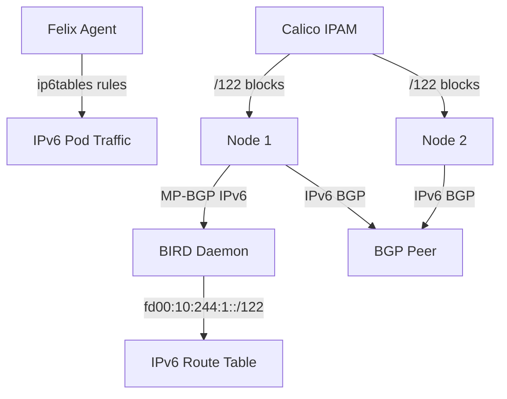

# How to Optimize IPv6 Control Plane in Calico

Author: [nawazdhandala](https://github.com/nawazdhandala)

Tags: Calico, Kubernetes, IPv6, Control Plane, BGP, Networking, Optimization

Description: Learn how to optimize Calico's IPv6 control plane including BGP configuration, IPAM settings, and Felix tuning to ensure reliable and performant IPv6 networking.

---

## Introduction

Running IPv6 on the Calico control plane requires specific optimizations beyond what works well for IPv4. IPv6 BGP sessions (MP-BGP), IPv6 IPAM block sizes, and FelixConfiguration settings all behave differently from their IPv4 counterparts. Without proper tuning, IPv6 clusters experience slow route convergence, oversized IPAM blocks, and policy enforcement gaps.

The Calico IPv6 control plane uses the same BIRD routing daemon and Felix agent as IPv4, but the configuration parameters and addressing schemes are fundamentally different. Understanding these differences and optimizing for IPv6 ensures consistent, reliable networking across both address families.

This guide covers the key IPv6 control plane optimizations for production Calico deployments.

## Prerequisites

- Kubernetes v1.21+ with IPv6 or dual-stack enabled
- Calico v3.21+
- IPv6-capable network infrastructure and nodes
- `calicoctl` CLI installed

## Step 1: Configure IPv6 IPPools with Correct Block Size

IPv6 IPAM requires a different approach to block sizing than IPv4.

```yaml
# ippool-ipv6-optimized.yaml
# IPv6 IPPool with block size optimized for pod density
apiVersion: projectcalico.org/v3
kind: IPPool
metadata:
  name: default-ipv6-ippool
spec:
  cidr: fd00:10:244::/48          # ULA /48 provides ample space for large clusters
  blockSize: 122                   # /122 = 4 IPv6 IPs per block
                                   # Use /120 (256 IPs) for high-density nodes
  ipipMode: Never                  # IPv6 does not use IP-in-IP
  vxlanMode: Never                 # Use native IPv6 routing with BGP
  natOutgoing: false               # IPv6 rarely needs NAT
  disabled: false
```

For high-density nodes, use larger blocks:

```yaml
# ippool-ipv6-high-density.yaml
# IPv6 IPPool with larger blocks for nodes running 100+ pods
apiVersion: projectcalico.org/v3
kind: IPPool
metadata:
  name: ipv6-high-density
spec:
  cidr: fd00:10:245::/48
  blockSize: 120                   # /120 = 256 IPv6 addresses per block
  ipipMode: Never
  natOutgoing: false
```

## Step 2: Enable IPv6 BGP in BGPConfiguration

Configure Calico to advertise IPv6 routes via MP-BGP.

```yaml
# bgpconfiguration-ipv6.yaml
# BGPConfiguration enabling IPv6 route advertisement
apiVersion: projectcalico.org/v3
kind: BGPConfiguration
metadata:
  name: default
spec:
  nodeToNodeMeshEnabled: true
  serviceClusterIPs:
    - cidr: 10.96.0.0/12           # IPv4 service CIDR
    - cidr: fd00:10:96::/112       # IPv6 service CIDR
  serviceLoadBalancerIPs:
    - cidr: fd00:192:168:100::/64  # IPv6 LoadBalancer IP range
```

## Step 3: Configure FelixConfiguration for IPv6

Tune Felix settings specific to IPv6 operation.

```bash
# Enable IPv6 support in FelixConfiguration
calicoctl patch felixconfiguration default --type merge --patch '{
  "spec": {
    "ipv6Support": true,
    "routeTableRange": {
      "min": 1,
      "max": 250
    }
  }
}'
```

## Step 4: Verify IPv6 BGP Sessions

Check that IPv6 BGP sessions are established and routes are being advertised.

```bash
# Check IPv6 BGP session status
calicoctl node status

# In BIRD CLI, check IPv6 routing table
kubectl exec -n calico-system -it <calico-node-pod> -- birdcl6

# Show IPv6 BGP protocols in BIRD
# (BIRD CLI command inside pod)
# show protocols all bgp*

# Check IPv6 routes are in the node's routing table
ip -6 route show | grep fd00
```

## Step 5: Test IPv6 Pod Connectivity

Validate end-to-end IPv6 connectivity between pods.

```bash
# Get a pod's IPv6 address
kubectl get pod <pod-name> -o jsonpath='{.status.podIPs[1].ip}'

# Test IPv6 connectivity from another pod
kubectl exec -n default <client-pod> -- ping6 -c3 <pod-ipv6-address>

# Test IPv6 DNS resolution
kubectl exec -n default <pod> -- nslookup -type=AAAA kubernetes.default

# Check IPv6 routes from node perspective
ip -6 route show table all | grep -v local | head -20
```

## IPv6 Control Plane Architecture



## Best Practices

- Use ULA (fd00::/8) addresses for pod CIDRs to avoid global routing conflicts
- Set IPv6 block size to `/122` for most clusters; increase to `/120` for high-density nodes
- Ensure all BGP peers support MP-BGP (Multiprotocol BGP) for IPv6 route exchange
- Test IPv6 network policies alongside IPv4 policies-they must be applied separately
- Monitor IPv6 BGP session state independently from IPv4 sessions

## Conclusion

Optimizing Calico's IPv6 control plane requires attention to IPAM block sizing, MP-BGP configuration, and Felix tuning specific to IPv6 addressing. By properly configuring IPv6 IPPools, enabling MP-BGP advertisement, and verifying end-to-end connectivity, you build a reliable IPv6 networking foundation. These optimizations ensure IPv6 performs consistently alongside IPv4 in dual-stack clusters and provides the correct routing behavior for IPv6-native workloads.
