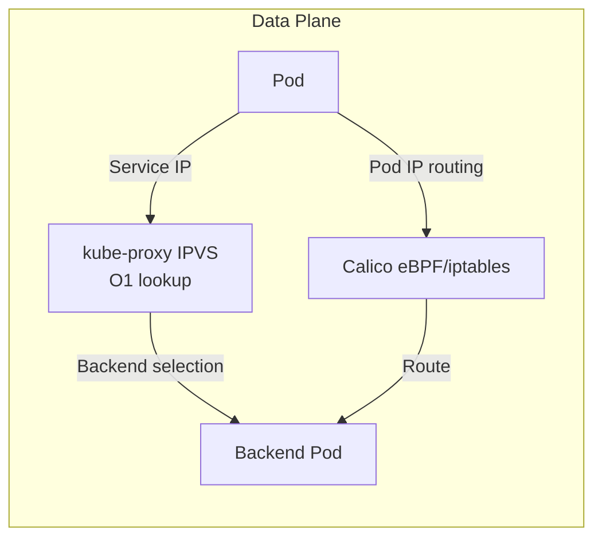

# How to Optimize IPVS Mode with Calico for Production

Author: [nawazdhandala](https://github.com/nawazdhandala)

Tags: Calico, Kubernetes, IPVS, kube-proxy, Networking

Description: Optimize IPVS mode configuration with Calico for production clusters handling high service request rates with minimal latency.

---

## Introduction

IPVS (IP Virtual Server) mode for kube-proxy provides significant performance improvements over the default iptables mode for clusters with large numbers of services. Where iptables performs linear rule traversal for each service lookup, IPVS uses hash tables for O(1) lookups regardless of the number of services. This difference becomes significant at scale: clusters with thousands of services see measurable latency reduction and CPU savings from switching to IPVS mode.

Calico works with IPVS mode kube-proxy without conflict. Calico handles pod routing and network policy while kube-proxy in IPVS mode handles service routing. The two systems operate on different parts of the networking stack and complementarily serve their respective roles.

## Prerequisites

- Kubernetes cluster with Calico
- kube-proxy with IPVS support (kernel modules: ip_vs, ip_vs_rr, ip_vs_wrr, ip_vs_sh)
- kubectl access

## Enable IPVS Mode

```bash
# Check if IPVS modules are loaded
lsmod | grep -E "ip_vs|nf_conntrack"

# Load IPVS modules
modprobe ip_vs ip_vs_rr ip_vs_wrr ip_vs_sh

# Configure kube-proxy for IPVS
kubectl edit configmap -n kube-system kube-proxy
# Set: mode: "ipvs"

# Restart kube-proxy
kubectl rollout restart daemonset -n kube-system kube-proxy
```

## Verify IPVS Rules

```bash
# Check IPVS virtual services
ipvsadm -ln

# Count IPVS entries
ipvsadm -ln | grep -c "TCP\|UDP"

# Compare with number of services
kubectl get svc -A | wc -l
```

## Test Service Connectivity

```bash
# Deploy test service
kubectl create deployment test-app --image=nginx --replicas=3
kubectl expose deployment test-app --port=80 --type=ClusterIP

SVC_IP=$(kubectl get svc test-app -o jsonpath='{.spec.clusterIP}')
kubectl run test-client --image=busybox -- wget -O- http://${SVC_IP}/
```

## IPVS Architecture with Calico



## Conclusion

IPVS mode provides superior service routing performance compared to iptables mode, especially at scale with many services. Calico and IPVS mode work together effectively — Calico handles pod connectivity and network policy while IPVS handles service load balancing. After migrating to IPVS mode, validate that all services are represented in the IPVS table and that service connectivity functions correctly.
