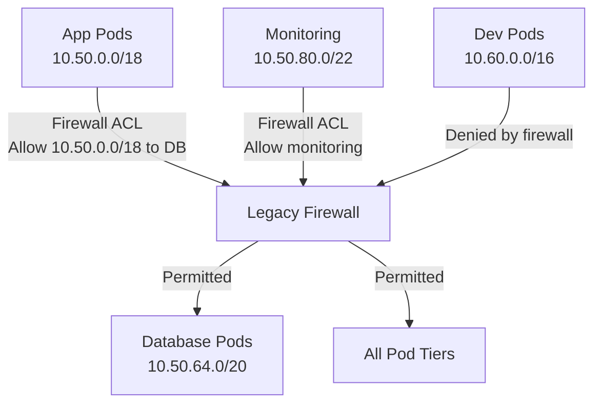

# How to Optimize Legacy Firewall Integration with Calico IPAM

Author: [nawazdhandala](https://github.com/nawazdhandala)

Tags: Calico, Kubernetes, IPAM, Firewall, LEGACY, Networking, Optimization, Security

Description: Learn how to optimize Calico IPAM configuration to ensure pod IP addresses are compatible with legacy firewall rules, enabling Kubernetes workloads to integrate seamlessly with existing network...

---

## Introduction

Many organizations migrating workloads to Kubernetes have existing perimeter firewalls, security appliances, and IP-based access control lists (ACLs) that cannot be immediately updated to accommodate dynamic pod IPs. Calico IPAM can be configured to allocate pod IPs from predictable ranges that align with legacy firewall rules, minimizing the disruption of the migration.

The key challenge is that legacy firewalls expect static or slowly-changing IP ranges, while Kubernetes pods are highly dynamic. By using Calico's topology-aware IP pools, IP reservations, and static pod IP features, you can provide the predictability legacy firewalls require while maintaining Kubernetes's operational flexibility.

This guide covers how to optimize Calico IPAM to work harmoniously with legacy firewall infrastructure.

## Prerequisites

- Calico v3.20+ with Calico IPAM
- Existing legacy firewalls with IP-based rules
- `calicoctl` CLI installed
- Network team coordination for firewall rule updates

## Step 1: Design Firewall-Aligned IP Pools

Create IP pools whose CIDRs align with planned firewall rule groupings.

```yaml
# ippool-production-apps.yaml
# IPPool for production application pods - single CIDR for firewall rules
apiVersion: projectcalico.org/v3
kind: IPPool
metadata:
  name: prod-app-pool
spec:
  cidr: 10.50.0.0/18             # One CIDR for all production app pods
  blockSize: 26
  nodeSelector: environment == "production"
  ipipMode: Never
  natOutgoing: false              # No SNAT - keep source IPs visible to firewalls
```

```yaml
# ippool-database-tier.yaml
# IPPool for database pods - separate CIDR enables tighter firewall rules
apiVersion: projectcalico.org/v3
kind: IPPool
metadata:
  name: database-tier-pool
spec:
  cidr: 10.50.64.0/20            # Narrower range for database tier
  blockSize: 26
  nodeSelector: tier == "database"
  ipipMode: Never
  natOutgoing: false
```

## Step 2: Disable NAT for Firewall Visibility

Legacy firewalls need to see actual pod source IPs, not SNAT'd node IPs.

```bash
# Disable NAT outgoing on existing pools to preserve source IPs
calicoctl patch ippool default-ipv4-ippool --type merge \
  --patch '{"spec":{"natOutgoing":false}}'

# Verify NAT is disabled
calicoctl get ippool default-ipv4-ippool -o yaml | grep natOutgoing
```

## Step 3: Create Stable IP Groups for Critical Services

Use IP reservation and static pod IPs to give legacy firewalls stable addresses for database-tier pods.

```yaml
# ipreservation-database-ips.yaml
# Reserve specific IPs for database pods to allow precise firewall rules
apiVersion: projectcalico.org/v3
kind: IPReservation
metadata:
  name: database-static-ips
spec:
  reservedCIDRs:
    - 10.50.64.1/32              # postgres-primary - reserved for manual assignment
    - 10.50.64.2/32              # postgres-replica - reserved for manual assignment
    - 10.50.64.3/32              # mysql-primary - reserved for manual assignment
```

Assign static IPs to database pods:

```yaml
# pod-postgres-static-ip.yaml
# Postgres pod with static IP matching reserved firewall rule IP
apiVersion: v1
kind: Pod
metadata:
  name: postgres-primary
  namespace: database
  annotations:
    cni.projectcalico.org/ipAddrs: '["10.50.64.1"]'   # Static IP for firewall rule
spec:
  containers:
    - name: postgres
      image: postgres:15
```

## Step 4: Document IP Range to Firewall Rule Mapping

Create a mapping between Calico IPPools and corresponding legacy firewall rules.

```bash
# Generate IP pool to firewall rule mapping document
cat << 'EOF'
Calico IPPool         CIDR             Firewall Rule Purpose
prod-app-pool         10.50.0.0/18     Allow from prod apps to API gateway
database-tier-pool    10.50.64.0/20    Allow from apps to databases (port 5432, 3306)
monitoring-pool       10.50.80.0/22    Allow from monitoring to all pods (port 9090)
EOF

# Verify current pool CIDRs match documented ranges
calicoctl get ippools -o wide
```

## Step 5: Validate Firewall Rule Compatibility

Test that firewall rules correctly allow/deny traffic based on Calico pool CIDRs.

```bash
# Test connectivity from production app pod to database (should succeed)
kubectl exec -n production <app-pod> -- nc -zv 10.50.64.1 5432

# Test connectivity from an unauthorized namespace (should fail)
kubectl exec -n dev <dev-pod> -- nc -zv 10.50.64.1 5432

# Verify source IP seen by firewall is the pod IP (not SNAT)
kubectl exec -n database postgres-primary -- \
  tcpdump -i eth0 -n 'tcp port 5432' -c5
```

## Integration Architecture



## Best Practices

- Disable `natOutgoing` on production pools so pod source IPs are visible to firewalls
- Use CIDR-aligned pools that map cleanly to firewall rule groupings
- Reserve static IPs for critical services that have explicit firewall rules by IP
- Coordinate pool CIDR design with network security teams before deployment
- Use Calico GlobalNetworkPolicies as a second layer of enforcement alongside legacy firewalls

## Conclusion

Optimizing Calico IPAM for legacy firewall integration ensures Kubernetes workloads can coexist with existing network security infrastructure without requiring immediate firewall overhaul. By designing firewall-aligned IP pools, disabling SNAT for source IP visibility, and using static IPs for critical services, you enable a gradual migration where legacy firewalls remain effective while Kubernetes adoption proceeds. This approach reduces migration risk and provides a clear path toward eventually replacing legacy firewall rules with Calico network policies.
