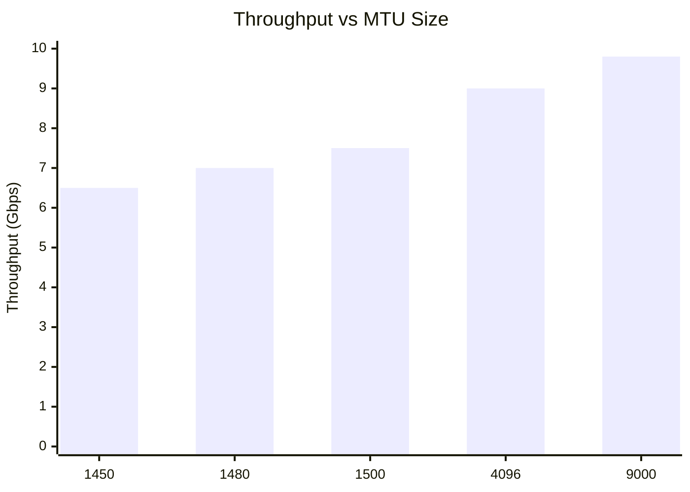

# How to Optimize MTU Sizing for Calico for Production

Author: [nawazdhandala](https://github.com/nawazdhandala)

Tags: Calico, Kubernetes, MTU, Networking, Performance

Description: Optimize Calico MTU sizing for production by enabling jumbo frames, selecting the right encapsulation mode, and validating MTU end-to-end across the entire network path.

---

## Introduction

MTU optimization in Calico production environments can yield significant performance improvements. When network infrastructure supports jumbo frames (MTU 9000), enabling them for Kubernetes workloads dramatically increases throughput by reducing the number of packets needed to transfer large volumes of data — an important consideration for data-intensive workloads like machine learning, video processing, or large database queries.

On standard 1500-byte MTU networks, the focus is on minimizing encapsulation overhead by choosing the right data plane. VXLAN has 50 bytes of overhead, IP-in-IP has 20 bytes, and native BGP routing has zero overhead. The right choice depends on your network capabilities and performance requirements.

## Prerequisites

- Network infrastructure that supports your target MTU
- Calico v3.20+ for automatic MTU detection
- Permission to modify host network configuration

## Enable Jumbo Frames for High-Performance Workloads

When your network supports jumbo frames (MTU 9000):

```bash
# Set host interface MTU to 9000
ip link set eth0 mtu 9000

# Make it persistent (example for NetworkManager)
nmcli connection modify eth0 802-3-ethernet.mtu 9000

# Update Calico for jumbo frame support
calicoctl patch felixconfiguration default --type merge \
  --patch '{"spec":{"mtu":9000,"vxlanMTU":8950}}'
```

## Choose Optimal Encapsulation Mode

| Scenario | Recommended Mode | Resulting Pod MTU (1500 host) |
|----------|-----------------|-------------------------------|
| BGP-capable network | None (native) | 1500 |
| L2-only network | VXLAN | 1450 |
| Mixed environment | CrossSubnet IP-in-IP | 1480 within subnet |
| Cloud provider | VXLAN CrossSubnet | Provider-dependent |

Set the optimal encapsulation:

```yaml
apiVersion: projectcalico.org/v3
kind: IPPool
metadata:
  name: default-ipv4-ippool
spec:
  cidr: 10.48.0.0/16
  ipipMode: Never
  vxlanMode: Never  # Use native BGP for zero overhead
```

## Validate Performance with iperf3

Compare throughput with different MTU settings:

```bash
# Baseline at standard MTU (1500/1450)
kubectl exec iperf3-client -- iperf3 -c ${SERVER_IP} -t 30 -J | \
  jq '.end.sum_received.bits_per_second'

# With jumbo frames enabled (9000)
# After enabling jumbo frames, re-run the same test
kubectl exec iperf3-client -- iperf3 -c ${SERVER_IP} -t 30 -J | \
  jq '.end.sum_received.bits_per_second'
```

## MTU Performance Impact



## Verify MTU Consistency Across Nodes

All nodes should have the same MTU configuration:

```bash
# Check MTU consistency
kubectl get nodes -o name | while read node; do
  mtu=$(kubectl debug node/${node##*/} -it --image=busybox -- ip link show eth0 2>/dev/null | \
    grep -oP 'mtu \K\d+')
  echo "${node}: ${mtu}"
done
```

## Conclusion

Optimizing Calico MTU sizing for production means choosing the right encapsulation mode to minimize overhead, enabling jumbo frames when the network supports them, and validating that the configured MTU is consistently applied across all nodes and pods. For I/O-intensive workloads, the performance difference between 1450-byte VXLAN MTU and 9000-byte jumbo frames can be 30-50% in throughput terms.
