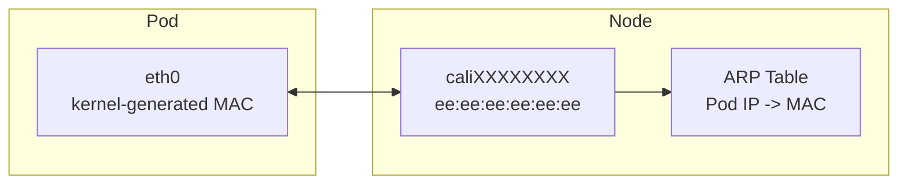

# How to Optimize Pod MAC Addresses with Calico for Production

Author: [nawazdhandala](https://github.com/nawazdhandala)

Tags: Calico, Kubernetes, MAC Address, Networking, CNI

Description: Optimize pod MAC address management in Calico for large clusters to prevent ARP flooding and MAC table exhaustion in physical switches.

---

## Introduction

Calico assigns MAC addresses to the host side of every pod's virtual ethernet (veth) pair using the hardcoded value `ee:ee:ee:ee:ee:ee`. The same MAC is reused on every `cali*` host-side interface because Calico routes traffic at L3 over point-to-point veth pairs, so the data link layer address is never used for forwarding. The pod-side `eth0` MAC, by contrast, is generated by the kernel unless overridden. This design works well for most environments but requires attention in networks where MAC addresses have security implications or in environments with physical switches that track ARP/MAC bindings.

Understanding Calico's MAC address assignment is important for debugging layer-2 networking issues, configuring certain network security controls, and ensuring compatibility with network monitoring tools that track device identity by MAC address.

## Prerequisites

- Calico v3.20+ installed
- kubectl access to the cluster
- Access to node networking stack

## Check Pod MAC Addresses

```bash
# View MAC address of a pod interface

kubectl exec test-pod -- ip link show eth0

# View the corresponding veth on the host
ip link | grep -A1 cali

# Verify MAC address uniqueness across pods
kubectl get pods -A -o wide | while read ns pod rest; do
  mac=$(kubectl exec -n ${ns} ${pod} -- ip link show eth0 2>/dev/null |     grep -oP '([0-9a-f]{2}:){5}[0-9a-f]{2}' | head -1)
  echo "${ns}/${pod}: ${mac}"
done | sort -t: -k2
```

## Configure MAC Prefix

The host-side `ee:ee:ee:ee:ee:ee` MAC is hardcoded in the Calico CNI plugin and is not configurable via `FelixConfiguration`. To set a specific MAC on the pod-side `eth0`, use the per-pod annotation `cni.projectcalico.org/hwAddr`:

```yaml
apiVersion: v1
kind: Pod
metadata:
  name: test-pod
  annotations:
    cni.projectcalico.org/hwAddr: "ca:fe:00:00:00:01"
spec:
  containers:
  - name: app
    image: nginx
```

## Check for MAC Conflicts

```bash
# Look for duplicate MACs in arp table
arp -n | awk '{print $3}' | sort | uniq -d
```

## MAC Address Architecture



## Conclusion

Calico uses a hardcoded MAC on the host side of every pod veth pair and lets the kernel assign the pod-side MAC, since traffic is routed at L3 over point-to-point links. Monitoring for MAC conflicts and understanding this assignment scheme helps diagnose layer-2 networking issues and configure security controls appropriately in your Kubernetes environment.
