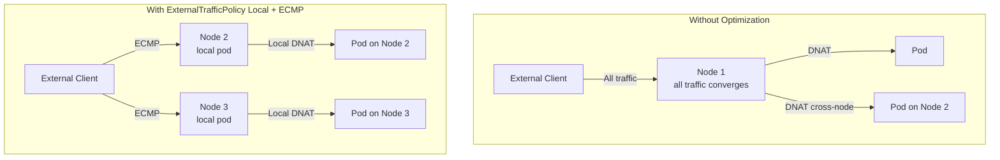

# How to Optimize Service IP Advertisement with Calico for Production

Author: [nawazdhandala](https://github.com/nawazdhandala)

Tags: Calico, Kubernetes, BGP, Service Advertisement, Performance

Description: Optimize Calico service IP advertisement for production by configuring ECMP, tuning advertisement scope, and using ExternalTrafficPolicy to preserve client IPs.

---

## Introduction

Default Calico service IP advertisement uses a single route per service, causing all traffic to a service IP to be forwarded to a single node even if multiple nodes could handle it. This creates a traffic concentration point and a single point of failure for service access from outside the cluster.

Optimizing service advertisement involves configuring ECMP routing so traffic is distributed across multiple nodes, setting ExternalTrafficPolicy to control whether traffic is always sent to a node with a local endpoint, and using BGP communities to influence how upstream routers prefer certain routes.

## Prerequisites

- Calico with service advertisement enabled
- ECMP-capable upstream routers
- Multiple node cluster with pods distributed across nodes

## Configure ECMP for Service Advertisement

Service IPs are advertised from all nodes, but ECMP on the router is needed to use all paths:

```bash
# Verify service IP is advertised from all nodes
for node in $(kubectl get nodes -o name | cut -d/ -f2); do
  POD=$(kubectl get pod -n calico-system -l app=calico-node \
    --field-selector spec.nodeName=${node} -o name | head -1)
  echo "=== $node ==="
  kubectl exec -n calico-system ${POD} -- birdcl show route export BGP_<peer_ip> | grep "10.96"
done
```

On your router, enable ECMP for service routes:

```bash
# Linux router
ip route show 10.96.0.0/12
# Should show: 10.96.0.0/12 nexthop via node1-ip ... nexthop via node2-ip ...
```

## Use ExternalTrafficPolicy: Local

Set `ExternalTrafficPolicy: Local` to ensure traffic is only sent to nodes that have a local pod endpoint, avoiding extra hops:

```yaml
apiVersion: v1
kind: Service
metadata:
  name: my-optimized-service
spec:
  type: LoadBalancer
  externalTrafficPolicy: Local
  selector:
    app: my-app
  ports:
  - port: 80
    targetPort: 8080
```

With `externalTrafficPolicy: Local`, Calico only advertises the service IP from nodes that actually have a healthy pod for that service. Traffic goes directly to a node with a local pod endpoint.

## Configure BGP Communities for Route Preference

Use BGP communities to influence how upstream routers prefer certain service routes:

```yaml
apiVersion: projectcalico.org/v3
kind: BGPConfiguration
metadata:
  name: default
spec:
  communities:
  - name: internal-services
    value: "65000:100"
  prefixAdvertisements:
  - cidr: 10.96.0.0/12
    communities:
    - internal-services
```

## Optimize with Calico eBPF Service Handling

For the best performance, switch to Calico eBPF mode which handles service DNAT more efficiently:

```bash
calicoctl patch felixconfiguration default --type merge \
  --patch '{"spec":{"bpfEnabled":true}}'
```

## Service Advertisement Optimization Diagram



## Conclusion

Optimizing Calico service IP advertisement requires ECMP configuration on upstream routers, using `ExternalTrafficPolicy: Local` to route traffic directly to nodes with local endpoints, and considering Calico eBPF mode for lower-overhead service DNAT. These optimizations together eliminate traffic concentration, reduce latency, and preserve source IPs for services that need them.
