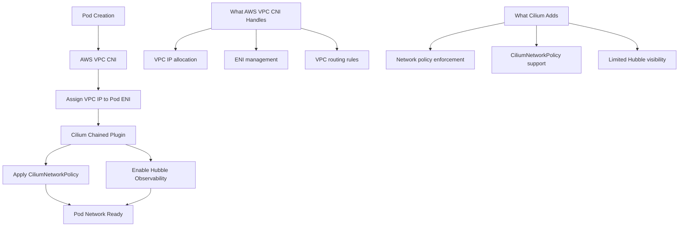

# Plan AWS VPC CNI Chaining with Cilium

Author: [nawazdhandala](https://github.com/nawazdhandala)

Tags: cilium, kubernetes, aws, vpc-cni, cni-chaining, eks, networking

Description: Learn how to plan and deploy Cilium in chained mode on top of AWS VPC CNI in EKS clusters, enabling Cilium network policies and observability while retaining native VPC IP allocation. This guide covers the planning, prerequisites, and configuration for AWS VPC CNI chaining.

---

## Introduction

AWS EKS clusters use the AWS VPC CNI plugin to assign VPC IP addresses directly to pods, enabling native VPC routing and integration with AWS security groups. However, AWS VPC CNI's network policy capabilities are limited — it only supports basic Kubernetes NetworkPolicy without advanced egress controls, FQDN policies, or L7 enforcement.

By chaining Cilium on top of AWS VPC CNI, you keep the native VPC IP assignment (no overlay, no IP translation) while adding Cilium's powerful CiliumNetworkPolicy enforcement and Hubble observability. This is the recommended path for EKS customers who need advanced network policy without migrating to a standalone CNI.

This guide covers the planning phase — understanding what changes, what stays the same, and how to configure the chain.

## Prerequisites

- EKS cluster with AWS VPC CNI v1.11+ installed
- Node groups using Amazon Linux 2 or Bottlerocket
- `cilium` CLI v0.15+ installed
- `kubectl` configured for your EKS cluster
- IAM permissions to modify node group launch templates

## Step 1: Review Current AWS VPC CNI Configuration

Understand the current CNI setup before adding Cilium to the chain.
```bash
# Check the current VPC CNI version
kubectl describe daemonset aws-node -n kube-system | grep Image

# View the current CNI configuration on a node
kubectl debug node/<node-name> -it --image=busybox -- \
  cat /etc/cni/net.d/10-aws.conflist
```

## Step 2: Understand the Architecture



## Step 3: Configure Cilium for AWS VPC CNI Chaining

Install Cilium in chained mode using Helm.
```bash
# Add the Cilium Helm repository
helm repo add cilium https://helm.cilium.io/
helm repo update

# Install Cilium configured for AWS VPC CNI chaining
helm install cilium cilium/cilium \
  --version 1.14.0 \
  --namespace kube-system \
  --set cni.chainingMode=aws-cni \
  --set cni.exclusive=false \
  --set enableIPv4Masquerade=false \
  --set routingMode=native \
  --set ipv4NativeRoutingCIDR="10.0.0.0/8"
```

## Step 4: Verify the Chain is Active

After installation, confirm both CNI plugins are active and working.
```bash
# Check Cilium agent status
cilium status

# Verify the CNI chain configuration on a node
kubectl debug node/<node-name> -it --image=busybox -- \
  cat /etc/cni/net.d/05-cilium.conf

# Run connectivity tests to validate policy enforcement
cilium connectivity test --test no-policies
```

## Best Practices

- Disable AWS security group policies for pods when using Cilium for network policy — they can conflict
- Set `enableIPv4Masquerade=false` since AWS VPC CNI handles routing natively
- Monitor Cilium agent pod logs on rolling node group updates to detect configuration drift
- Use `CiliumClusterwideNetworkPolicy` for cluster-wide default-deny in chained mode
- Pin Cilium version to match your EKS Kubernetes version compatibility matrix
- Test pod-to-pod connectivity and external egress before deploying workloads

## Conclusion

AWS VPC CNI chaining with Cilium is the most straightforward path to advanced network policy enforcement on EKS without a full CNI replacement. By keeping VPC native IP assignment and layering Cilium's policy engine on top, you gain CiliumNetworkPolicy capabilities and observability while maintaining full compatibility with AWS networking features. Plan the configuration carefully, test in a non-production cluster first, and monitor the chained agents after each node group update.
